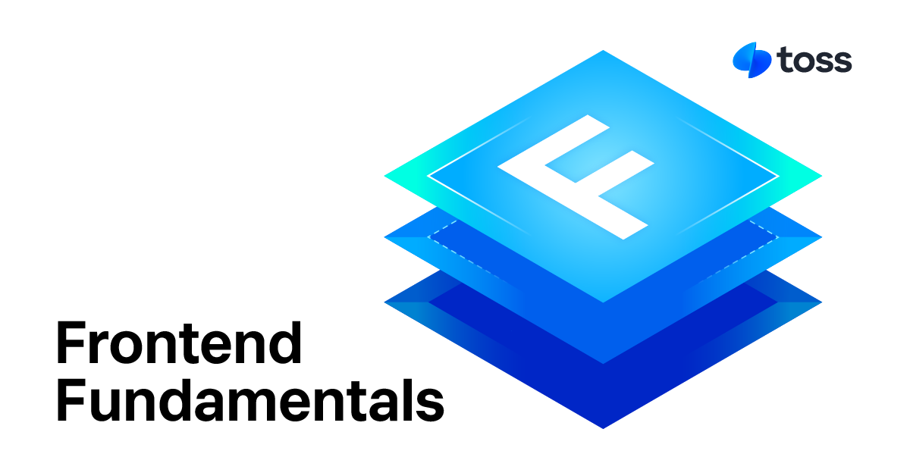

[English](https://github.com/toss/frontend-fundamentals/blob/main/README.md) | 한국어

# 프론트엔드 펀더멘털

> 프론트엔드 개발을 위한 필수 원칙

**프론트엔드 펀더멘털 (FF)** 은 신뢰할 수 있고 유지 관리 가능하며 접근 가능한 프론트엔드 애플리케이션을 구축하기 위한 필수 원칙 모음이예요. 

코드 품질을 판단하는 방법, 번들링이 개발자 대 프로덕션에서 다르게 작동하는 이유, 화면 리더가 UI를 해석하는 방법, 효율적으로 디버깅하는 방법 등 일반적이지만 까다로운 질문에 답하는 데 도움을 줍니다.

https://frontend-fundamentals.com/code-quality/

## 🧭 사용 시기

- 🦨 코드에 대해 확신이 서지 않지만 논리적으로 문제를 설명하기 어려운 경우
- 🧯 지속적인 프론트엔드 버그를 디버깅하려고 할 때와 기본 사항을 다시 확인하고 싶을 때
- 👥 접근성을 위해 UI 코드를 검토할 때와 구체적으로 해야 할 일과 하지 말아야 할 일을 원할 때
- 🛠️ 팀이 깨끗하고 견고한 프론트엔드 코드에 대한 공유 표준을 설정할 때

## 📚 컬렉션

- [코드 품질 펀더멘털](https://frontend-fundamentals.com/code-quality/)
- [번들링 펀더멘털](https://frontend-fundamentals.com/bundling/)
- [A11y 펀더멘털](https://frontend-fundamentals.com/a11y/)
- [디버그 펀더멘털](https://frontend-fundamentals.com/debug/)

## 기여하기

**프론트엔드 펀더멘털 (FF)** 은 좋은 코드 작성을 위한 표준을 확립하기 위한 커뮤니티 주도 프로젝트이예요.

잘 모르는 코드가 있으면 GitHub 토론 페이지에 게시해보세요.  
커뮤니티는 코드에 대한 다양한 리뷰를 제공하여 여러분과 다른 사람들이 무엇이 좋은 코드인지 비판적으로 생각할 수 있도록 도와줍니다.  
높은 지지를 받는 사례는 프론트엔드 펀더멘털 문서에 포함될 수도 있어요. 기여 지침은 곧 발표될 예정입니다.

- [GitHub 토론 게시물](https://github.com/toss/frontend-fundamentals/discussions)

## 라이선스

MIT © Viva Republica, Inc. 자세한 내용은 [LICENCE](/.LICENSE.md )를 참조하세요.

<a title="Toss" href="https://toss.im">
  <picture>
    <source media="(prefers-color-scheme: dark)" srcset="https://static.toss.im/logos/png/4x/logo-toss-reverse.png">
    
  </picture>
</a>