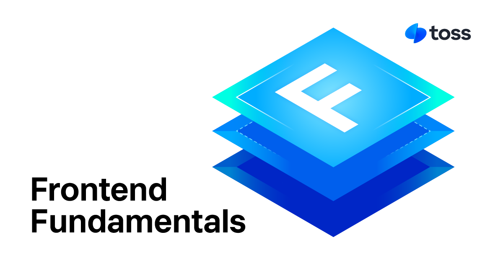

# Frontend Fundamentals
> Guidelines for easily modifiable frontend code

**Frontend Fundamentals (FF)** provides standards for writing great frontend code. Think of it as a compass to help you navigate towards better code quality as a frontend developer.  
It introduces four core principles of good code, along with practical examples and solutions.  
https://frontend-fundamentals.com/en/

## When to Use
- 🦨 When you're unsure about your code but find it hard to explain the issues logically
- 👀 When you want to learn how to quickly identify and fix bad code
- 🤓 When you find yourself exploring a shared link during a code review and realize, "This is exactly what my code looks like," from an objective perspective
- 👥 When your team wants to establish a shared coding style and standards for code quality

## Contributing

**Frontend Fundamentals (FF)** is a community-driven project to establish standards for writing good code.  

If you have a piece of code you're unsure about, post it on the GitHub Discussions page.  
The community can provide diverse reviews of your code, helping you and others think critically about what makes good code.  
Highly supported cases may even make it into the Frontend Fundamentals documentation. Contribution guidelines will be announced soon.

- [Post on GitHub Discussions](https://github.com/toss/frontend-fundamentals/discussions)

## License

MIT © Viva Republica, Inc. See [LICENSE](./LICENSE.md) for details.

<a title="Toss" href="https://toss.im">
  <picture>
    <source media="(prefers-color-scheme: dark)" srcset="https://static.toss.im/logos/png/4x/logo-toss-reverse.png">
    
  </picture>
</a>
