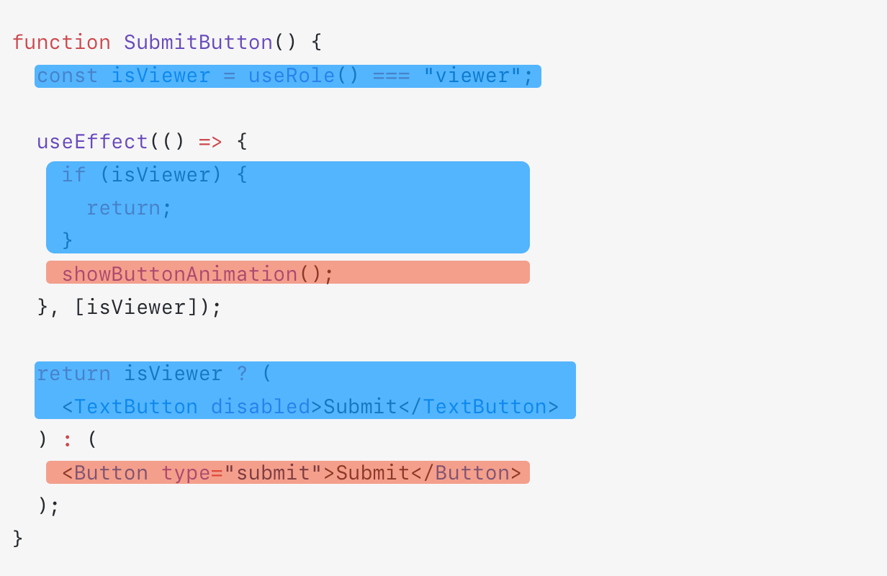

# Separating Code That Doesn't Run Together

<div style="margin-top: 16px">
<Badge type="info" text="Readability" />
</div>

If code that doesn't run simultaneously exists in a single function or component, it becomes difficult to grasp its behavior at a glance.
It may also include a large number of branches in the implementation, making it hard to understand its purpose.

## 📝 Code Example

The `<SubmitButton />` component below behaves differently depending on the user's permission.

- If the user's permission is read-only (`"viewer"`), the invite button is disabled and the animation is not played.
- If the user is a regular user, the invite button can be used and the animation is played.

```tsx
function SubmitButton() {
  const isViewer = useRole() === "viewer";

  useEffect(() => {
    if (isViewer) {
      return;
    }
    showButtonAnimation();
  }, [isViewer]);

  return isViewer ? (
    <TextButton disabled>Submit</TextButton>
  ) : (
    <Button type="submit">Submit</Button>
  );
}
```

## 👃 Smell the Code

### Readability

In the `<SubmitButton />` component, two different permission states for the user are handled simultaneously within a single component.
As a result, there are too many contexts for the reader to consider at once.

For example, in the following code, the blue parts are executed when the user has read-only permissions (`'viewer'`), while the red parts are executed for regular users.
Intermixed code that doesn't execute simultaneously creates confusion and makes it harder to understand the logic.



## ✏️ Work on Improving

This code is designed to completely separate the management of when the user has read-only permissions and when they are a regular user.

```tsx
function SubmitButton() {
  const isViewer = useRole() === "viewer";

  return isViewer ? <ViewerSubmitButton /> : <AdminSubmitButton />;
}

function ViewerSubmitButton() {
  return <TextButton disabled>Submit</TextButton>;
}

function AdminSubmitButton() {
  useEffect(() => {
    showAnimation();
  }, []);

  return <Button type="submit">Submit</Button>;
}
```

- The branches scattered throughout the `<SubmitButton />` code have been merged into one, reducing the number of branches.
- Since `<ViewerSubmitButton />` and `<AdminSubmitButton />` manage only one branch, the context that the reader needs to consider at once is reduced.
