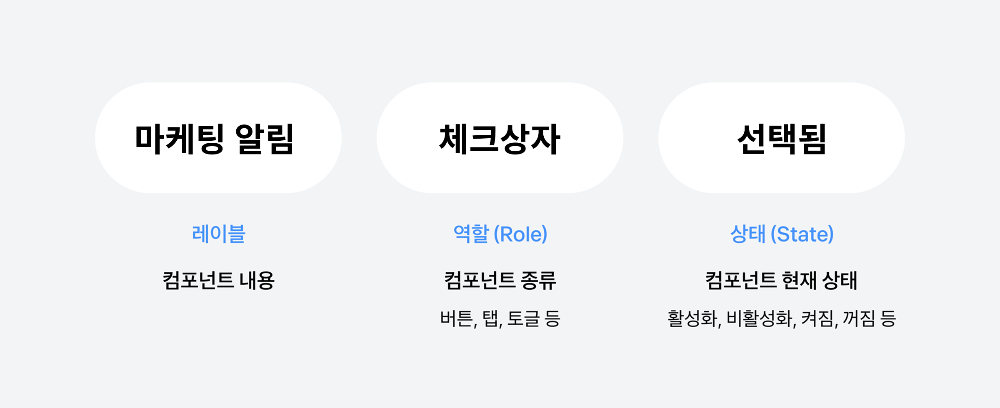
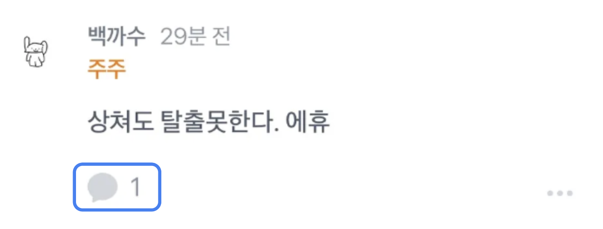
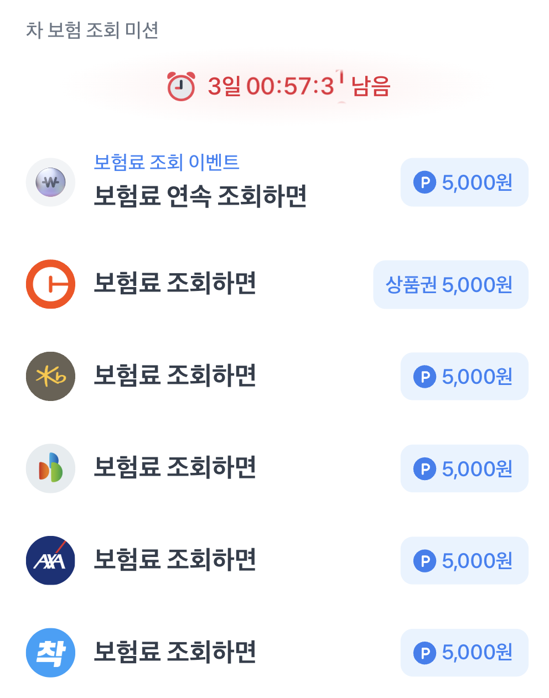
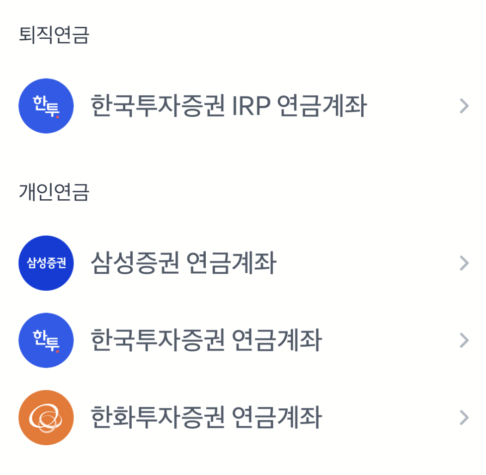
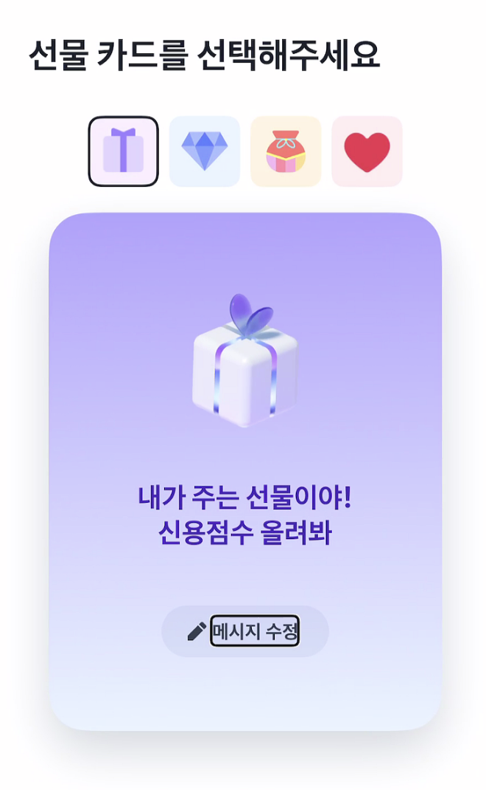
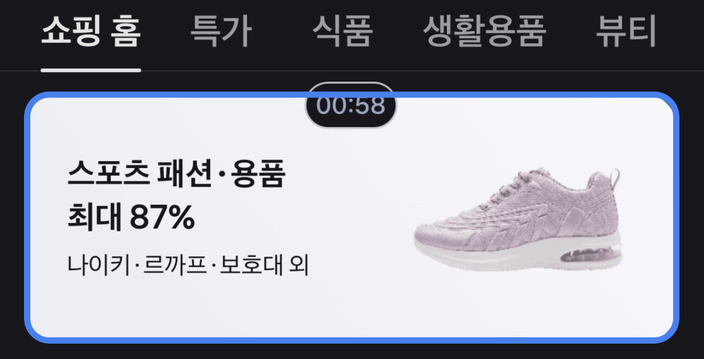
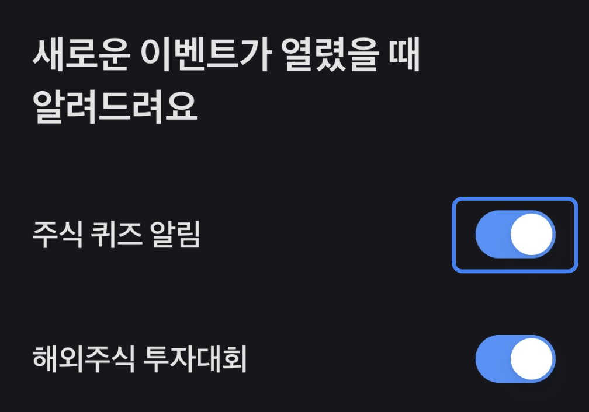

# 개발자를 위한 접근성 입문 가이드

스크린 리더는 화면 속 구조와 정보를 음성으로 읽어주는 보조 기술이에요.

이 가이드에서는 스크린리더가 화면을 매끄럽게 읽을 수 있도록 개발자가 직접 챙겨야 하는 접근성 포인트를 설명해요.


## 1. 스크린리더의 3요소 — 레이블, 역할, 상태값

스크린리더는 화면의 요소를 다음 순서로 읽어요.

- **레이블(Label)**: 컴포넌트의 이름이에요. 어떤 기능인지 설명해요.
- **역할(Role)**: 요소가 어떤 종류인지 나타내요. (예: 버튼, 입력창, 스위치 등)
- **상태(State)**: 현재 상태를 알려줘요. (예: 활성화됨, 꺼짐, 선택됨 등)

예를 들어 아래 코드는 “마케팅 알림”에 대한 체크박스를 스크린리더가 읽는 방법이에요.

```tsx
<Checkbox.Circle
	aria-label="마케팅 알림"
	role="radio"
	aria-checked={true}
/>
```

<aside>

::: 스크린리더는 이렇게 읽어요

[스크린리더 녹음 파일](./audios/a11y-audio.mp3)

**읽히는 순서**

마케팅 알림  **`레이블`**
체크상자      **`역할`**
선택됨         **`상태값`**
설정을 끄거나 켜려면 이중탭 하십시오 **`자동설명`**

:::




## 2. 역할 챙기는 법

요소가 어떤 **의미를 가진 UI 컴포넌트**인지 스크린리더가 인식할 수 있도록 `role` 속성을 명확히 지정해야 해요.

HTML의 기본 요소(`<button>`, `<input>`, `<a>` 등)는 기본 역할이 내장돼 있지만, 커스텀 컴포넌트를 만들 때는 `role`을 명시적으로 선언해야 해요.


| 컴포넌트 | HTML 요소 | role 속성 | 설명 |
| --- | --- | --- | --- |
| 텍스트, 아이콘 등 장식 요소 | `<span>`, `<div>` | 없음 | 클릭 불가, 정보 전달만 하는 요소
(정보 전달 필요 시 그에 맞는 역할을 지정해줘야 해요.) |
| 탭(Tab) | `<ul>`, `<li>` | `role="tablist"`,
 role="tab"` , | 여러 화면 중 하나를 전환하는 요소 |
| 입력창(Input) | `<input>` | `role="textbox"` | 사용자가 텍스트를 입력하는 요소 |
| 체크박스(Checkbox) | `<input type="checkbox">` | `role="checkbox"` | 다중 선택 가능 |
| 스위치(Switch) | `<button>` | `role="switch"` | ON/OFF 상태를 전환하는 요소 |
| 라디오 버튼(Radio) | `<input type="radio">` | `role="radiogroup"`,
`role="radio"` | 여러 옵션 중 하나 선택 |
| 링크(Link) | `<a>` | `role="link"` | 페이지 이동 요소 |
| 버튼(Button) | `<button>` | `role="button"` | 실행 동작을 수행하는 요소 |

탭과 라디오는 왜 그룹으로 묶여야 하는지, 묶게 되면 어떤 이점이 있는지 (또는 어떤 문제점이 있는지) 부연 설명 추가

### 컴포넌트의 의미를 코드에 담는 법

컴포넌트의 의미를 명확히 전달하기 위해서는 레이블과 상태를 모두 설정해야 해요. <br />
아래 코드는 적절히 역할과 레이블을 챙기면서 탭을 구현한 예시예요. 

```tsx
function Tab() {
	return (
		 <div
        role="tablist"
        aria-label="메뉴"
      >
        <button role="tab" aria-selected={true}>첫번째 항목</button>
        <button role="tab" aria-selected={false}>두번째 항목</button>
      </div>
	);
}
```

::: ✅ 이렇게 읽어줘요

메뉴, **`탭그룹`**

첫번째 항목, **`탭`**

두번째 항목, **`탭`**

> 텍스트로 정보 전달이 가능한 요소에서는 중복으로 읽어주지 않도록 레이블을 생략해요.

:::


---

## 3. 레이블 챙기는 법


사용자와 상호 작용을 하면서 텍스트 요소가 없는 경우, 레이블을 활용해 상호 작용할 요소가 어떤 것인지 설명해 주어야 스크린리더를 사용하는 사용자도 이해할 수 있어요.

> 레이블 활용 방법에 대한 자세한 내용은 [여기](https://frontend-fundamentals.com/a11y/semantic/required-label.html)를 참고하면 좋아요.


### 1. 입력창

어떤 걸 입력해야 하는지 써주세요.


```html
<form>
  <h1>자세한 주소를 알려주세요</h1>
  <input type="text" />
</form>
```

::: ❌ 안쓰면 이렇게만 들려요

입력창 

:::

```html
<form>
  <h1>자세한 주소를 알려주세요</h1>
  <label>상세주소</label>
  <input type="text" />
</form>
```


::: ✅

**상세주소**, 입력창 

:::


*입력창이 여러 개라면, 각 영역을 구분해서 써주세요.*


```html
<form>
  <h1>카드 정보를 확인해주세요</h1>
  <p>본인 명의의 카드만 결제가 가능해요</p>

  <div role="group">
    <label>카드번호</label>
	  <div>
	    <input
	      type="text"
	      inputMode="numeric"
	      maxLength={4}
	    />
	    <input
	      type="text"
	      inputMode="numeric"
	      maxLength={4}
	      aria-label="카드번호 둘째단 4자리"
			/>
    </div>
	 </div>
 </form>
 ```


::: ❌ 안쓰면 이렇게만 들려요

입력창, 입력창, 입력창, 입력창

:::


```html
<form>
  <h1>카드 정보를 확인해주세요</h1>
  <p>본인 명의의 카드만 결제가 가능해요</p>

  <div role="group">
    <label>카드번호</label>
	  <div>
	    <input
	      type="text"
	      inputMode="numeric"
	      maxLength={4}
	      aria-label="카드번호 첫째단 4자리"
	    />
	    <input
	      type="text"
	      inputMode="numeric"
	      maxLength={4}
	      aria-label="카드번호 둘째단 4자리"
			/>
    </div>
	 </div>
 </form>
 ```

<aside>

::: ✅

**카드번호 첫째단 4자리**, 입력창

**카드번호 둘째단 4자리**, 입력창

 …

:::

---

### 2. 버튼

**텍스트 없는 아이콘 버튼일 때** 어떤 동작을 하는지 설명해주세요.


```tsx
<div>
  <button>
    <SearchIcon />
  </button>
  <button>
    <SettingIcon>
  </button>
</div>
```

::: ❌ 안쓰면 이렇게만 들려요

버튼

:::

```tsx
<div>
  <button aria-label="검색">
    <SearchIcon />
  </button>
  <button aria-label="설정">
    <SettingIcon />
  </button>
</div>
```

::: ✅

**검색**, 버튼

**설정**, 버튼

:::


```tsx
<div>
  <button>
    <LeftArrowIcon />
  </button>
  <span>8월</span>
  <button>
    <RightArrowIcon />
  </button>
</div>
```

::: ❌ 안쓰면 이렇게만 들려요

버튼, 8월, 버튼

:::

```tsx
<div>
  <button aria-label="지난 달">
    <LeftArrowIcon />
  </button>
  <span>8월</span>
  <button aria-label="다음 달">
    <RightArrowIcon />
  </button>
</div>
```

::: ✅

**지난 달**, 버튼

8월

**다음 달**, 버튼

:::



```tsx
<div>
  <button>
    <CommentIcon />
    <span>{commentCount}</span>
  </button>
</div>
```

::: ❌ 안쓰면 이렇게만 들려요

1 버튼

:::

```tsx
<div>
  <button aria-label={`댓글 총 ${commentCount}개`}>
    <CommentIcon />
    <span aria-hidden="true">{commentCount}</span>
  </button>
</div>
```

::: ✅

**댓글 총 n개**, 버튼

:::


*텍스트로 의미 전달이 충분히 되고 있다면 생략해도 돼요*
    
    
    
    
    <aside>
    
    텍스트 버튼일 때
    
    </aside>
    
    
    
    <aside>
    
    아이콘과 동일한 의미가 
    텍스트로 전달되고 있을 때
    
    </aside>
    

---

### 3. 이미지

#### 3.1 브랜드 로고

**써야 할 때**

로고가 **서비스 식별**에 꼭 필요하고
텍스트로 설명되고 있지 않을 때




::: ❌ 안 쓰면 이렇게만 들려요

보험료 조회하면 

보험료 조회하면 

:::


::: ✅ 어떤 로고인지 알려주세요

**캐롯손해보험** 보험료 조회하면

**KB손해보험** 보험료 조회하면

:::


**안 써도 될 때**

로고명이 텍스트로 적혀 있을 때



#### 3.2 콘텐츠 이미지


**써야 할 때**

콘텐츠를 구분하거나 선택하는 데 
**사진이 핵심 정보**일 때



::: ❌ 안 쓰면 이렇게만 들려요

이미지

:::


::: ✅ 어떤 카드인지 알 수 있게 해주세요

**선물 상자 카드,** 이미지

**다이아몬드 카드,** 이미지

**복주머니 카드,** 이미지

**하트 카드,** 이미지

:::


**안 써도 될 때**

이미지가 단순 시각 보조일 때 (장식요소)


#### 3.3 상품 이미지

**써야 할 때**

텍스트만으로는 **어떤 상품인지 알 수 없을 때**


::: ❌ 안 쓰면 이렇게만 들려요

4,700원, 아이스아메리카노 T

3,000원, 교환권

:::

::: ✅ 어떤 상품인지 정확히 알 수 있게 해주세요

**스타벅스**, 4,700원, 아이스아메리카노 T

**CU**, 3,000원, 교환권

:::


**안 써도 될 때**

텍스트에 상품명이 나와있을 때


### 3.4 광고/프로모션 배너

무슨 이벤트/기획전인지 설명하고, 이동 행동까지 포함해 주세요.



```html
<button href="/sports-fashion-sale">
  
</button>
```

::: ❌ 안쓰면 이렇게만 들려요

스포츠 패션 용품 최대 87%, 나이키 르까프 보호대 외, 버튼

:::

```html
<button href="/sports-fashion-sale" aria-label="스포츠 패션 용품 최대 87% 기획전 이동하기">
  
</button>
```

::: ✅ 

**스포츠 패션 용품 최대 87% 기획전 이동하기**, 버튼

:::

#### 3.5 그래픽

텍스트 없이 그래픽으로만 정보를 전달하는 상황이라면 꼭 레이블을 작성해주세요.


::: ❌ 안쓰면

어떤 변화가 일어나고 있는지 알 수 없어요

:::

::: ✅ 

**상담원이 채팅을 입력중입니다**

:::


::: ❌ 안쓰면

이 정보를 알 수 없어요.

:::

::: ✅

**원리금균등 163,244원, 원금균등 162,500원, 만기일시 300,000원,** 이미지

:::


::: ❌ 안쓰면 이렇게만 들려요

자산 연결 중, 자산 연결 완료

:::

::: ✅ 어떤 단계까지 왔는지 알 수 있게 해주세요

**자산 연결 1단계 완료**

:::

---

### 4. 체크박스 / 라디오버튼 / 스위치

무엇을 선택하는지 적어주세요. 옆에 글자가 있더라도 해당 컴포넌트와 정확히 연결되지 않으면, 사용자는 이 컴포넌트가 어떤 의미인지 추측해야 하고 명확하게 이해하기 어려워요.


::: ❌ 안쓰면 이렇게만 들려요

선택됨, 체크박스 

:::


::: ✅ 

**필수 카드 결제 알림 받기 서비스 이용약관**, 선택됨, 체크박스

:::


::: ❌ 안쓰면 이렇게만 들려요

선택됨, 라디오버튼

:::

::: ✅

**토스뱅크 통장**, 선택됨, 라디오버튼

:::




::: ❌ 안쓰면 이렇게만 들려요

스위치, 켬, 끄거나 켜려면 이중 탭 하십시오.

:::


::: ✅

**주식 퀴즈 알림**, 스위치, 켬, 끄거나 켜려면 이중 탭 하십시오.

:::

**토글은 구현 방식에 따라 스크린리더에서 버튼처럼도, 스위치처럼도 읽힐 수 있어요. 접근성 표준에서는 ON/OFF 상태를 직관적으로 전달할 수 있는 스위치 역할(role=switch)을 권장해요.*

---

## 4. 상태(State) 챙기는 법

상태값은 스크린리더가 컴포넌트의 동작 변화를 인식할 수 있도록 돕는 정보예요.

대표적으로 `aria-checked`, `aria-disabled`, `aria-expanded`, `aria-selected` 등이 있어요.

| 속성 | 의미 | 적용 예시 |
| --- | --- | --- |
| `aria-checked` | 체크 여부 | 체크박스, 스위치 |
| `aria-selected` | 선택 여부 | 탭, 리스트 |
| `aria-expanded` | 펼침 여부 | 아코디언, 드롭다운 |
| `aria-disabled` | 비활성화 여부 | 버튼 등 |
| `aria-busy` | 로딩 중 상태 | 데이터 로드 시 |

아래 예시는 아코디언 컴포넌트에 상태를 전달한 예시예요.

```tsx
function Accordion() {
	const [open, setOpen] = useState(false);

	return (
	<div>
		<button
			aria-expanded={open}
			onClick={() => setOpen(!open)}
		>
			{open ? '내용 접기' : '내용 보기'}
		</button>
		{open && <p>내용</p>}
	</div>
	);
}
```