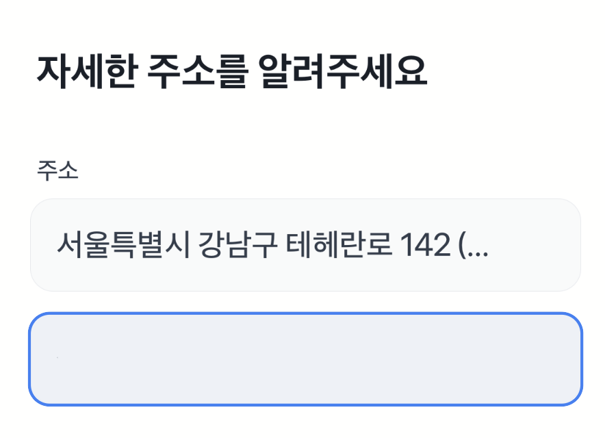
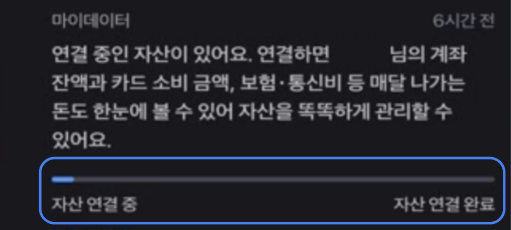

# 레이블 지정하기

레이블은 화면에 보이지 않는 텍스트를 스크린 리더에 전달해요. 시각적 텍스트가 없거나 여러 요소가 모여 있을 때, 레이블을 꼭 지정해야 사용자가 어떤 요소인지 이해해요.

특히 입력창이나 버튼과 같이 사용자와 상호 작용을 하는 컴포넌트에 텍스트 요소가 없으면 중요한 상호 작용을 놓칠 수 있어요. 그래서 레이블을 활용해 상호 작용할 요소가 어떤 것인지 설명해줘야 해요.

어떻게 레이블을 지정하면 좋은지 입력창, 버튼, 이미지, 체크박스/라디오버튼/스위치 컴포넌트를 각각 예시로 확인해 볼게요.

## 입력창

### 입력해야 하는 정보가 무엇인지 레이블에 추가하기

스크린 리더 사용자는 시각적인 힌트를 보지 못해요. 입력창에 레이블이 없으면 사용자가 어떤 정보를 입력해야 하는지 알 수 없어서 잘못된 값을 입력할 수 있어요.

예를 들어 다음과 같이 코드에 레이블이 없는 주소 입력창이 있을 때, 스크린 리더 사용자는 어떤 정보를 입력해야 하는지 알 수 없어요.

```js
<form>
  <h1>자세한 주소를 알려주세요</h1>
  <span>주소</span>
  <input type="text" />
  <input type="text" />
</form>
```



::: danger ❌ 레이블을 안쓰면 이렇게 들려요

자세한 주소를 알려주세요, 머리말<br />
주소<br />
입력창<br />
입력창

:::

다음과 같이 사용자가 어떤 정보를 입력해야 하는지 `aria-label`이나 `<label>`로 알려주세요.

```js{5}
<form>
  <h1>자세한 주소를 알려주세요</h1>
  <label htmlFor="address">주소</label>
  <input type="text" id="address" />
  <input type="text" aria-label="상세주소" />
</form>
```

::: info ✅ 레이블을 잘 쓰면 이렇게 들려요

자세한 주소를 알려주세요, 머리말<br />
**주소**, 입력창<br />
**상세주소**, 입력창

:::

이제 사용자는 상세 주소 입력창이라는 것을 인지하고, 올바른 값을 입력할 수 있어요.

### 입력창이 여러 개일 때 각 영역 구분하기

카드번호처럼 여러 개의 입력창이 연속으로 나올 때는 순서와 역할을 구분해 알려줘야 해요. `<fieldset>`과 `<legend>`로 그룹을 묶거나, 각 입력창에 개별 `aria-label`을 달아 사용자가 차례대로 입력할 수 있게 하세요.

예를 들어 다음과 같이 카드번호를 입력하는 네 개 입력창에 레이블이 없이 인풋만 있다면, 사용자에게는 네 칸이 모두 같은 입력창으로 들려요.

```html
<form>
  <h1>카드 정보를 확인해주세요</h1>
  <p>본인 명의의 카드만 결제가 가능해요</p>

  <div>
    카드번호
    <div>
      <input type="text" inputmode="numeric" maxlength="4" />
      <input type="text" inputmode="numeric" maxlength="4" />
      <input type="text" inputmode="numeric" maxlength="4" />
      <input type="text" inputmode="numeric" maxlength="4" />
    </div>
  </div>
</form>
```


::: danger ❌ 레이블을 안쓰면 이렇게 들려요

카드번호<br />
입력창<br />
입력창<br />
입력창<br />
입력창

:::

`<fieldset>`과 `<legend>`로 그룹화하고, 각 인풋창마다 `aria-label`을 달아 구분해요.

```html
<form>
  <h1>카드 정보를 확인해주세요</h1>
  <p>본인 명의의 카드만 결제가 가능해요</p>

  <fieldset>
    <legend>카드번호</legend>
    <div>
      <input
        type="text"
        inputmode="numeric"
        maxlength="4"
        aria-label="카드번호 첫번째 4자리"
      />
      <input
        type="text"
        inputmode="numeric"
        maxlength="4"
        aria-label="카드번호 두번째 4자리"
      />
      <input
        type="text"
        inputmode="numeric"
        maxlength="4"
        aria-label="카드번호 세번째 4자리"
      />
      <input
        type="text"
        inputmode="numeric"
        maxlength="4"
        aria-label="카드번호 네번째 4자리"
      />
    </div>
  </fieldset>
</form>
```

::: info ✅ 레이블을 잘 쓰면 이렇게 들려요

**카드번호**, 그룹<br />
**카드번호 첫번째 4자리**, 입력창<br />
**카드번호 두번째 4자리**, 입력창<br />
**카드번호 세번째 4자리**, 입력창<br />
**카드번호 네번째 4자리**, 입력창<br />

:::

이제 사용자는 카드번호 입력 흐름을 직관적으로 따라가며 각 칸에 올바른 숫자를 입력할 수 있어요.

## 버튼

### 아이콘만 있는 버튼의 동작을 설명하기

스크린 리더 사용자는 버튼 안에 텍스트가 없으면 어떤 기능인지 알기 어려워요. 아이콘만 있을 때는 `aria-label`을 사용해 버튼이 수행하는 동작을 분명히 전달해야 해요.

#### 기능을 아이콘으로 나타낸 버튼

다음은 기능이 설명되지 않고 아이콘으로만 이뤄진 버튼이에요.

```js
<div>
  <button>
    <SearchIcon />
  </button>
  <button>
    <SettingIcon />
  </button>
</div>
```


::: danger ❌ 레이블을 안쓰면 이렇게 들려요

버튼, 버튼

:::

사용자가 해당 버튼이 검색, 설정인지 알 수 없어서 사용이 불가능해요. 따라서 다음과 같이 버튼에 레이블을 달아줘야 해요.

```js{2,5}
<div>
  <button aria-label="검색">
    <SearchIcon />
  </button>
  <button aria-label="설정">
    <SettingIcon />
  </button>
</div>
```

::: info ✅ 레이블을 잘 쓰면 이렇게 들려요

**검색**, 버튼<br />
**설정**, 버튼

:::

이제 스크린 리더 사용자는 버튼이 검색과 설정 기능임을 바로 이해할 수 있어요.

#### 방향이 명시되어야 하는 이동 버튼

또 다른 예시로, 달력이나 페이지 이동에서 화살표 버튼은 '이전'인지 '다음'인지 구분해야 해요. 다음은 방향 정보가 없는 코드 예시예요.

```js
<div>
  <button>
    <LeftArrowIcon />
  </button>
  <span>8월</span>
  <button>
    <RightArrowIcon />
  </button>
</div>
```


::: danger ❌ 레이블을 안쓰면 이렇게 들려요

버튼, 8월, 버튼

:::

다음과 같이 `aria-label`로 방향을 알려주면 사용자가 현재 위치를 앞뒤로 탐색하기 쉬워져요.

```tsx
<div>
  <button aria-label="지난 달">
    <LeftArrowIcon />
  </button>
  <span>8월</span>
  <button aria-label="다음 달">
    <RightArrowIcon />
  </button>
</div>
```

::: info ✅ 레이블을 잘 쓰면 이렇게 들려요

**지난 달**, 버튼<br />
8월<br />
**다음 달**, 버튼<br />

:::

#### 댓글 컴포넌트

댓글 아이콘 옆에 숫자만 있으면 스크린 리더는 숫자만 읽고 버튼 기능을 파악하지 못해요. 총 댓글 수와 버튼임을 함께 설명해 주세요.

```js
<div>
  <button>
    <CommentIcon />
    <span>{commentCount}</span>
  </button>
</div>
```


::: danger ❌ 레이블을 안쓰면 이렇게 들려요

**1** 버튼

:::

```js
<div>
  <button aria-label={`댓글 총 ${commentCount}개`}>
    <CommentIcon />
    <span>{commentCount}</span>
  </button>
</div>
```

이제 사용자는 버튼이 댓글 보기 기능이며 몇 개의 댓글이 있는지 바로 알 수 있어요.

::: info ✅ 레이블을 잘 쓰면 이렇게 들려요

**댓글 총 n개**, 버튼

:::

만약 텍스트 버튼일 때 다음과 같이 의미를 텍스트로 나타냈거나, 아이콘과 같은 의미가 텍스트로 전달되고 있다면 레이블을 생략해도 돼요.

- 텍스트 버튼 예시
  

- 버튼에 아이콘과 텍스트가 함께 있는 예시
  

## 이미지

이미지는 시각 정보가 기본인데, 스크린 리더 사용자는 이미지 내용을 보지 못해요. 중요한 의미를 담은 이미지에는 `alt` 또는 `aria-label`을 꼭 달아야 사용자가 어떤 정보인지 이해할 수 있어요.

### 브랜드 로고

브랜드 로고는 서비스나 회사 이름을 식별하는 핵심 요소예요. 로고에 텍스트가 포함되지 않았다면 `alt`나 `aria-label`로 브랜드명을 전달해 주세요. 그래야 스크린 리더 사용자가 어떤 서비스인지 알 수 있어요.


::: danger ❌ 레이블을 안 쓰면 이렇게 들려요

보험료 조회하면

보험료 조회하면

:::

::: info ✅ 레이블을 잘 쓰면 이렇게 들려요 

**캐롯손해보험** 보험료 조회하면

**KB손해보험** 보험료 조회하면

:::

다음과 같이 로고 이름이 텍스트로 이미 적혀 있다면 레이블을 사용하지 않아도 돼요.


로고 안에 이미 텍스트로 브랜드명이 들어 있으면 `alt`를 빈 문자열(`""`)로 처리해 장식용 이미지임을 표시할 수 있어요.

### 콘텐츠 이미지

이미지가 주요 정보일 때는 이미지 자체를 설명해야 해요. 예를 들어 카드 선택 화면에서 카드 그림이 핵심이라면, 어떤 카드를 고르는지 `alt`로 알려주세요.


::: info ✅ 어떤 카드인지 알 수 있게 해주세요

**선물 상자 카드,** 버튼<br />
**다이아몬드 카드,** 버튼<br />
**복주머니 카드,** 버튼<br />
**하트 카드,** 버튼

:::

이미지가 단순 시각 보조이거나 장식 요소라면 레이블을 사용하지 않아도 돼요.


### 상품 이미지

상품 페이지에서 이미지만 보고는 상품 이름이나 가격을 알 수 없으면, `alt`에 상품명과 가격을 함께 넣어 주세요. 그러면 스크린 리더 사용자가 상품을 바로 파악할 수 있어요.


::: danger ❌ 안 쓰면 이렇게 들려요

4,700원, 아이스아메리카노 T
3,000원, 교환권

:::

::: info ✅ 어떤 상품인지 정확히 알 수 있게 해주세요

**스타벅스**, 4,700원, 아이스아메리카노 T
**CU**, 3,000원, 교환권

:::

텍스트에 상품명이 나와있을 때 레이블을 사용하지 않아도 돼요.


### 그래픽

차트, 로딩 애니메이션, 프로그래스 바처럼 텍스트 없이 그래픽으로만 정보를 전달할 때는 꼭 설명 레이블을 달아야 해요. 그래야 사용자에게 어떤 변화나 수치가 표시되는지 알려줄 수 있어요.

#### 로딩 중이거나 진행 중인 이미지


::: danger ❌ 레이블을 안쓰면

어떤 변화가 일어나고 있는지 알 수 없어요

:::

::: info ✅ 레이블을 잘 쓰면 이렇게 들려요 

**상담원이 채팅을 입력중입니다**

:::

#### 차트 이미지

차트나 그래프는 축 이름과 주요 값도 함께 안내해 주세요.


::: danger ❌ 레이블을 안쓰면

이 정보를 알 수 없어요.

:::

::: info ✅ 레이블을 잘 쓰면 이렇게 들려요

**원리금균등 163,244원, 원금균등 162,500원, 만기일시 300,000원,** 이미지

:::

#### 프로그레스 바

프로그레스 바처럼 단계가 중요한 경우에는 현재 단계를 알려주세요.



::: danger ❌ 레이블을 안쓰면 이렇게 들려요

자산 연결 중, 자산 연결 완료

:::

::: info ✅ 레이블을 잘 쓰면 이렇게 들려요 어떤 단계까지 왔는지 알 수 있게 해주세요

**자산 연결 1단계 완료**

:::

## 선택형 컴포넌트

체크박스, 라디오버튼, 스위치는 사용자가 옵션을 선택하는 요소예요. 화면에 단순히 텍스트를 옆에 보여주거나, 텍스트가 누락되면 스크린 리더가 어떤 선택지를 설명하는지 알기 어려워요.

`<label>` 이나 `aria-label`을 사용해 각 컴포넌트가 무엇을 선택하는지 명확히 연결해 주세요.

### 체크박스


::: danger ❌ 레이블을 안쓰면 이렇게 들려요

선택됨, 체크박스

:::

::: info ✅ 레이블을 잘 쓰면 이렇게 들려요 

**필수 카드 결제 알림 받기 서비스 이용약관**, 선택됨, 체크박스

:::

### 라디오 버튼


::: danger ❌ 레이블을 안쓰면 이렇게 들려요

선택됨, 라디오버튼

:::

::: info ✅ 레이블을 잘 쓰면 이렇게 들려요

**토스뱅크 통장**, 선택됨, 라디오버튼

:::

### 스위치


::: danger ❌ 레이블을 안쓰면 이렇게 들려요

스위치, 켬, 끄거나 켜려면 이중 탭 하십시오.

:::

::: info ✅ 레이블을 잘 쓰면 이렇게 들려요

**주식 퀴즈 알림**, 스위치, 켬, 끄거나 켜려면 이중 탭 하십시오.

:::

---

레이블 활용 방법에 대한 더 자세한 내용은 [여기](../semantic/required-label.html)를 참고해 주세요.
