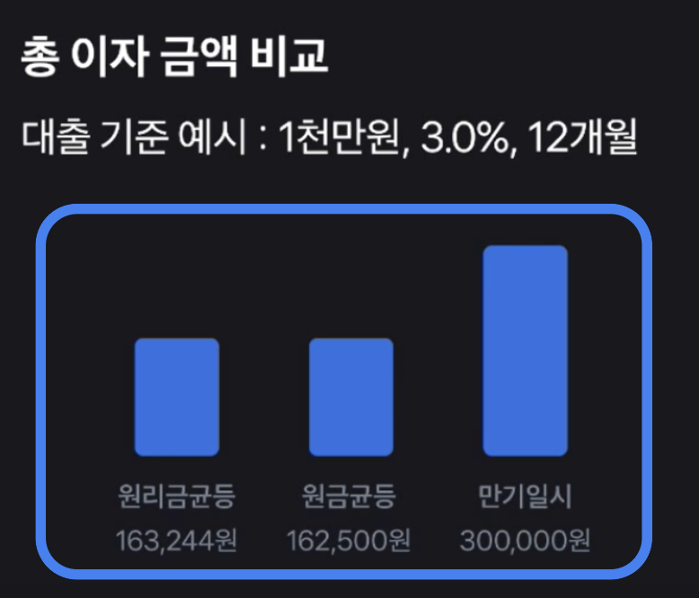

# 레이블 챙기기

사용자와 상호 작용을 하면서 텍스트 요소가 없는 경우, 레이블을 활용해 상호 작용할 요소가 어떤 것인지 설명해 주어야 스크린리더를 사용하는 사용자도 이해할 수 있어요.

레이블 활용 방법에 대한 자세한 내용은 [여기](../semantic/required-label.html)를 참고해 주세요.

## 1. 입력창

### 어떤 것을 입력해야 하는지 레이블에 추가해 주세요.


```js
<form>
  <h1>자세한 주소를 알려주세요</h1>
  <input type="text" />
  <input type="text" />
</form>
```

::: danger ❌ 레이블을 안쓰면 이렇게 들려요

입력창

:::

```js{4}
<form>
  <h1>자세한 주소를 알려주세요</h1>
  <input type="text" aria-label="주소" />
  <input type="text" aria-label="상세주소" />
</form>
```

::: info ✅ 레이블을 잘 쓰면 이렇게 들려요

**상세주소**, 입력창

:::

### 입력창이 여러 개라면, 각 영역을 구분해서 써주세요.


```html
<form>
  <h1>카드 정보를 확인해주세요</h1>
  <p>본인 명의의 카드만 결제가 가능해요</p>

  <div>
    카드번호
    <div>
      <input type="text" inputmode="numeric" maxlength="4" />
      <input type="text" inputmode="numeric" maxlength="4" />
      <input type="text" inputmode="numeric" maxlength="4" />
      <input type="text" inputmode="numeric" maxlength="4" />
    </div>
  </div>
</form>
```

::: danger ❌ 레이블을 안쓰면 이렇게 들려요

카드번호,
입력창, 입력창, 입력창, 입력창

:::

```html
<form>
  <h1>카드 정보를 확인해주세요</h1>
  <p>본인 명의의 카드만 결제가 가능해요</p>

  <fieldset>
    <legend>카드번호</legend>
    <div>
      <input
        type="text"
        inputmode="numeric"
        maxlength="4"
        aria-label="카드번호 첫번째 4자리"
      />
      <input
        type="text"
        inputmode="numeric"
        maxlength="4"
        aria-label="카드번호 두번째 4자리"
      />
      <input
        type="text"
        inputmode="numeric"
        maxlength="4"
        aria-label="카드번호 세번째 4자리"
      />
      <input
        type="text"
        inputmode="numeric"
        maxlength="4"
        aria-label="카드번호 네번째 4자리"
      />
    </div>
  </fieldset>
</form>
```

::: info ✅ 레이블을 잘 쓰면 이렇게 들려요

**카드번호**, 그룹<br />
**카드번호 첫번째 4자리**, 입력창<br />
**카드번호 두번째 4자리**, 입력창<br />
**카드번호 세번째 4자리**, 입력창<br />
**카드번호 네번째 4자리**, 입력창<br />

:::

## 2. 버튼

### **텍스트 없는 아이콘 버튼일 때** 어떤 동작을 하는지 설명해주세요.


```js
<div>
  <button>
    <SearchIcon />
  </button>
  <button>
    <SettingIcon />
  </button>
</div>
```

::: danger ❌ 레이블을 안쓰면 이렇게 들려요

버튼, 버튼

:::

```js{2,5}
<div>
  <button aria-label="검색">
    <SearchIcon />
  </button>
  <button aria-label="설정">
    <SettingIcon />
  </button>
</div>
```

::: info ✅ 레이블을 잘 쓰면 이렇게 들려요

**검색**, 버튼<br />
**설정**, 버튼

:::


```js
<div>
  <button>
    <LeftArrowIcon />
  </button>
  <span>8월</span>
  <button>
    <RightArrowIcon />
  </button>
</div>
```

::: danger ❌ 레이블을 안쓰면 이렇게 들려요

버튼, 8월, 버튼

:::

```tsx
<div>
  <button aria-label="지난 달">
    <LeftArrowIcon />
  </button>
  <span>8월</span>
  <button aria-label="다음 달">
    <RightArrowIcon />
  </button>
</div>
```

::: info ✅ 레이블을 잘 쓰면 이렇게 들려요

**지난 달**, 버튼<br />
8월<br />
**다음 달**, 버튼<br />

:::


```js
<div>
  <button>
    <CommentIcon />
    <span>{commentCount}</span>
  </button>
</div>
```

::: danger ❌ 레이블을 안쓰면 이렇게 들려요

**1** 버튼

:::

```js
<div>
  <button aria-label={`댓글 총 ${commentCount}개`}>
    <CommentIcon />
    <span>{commentCount}</span>
  </button>
</div>
```

::: info ✅ 레이블을 잘 쓰면 이렇게 들려요

**댓글 총 n개**, 버튼

:::

::: details _텍스트로 의미 전달이 충분히 되고 있다면 생략해도 돼요_

1. 텍스트 버튼일 때
   

2. 아이콘과 동일한 의미가 텍스트로 전달되고 있을 때
   

:::

## 3. 이미지

### 브랜드 로고

브랜드 로고가 서비스를 식별하기 위해 꼭 필요하고, 텍스트로 설명되고 있지 않을 때 레이블을 사용해야 해요.


::: danger ❌ 안 쓰면 이렇게 들려요

보험료 조회하면

보험료 조회하면

:::

::: info ✅ 레이블을 잘 쓰면 이렇게 들려요 어떤 로고인지 알려주세요

**캐롯손해보험** 보험료 조회하면

**KB손해보험** 보험료 조회하면

:::

로고명이 텍스트로 이미 적혀 있다면 레이블을 사용하지 않아도 돼요.


### 콘텐츠 이미지

콘텐츠를 구분하거나 선택하는 데 **사진이 핵심 정보**일 때 레이블을 사용해야 해요.


::: info ✅ 어떤 카드인지 알 수 있게 해주세요

**선물 상자 카드,** 버튼<br />
**다이아몬드 카드,** 버튼<br />
**복주머니 카드,** 버튼<br />
**하트 카드,** 버튼

:::

이미지가 단순 시각 보조이거나 장식 요소라면 레이블을 사용하지 않아도 돼요.


### 상품 이미지

텍스트만으로는 **어떤 상품인지 알 수 없을 때** 레이블을 사용해야 해요.


::: danger ❌ 안 쓰면 이렇게 들려요

4,700원, 아이스아메리카노 T
3,000원, 교환권

:::

::: info ✅ 어떤 상품인지 정확히 알 수 있게 해주세요

**스타벅스**, 4,700원, 아이스아메리카노 T
**CU**, 3,000원, 교환권

:::

텍스트에 상품명이 나와있을 때 레이블을 사용하지 않아도 돼요.


### 그래픽

텍스트 없이 그래픽으로만 정보를 전달하는 상황이라면 꼭 레이블을 작성해주세요.


::: danger ❌ 레이블을 안쓰면

어떤 변화가 일어나고 있는지 알 수 없어요

:::

::: info ✅ 레이블을 잘 쓰면 이렇게 들려요 

**상담원이 채팅을 입력중입니다**

:::



::: danger ❌ 레이블을 안쓰면

이 정보를 알 수 없어요.

:::

::: info ✅ 레이블을 잘 쓰면 이렇게 들려요

**원리금균등 163,244원, 원금균등 162,500원, 만기일시 300,000원,** 이미지

:::


::: danger ❌ 레이블을 안쓰면 이렇게 들려요

자산 연결 중, 자산 연결 완료

:::

::: info ✅ 레이블을 잘 쓰면 이렇게 들려요 어떤 단계까지 왔는지 알 수 있게 해주세요

**자산 연결 1단계 완료**

:::

## 4. 체크박스 / 라디오버튼 / 스위치

무엇을 선택하는지 적어주세요. 옆에 글자가 있더라도 해당 컴포넌트와 정확히 연결되지 않으면, 사용자는 이 컴포넌트가 어떤 의미인지 추측해야 하고 명확하게 이해하기 어려워요.


::: danger ❌ 레이블을 안쓰면 이렇게 들려요

선택됨, 체크박스

:::

::: info ✅ 레이블을 잘 쓰면 이렇게 들려요 

**필수 카드 결제 알림 받기 서비스 이용약관**, 선택됨, 체크박스

:::


::: danger ❌ 레이블을 안쓰면 이렇게 들려요

선택됨, 라디오버튼

:::

::: info ✅ 레이블을 잘 쓰면 이렇게 들려요

**토스뱅크 통장**, 선택됨, 라디오버튼

:::


::: danger ❌ 레이블을 안쓰면 이렇게 들려요

스위치, 켬, 끄거나 켜려면 이중 탭 하십시오.

:::

::: info ✅ 레이블을 잘 쓰면 이렇게 들려요

**주식 퀴즈 알림**, 스위치, 켬, 끄거나 켜려면 이중 탭 하십시오.

:::

\*_토글은 구현 방식에 따라 스크린리더에서 버튼처럼도, 스위치처럼도 읽힐 수 있어요. 접근성 표준에서는 ON/OFF 상태를 직관적으로 전달할 수 있는 스위치 역할(role=switch)을 권장해요._
