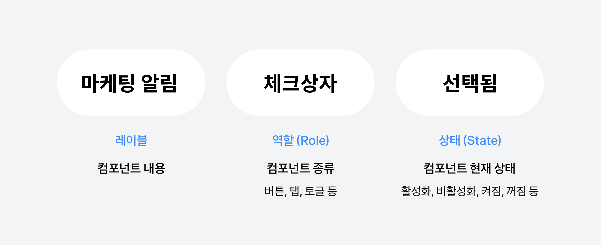

# 접근성 개발 입문하기

접근성 개발에 입문하러 오신 것을 환영해요. 접근성 개발 입문 가이드에서 다룰 기본 도구는 스크린 리더예요. 스크린 리더는 화면 속 요소와 정보를 음성으로 전달하는 보조 기술이에요.

접근성을 고려해 코드를 작성하려면 스크린 리더가 내용을 자연스럽게 읽도록 만드는 것이 중요해요. 이 가이드에서는 개발자가 스크린 리더 호환성을 확보하는 방법을 다뤄볼게요.

## 스크린 리더 이해하기

먼저 스크린 리더의 기본적인 역할과 구성을 이해해 볼게요. 스크린 리더의 3요소는 **역할, 레이블, 상태값** 이에요.

스크린 리더는 화면에 있는 요소를 다음 순서로 읽어요.

- **역할(Role)**: 요소가 어떤 종류인지 나타내요. (예: 버튼, 입력창, 스위치 등)
- **레이블(Label)**: 컴포넌트의 이름이에요. 어떤 기능인지 설명해요.
- **상태(State)**: 현재 상태를 알려줘요. (예: 활성화됨, 꺼짐, 선택됨 등)

예시로 살펴볼게요.



이 화면을 스크린 리더가 읽을 때는 다음 코드를 따라 읽어요.

```html
<div
  role="radio"
  tabindex="0"
  aria-checked="true"
  aria-label="마케팅 알림"
></div>
```

스크린 리더는 순서대로 이렇게 읽어요.

1. 마케팅 알림 **`레이블`**
2. 체크상자 **`역할`**
3. 선택됨 **`상태값`**
4. 설정을 끄거나 켜려면 이중탭 하십시오 **`자동설명`**

직접 들어보려면 아래 오디오를 재생해 보세요.

<audio src="./audios/a11y-audio.mp3" controls />
