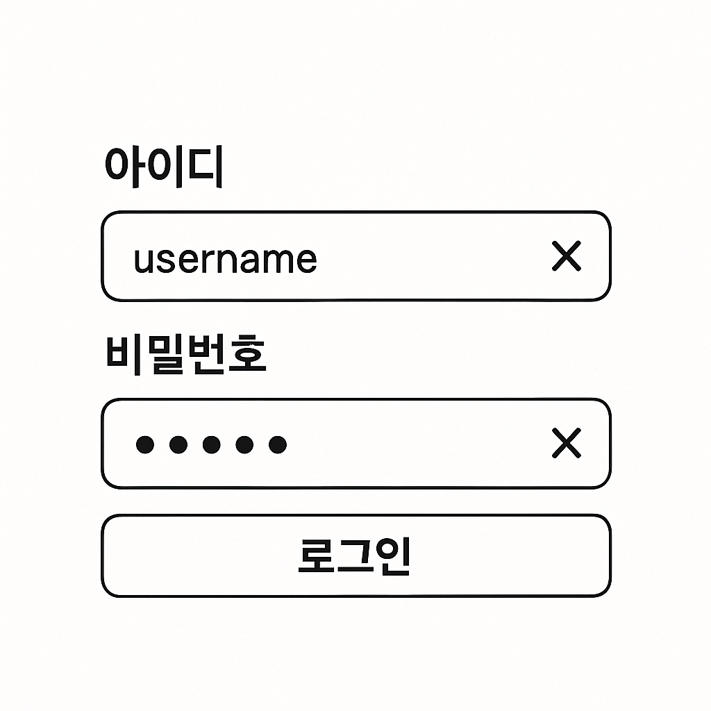

# 入力要素は`<form>`で包む

ユーザーは入力欄に内容を入力してEnterキーを押すとフォームが送信（submit）されることを期待します。この動作は`<form>`タグを正しく使えば、別途スクリプトなしで機能します。

さらに、ブラウザの自動補完（autocomplete）、入力履歴の保存、モバイルでの入力最適化といったブラウザ標準の機能も、`<form>`を通じて自然に提供されます。

::: info スクリーンリーダーのアクセシビリティの観点で`<form>`が重要な理由

- **役割（Role）の案内** : スクリーンリーダーは`<form>`要素に到達すると「フォーム、（名前があればその名前、）フォームの開始」のように、その領域がフォームであることを明確に案内します。フォームが終わる箇所では「フォームの終わり」や「フォーム終了」といった案内を行います。

- **高速なナビゲーション**: スクリーンリーダー利用者は、見出し・リンク・フォームなど意味のある構造単位へ素早く移動できます。`<form>`が明確にマークアップされていれば、ユーザーはショートカットキー（例：NVDAのf、JAWSのf）でフォーム領域だけを素早く探索できます。

- **文脈の提供**: 複数の入力要素がある場合、それらが1つのフォームに属しているという文脈をスクリーンリーダーが伝えます。たとえば「ログインフォーム」というラベルがあれば、ユーザーは今入力している情報がログインに関するものであることを容易に理解できます。

- **エラーや状態の案内**: フォーム送信時のエラーメッセージや必須入力の案内などもフォーム領域内で案内されるため、スクリーンリーダー利用者は全体の流れを逃さず情報を受け取れます。

次のコード例を参考にしてください。

```html
<form aria-label="ログイン">
  <label for="id">ID</label>
  <input id="id" name="id" type="text" />
  <label for="pw">パスワード</label>
  <input id="pw" name="pw" type="password" />
  <button type="submit">ログイン</button>
</form>
```

スクリーンリーダーはフォームに入ると「ログイン、フォーム、ID、編集、パスワード、編集、ログイン、ボタン、フォーム終了」のように案内します。
:::

## `<form>`を正しく使うには

- 入力要素（input、textarea など）は `<form>`要素で包みましょう。
- ユーザーがフォームを送信したときに特定のページへ送るのではなく、現在のページでリロードなしに動作させたい場合は、`onsubmit`で`event.preventDefault()`を呼びます。
- 送信ボタンは`<button type="submit">`で作成します。`<button>`のデフォルトタイプはsubmitなので、単なるクリック用ボタンには必ず`type="button"`を明示します。

次の例で、アクセシビリティを考慮した正しいフォームの書き方を見てみましょう。

```html
<form onsubmit="event.preventDefault(); /* 望む動作 */">
  <input type="text" name="username" />
  <input type="password" name="password" />
  <button type="submit">ログイン</button>
  <button type="button">キャンセル</button> {/* 単純な動作用のボタン */}
</form>
```

::: warning
`<form>`内の`<button>`はデフォルトでsubmit動作を行います。単なるクリックイベントだけが必要なボタンには、必ず`type="button"`を指定してください。
:::

## ボタンが`<form>`の外にある場合

実務では、submitボタンがフォーム本体から離れて配置されることがよくあります。この場合は`<button>`の`form`属性を使って`<form>`と関連付けられます。次のように`<form>`の`id`と結び付けてください。

```html
<form id="my-form" onsubmit="event.preventDefault(); /* 望む動作 */">
  <input type="text" name="search" />
</form>
<button type="submit" form="my-form">検索</button>
```

このようにすると、ボタンが`<form>`の外にあってもそのフォームを送信できます。

## 実戦例：ログインフォームを作る



実際によく使われるログインフォームのマークアップをしてみます。IDとパスワードの入力欄があり、送信できるログインボタンがあります。各入力欄には、値があるときだけ表示される削除ボタンがあります。

```html
<form onsubmit="event.preventDefault(); /* 望む動作 */">
  <label for="login-id">ID</label>
  <div>
    <input id="login-id" name="id" type="text" />
    <!-- 入力値があるときだけ表示される削除ボタン -->
    <button type="button" tabindex="{-1}" aria-label="ID の入力値を削除">
      ❌
    </button>
  </div>
  <label for="login-pw">パスワード</label>
  <div>
    <input id="login-pw" name="pw" type="password" />
    <!-- 入力値があるときだけ表示される削除ボタン -->
    <button type="button" tabindex="-1" aria-label="パスワードの入力値を削除">
      ❌
    </button>
  </div>
  <button type="submit">ログイン</button>
</form>
```

上のように記述すれば、`<form>`を使うことでEnterキーでもログイン動作を実行できます。また、削除ボタンには`tabindex="-1"`を指定してキーボードフォーカスを受けないようにしています。

::: info 入力値削除ボタンがキーボードユーザーに不要な理由？
削除ボタンは、キーボードユーザーが入力値を消すのに必須ではないため、フォーカスを受けないようにしました。テキストは`Backspace`キーで削除できるからです。
:::

このようにすると、キーボードユーザーも不要なフォーカス移動なしに、慣れ親しんだ方法でフォームを利用できます。フォームの基本動作とブラウザーのさまざまな機能を最大限に活用するために、入力要素の上位には必ず`<form>`を使ってください！
