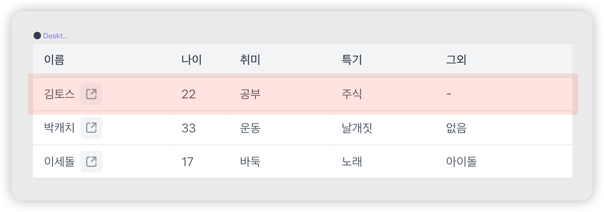

# テーブル行にクリックイベントハンドラーを付けない

テーブルUIで行全体をクリックして詳細ページへ遷移するパターンはよく使われます。ですが、これをアクセシブルに実装するにはいくつか重要な注意点があります。



## 問題：キーボードで選択できず、クリック可能であることが伝わらない

### 誤った例

開発者はしばしばテーブル行（`<tr>`）に直接クリックイベントを付け、行全体をクリック可能にしてしまいます。

```jsx
<tr onclick="location.assign('/detail/キムトス')">
  <td>
    キムトス <Icon />
  </td>
  <td>22</td>
  <td>勉強</td>
  <td>株式</td>
  <td>-</td>
</tr>
```

この方法には次のようなアクセシビリティの問題があります。

1. **キーボードアクセシビリティの不足**
   - テーブル行（`<tr>`）は既定でキーボードフォーカスを受けられず、キーボード利用者がアクセスできません。
   - キーボード利用者はこの行を選択したりクリックしたりする手段がありません。

2. **スクリーンリーダー利用者への情報不足**
   - 行がクリック可能であることがスクリーンリーダー利用者に伝わりません。
   - 行がどこへリンクしているかの情報がありません。

## ✅ 改善方法

行全体をクリック可能にしつつアクセシビリティを保つには、行内に実際のリンク要素を含め、CSSでリンクのヒット領域を拡張する方法が有効です。

```jsx
<style>
  .link::after {
    position: absolute;
    display: block;
    content: '';
    inset: 0;
  }
</style>

<tr style="position: relative;">
  <td>
    キムトス
    <IconLink
      label="자세히 보기"
      href="/detail/김토스"
      className="link"
    />
  </td>
  <td>22</td>
  <td>勉強</td>
  <td>株式</td>
  <td>-</td>
</tr>
```

このように改善すると次の利点があります。

1. **キーボードアクセスの提供**
   - リンク要素は既定でキーボードフォーカスを受けられるため、キーボード利用者もアクセス可能です。
   - Tabキーでリンクにフォーカスし、Enterキーでアクティブ化できます。

2. **スクリーンリーダー利用者への明確な情報提供**
   - リンク要素はスクリーンリーダーで「リンク」と認識され、クリック可能であることが伝わります。
   - `label`属性（実際には`aria-label`に変換）の利用で、リンクの目的を明確に伝えられます。

3. **마우스 사용자를 위한 편의성 유지**
   - ブラウザのリンク機能（新規タブで開く、リンクアドレスのコピーなど）をそのまま提供できます。
   - CSS`::after`疑似要素で行全体をクリック可能にし、マウス利用者の利便性を維持します。
   - 小さなリンク領域だけを狙ってクリックする不便を解消します。

4. **セマンティックなマークアップを遵守**
   - HTMLの意味論的構造を保ちつつアクセシビリティを向上させます。
   - リンクの目的を明確に表現できます。
