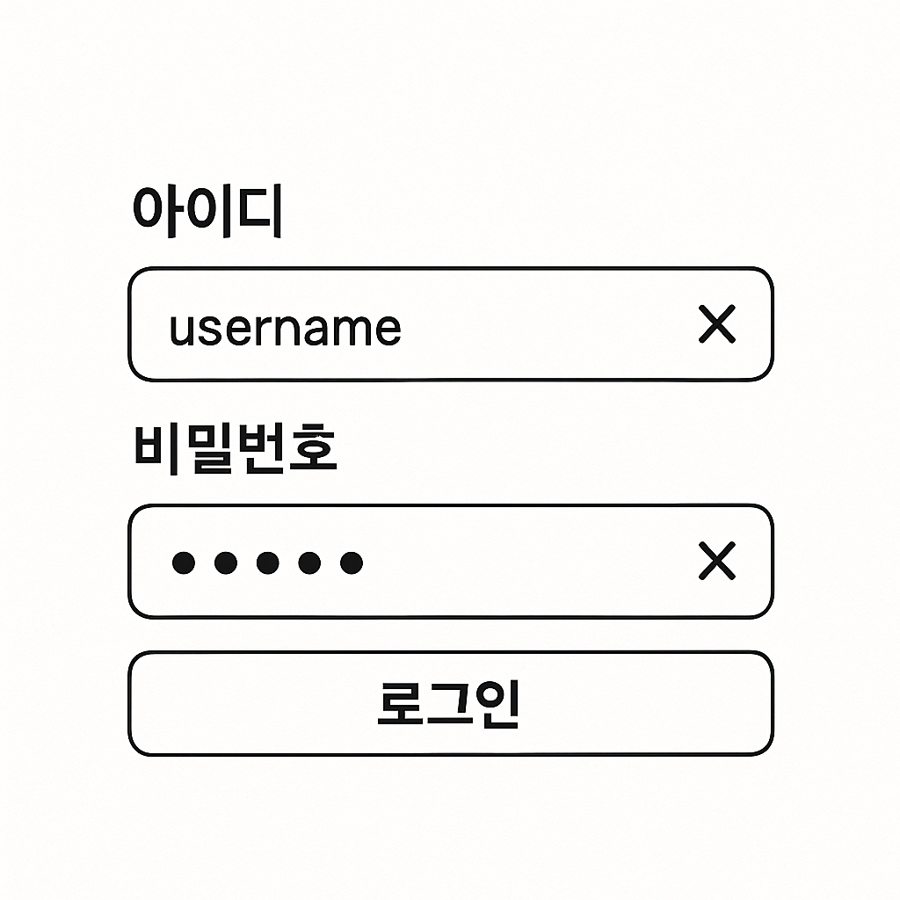

# 입력 요소는 `<form>` 으로 감싸야 해요.

사용자는 입력란에 내용을 입력하고 Enter 키를 눌렀을 때 폼이 제출(submit)되기를 기대해요. 이 동작은 `<form>` 태그를 올바르게 사용해야만 별도의 스크립트 없이 동작해요. 

뿐만 아니라, 브라우저의 자동완성(autocomplete), 입력 기록 저장, 모바일에서의 입력 최적화 같은 브라우저 기본 기능들도 `<form>` 을 통해 자연스럽게 제공돼요.

::: info `<form>` 사용이 스크린리더 접근성 측면에서 중요한 이유
- **역할(Role) 안내**: 스크린리더는 `<form>` 요소를 만나면 "폼, 폼의 이름(있다면), 폼의 시작"과 같이 해당 영역이 폼임을 사용자에게 명확하게 안내해요. 폼이 끝나는 지점에서는 "폼의 끝" 또는 "폼 종료"와 같은 안내를 해줘요.
- **빠른 탐색**: 스크린리더 사용자는 웹 페이지를 제목, 링크, 폼 등 의미 있는 구조 단위로 빠르게 이동할 수 있어요. `<form>`이 명확하게 마크업되어 있으면, 사용자는 단축키(예: NVDA의 f, JAWS의 f 등)로 폼 영역만 빠르게 탐색할 수 있어요.
- **맥락 제공**: 여러 입력 요소가 있을 때, 이들이 하나의 폼에 속해 있다는 맥락을 스크린리더가 전달해줘요. 예를 들어, "로그인 폼"이라는 레이블이 있다면, 사용자는 지금 입력하는 정보가 로그인과 관련된 것임을 쉽게 알 수 있어요.
- **에러 및 상태 안내**: 폼 제출 시 에러 메시지, 필수 입력 안내 등도 폼 영역 내에서 안내되기 때문에, 스크린리더 사용자는 전체적인 흐름을 놓치지 않고 정보를 받을 수 있어요.

다음 코드 예시를 참고해 보세요.

```html
<form aria-label="로그인">
  <label for="id">아이디</label>
  <input id="id" name="id" type="text" />
  <label for="pw">비밀번호</label>
  <input id="pw" name="pw" type="password" />
  <button type="submit">로그인</button>
</form>
```
스크린리더는 폼에 진입할 때 "로그인, 폼, 아이디, 편집, 비밀번호, 편집, 로그인, 버튼, 폼 종료" 와 같이 안내해줘요.
:::

## `<form>` 을 올바르게 사용하려면

- 입력 요소(input, textarea 등)를 `<form>` 요소로 감싸야 해요.
- 사용자가 폼을 제출했을 때 페이지 새로고침 없이 동작하게 하려면 `onSubmit`에서 `event.preventDefault()` 를 호출해야 해요.
- 제출 버튼은 `<button type="submit">`으로 만들어야 해요. `<button>`의 기본 타입은 submit이기 때문에, 단순 클릭용 버튼은 반드시 `type="button"`을 명시해야 해요.

다음 예제 코드로 접근성을 고려한 올바른 폼 작성법을 살펴보세요.

```jsx
<form onSubmit={e => { e.preventDefault(); /* 원하는 동작 */ }}>
  <input type="text" name="username" />
  <input type="password" name="password" />
  <button type="submit">로그인</button>
  <button type="button">취소</button> {/* 단순 동작용 버튼 */}
</form>
```

::: warning
`<form>` 안의 `<button>`은 기본적으로 submit 동작을 해요. 단순 클릭 이벤트만 필요한 버튼은 `type="button"`을 꼭 명시해야 해요.
:::

## 버튼이 `<form>` 바깥에 있을 때

실무에서는 submit 버튼이 폼과 떨어져 있는 경우가 종종 있어요. 이럴 때는 `<button>`에 `form` 속성을 사용해서 `<form>` 과 연결할 수 있어요. 다음과 같이 `<form>` 의 `id` 와 연결하면 돼요.

```jsx
<form id="my-form" onSubmit={e => e.preventDefault()}>
  <input type="text" name="search" />
</form>
<button type="submit" form="my-form">검색</button>
```

이렇게 하면 버튼이 `<form>` 바깥에 있어도 해당 폼을 submit할 수 있어요.

## 실전 예시: 로그인 폼 만들기



실제로 많이 쓰이는 로그인 폼의 마크업을 해볼게요. 아이디와 비밀번호 입력칸이 있고, submit을 할 수 있는 로그인 버튼이 있어요. 각 입력칸에 값이 있을 때만 보이는 삭제 버튼이 있어요.

```jsx
<form onSubmit={e => e.preventDefault()}>
  <label htmlFor="login-id">아이디</label>
  <div>
    <input id="login-id" name="id" type="text" />
    {/* 입력값이 있을 때만 보이는 삭제 버튼 */}
    <button
      type="button"
      tabIndex={-1}
      aria-label="아이디 입력값 삭제"
    >
      ❌
    </button>
  </div>
  <label htmlFor="login-pw">비밀번호</label>
  <div>
    <input id="login-pw" name="pw" type="password" />
    {/* 입력값이 있을 때만 보이는 삭제 버튼 */}
    <button
      type="button"
      tabIndex={-1}
      aria-label="비밀번호 입력값 삭제"
    >
      ❌
    </button>
  </div>
  <button type="submit">로그인</button>
</form>
```

위와 같이 작성하면 `<form>`을 사용해서 Enter 키로도 로그인 동작을 실행할 수 있어요. 또, 삭제 버튼은 `tabIndex={-1}`을 지정해서 키보드 포커스를 받지 않게 했어요.

::: info 입력값 삭제 버튼이 키보드 사용자에게 필요없는 이유?
삭제 버튼은 키보드 사용자가 입력값을 지우는 데 꼭 필요하지 않아서 포커스를 받지 않도록 했어요. 텍스트는 `Backspace` 키로 지울 수 있기 때문이에요.
:::

이렇게 하면 키보드 사용자도 불필요한 포커스 이동 없이, 익숙한 방식으로 폼을 사용할 수 있어요. 폼의 기본 동작과 브라우저의 다양한 기능을 최대한 활용하려면, 입력 요소 상위에는 꼭 `<form>`을 사용해 주세요!