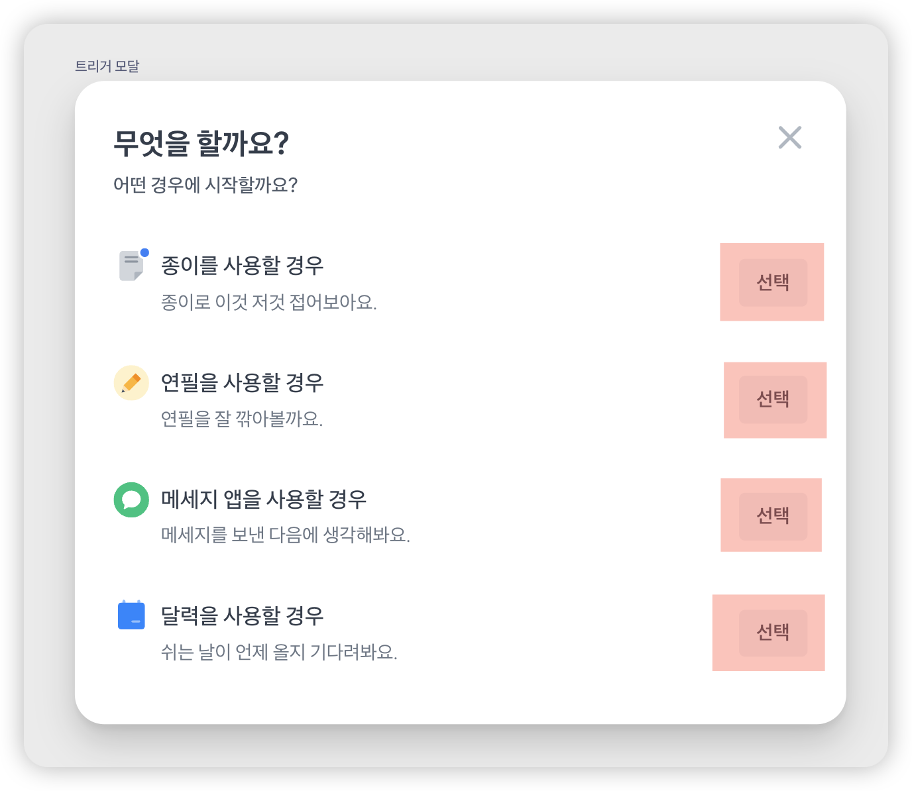

# 같은 이름의 요소에는 설명 추가하기

같은 이름의 버튼이 여러 번 등장할 때, 사용자(특히 스크린 리더 사용자)는 각각의 버튼이 어떤 항목과 연결되는지 알 수 있어야 해요. 

예를 들어 아래와 같은 구성에서 버튼 이름이 모두 "선택"이라면, 어떤 항목을 선택하는 버튼인지 알기 어렵기 때문에 **명확한 맥락을 함께 제공해야 해요.**



## 문제: 의미를 읽지 못하는 스크린 리더

### 잘못된 예시

다음 코드는 시각적으로는 문제가 없어 보이지만, 스크린 리더로 보면 버튼 두 개 모두 "선택, 버튼"이라고만 들려요. 그래서 사용자는 서로 다른 버튼이 어떤 항목과 연결됐는지 알 수 없어요.

```html 10,20
<div class="option-list">
  <div>
    <div>
      <div class="paper-icon">📄</div>
      <div>
        <div>종이를 사용할 경우</div>
        <div>종이로 이것 저것 적어보아요.</div>
      </div>
    </div>
    <button>선택</button>
  </div>
  <div>
    <div>
      <div class="pencil-icon">✏️</div>
      <div>
        <div>연필을 사용할 경우</div>
        <div>연필을 잘 깎아볼까요.</div>
      </div>
    </div>
    <button>선택</button>
  </div>
</div>
```

## ✅ 개선하기

### 1. `aria-label`로 버튼 설명 추가하기

`aria-label`은 시각적으로 보이지 않아도 스크린 리더가 읽을 수 있는 설명을 제공해요.

```html 10,20
<div class="option-list">
  <div>
    <div>
      <div class="paper-icon">📄</div>
      <div>
        <div>종이를 사용할 경우</div>
        <div>종이로 이것 저것 적어보아요.</div>
      </div>
    </div>
    <button aria-label="종이를 사용할 경우에 선택">선택</button>
  </div>
  <div>
    <div>
      <div class="pencil-icon">✏️</div>
      <div>
        <div>연필을 사용할 경우</div>
        <div>연필을 잘 깎아볼까요.</div>
      </div>
    </div>
    <button aria-label="연필을 사용할 경우에 선택">선택</button>
  </div>
</div>
```

::: warning `aria-label` 사용 시 주의할 점

`aria-label`을 사용하면 기존에 화면에 보이는 텍스트가 스크린 리더에 노출되지 않게 돼요. 따라서 버튼에 "선택"이라는 시각적 텍스트가 있는데, `aria-label="종이를 사용할 경우"`처럼 완전히 다른 문구로 대체해버리면 스크린 리더 사용자 입장에서는 "선택"이라는 단어를 전혀 듣지 못하게 돼요.

가능하면 **시각적 텍스트를 포함한 문장으로 `aria-label`을 작성**해 주세요. 예를 들어 "종이를 사용할 경우" 대신 "종이를 선택" 또는 "선택 - 연필"처럼요.
:::


### 2. 리스트 마크업과 레이블 연결하기

`<li>` 같은 리스트 마크업에 제목 역할의 텍스트를 `aria-labelledby`로 연결해, 항목별로 어떤 버튼인지 구분할 수 있도록 해요.

```html 2,10,12,20
<ul class="option-list">
  <li aria-labelledby="paper-title">
    <div>
      <div class="paper-icon">📄</div>
      <div>
        <div id="paper-title">종이를 사용할 경우</div>
        <div>종이로 이것 저것 적어보아요.</div>
      </div>
    </div>
    <button>선택</button>
  </li>
  <li aria-labelledby="pencil-title">
    <div>
      <div class="pencil-icon">✏️</div>
      <div>
        <div id="pencil-title">연필을 사용할 경우</div>
        <div>연필을 잘 깎아볼까요.</div>
      </div>
    </div>
    <button>선택</button>
  </li>
</ul>
```

첫번째 버튼을 스크린 리더에서 "선택, 버튼, 종이를 사용할 경우, 그룹 (4개 중 1번째)" 라고 읽게돼요.

::: warning 리스트 마크업 사용시 주의할 점
최신 스크린 리더는 리스트 요소의 이름까지 잘 읽어주지만, **하위 버전에서는 제대로 읽지 못할 수 있어요**. 다음 섹션에서 이를 해결하는 방법을 설명해요.
:::

### 3. 버튼에도 `aria-labelledby` 추가하기

앞서 2번과 같이 리스트 마크업을 사용하면서, 버튼에도 직접 설명을 연결하면 모든 스크린 리더에서 더 명확하게 작동해요.

```html 2,10,12,20
<ul class="option-list">
  <li aria-labelledby="paper-title">
    <div>
      <div class="paper-icon">📄</div>
      <div>
        <div id="paper-title">종이를 사용할 경우</div>
        <div>종이로 이것 저것 적어보아요.</div>
      </div>
    </div>
    <button id="paper-button" aria-labelledby="paper-title paper-button">선택</button>
  </li>
  <li aria-labelledby="pencil-title">
    <div>
      <div class="pencil-icon">✏️</div>
      <div>
        <div id="pencil-title">연필을 사용할 경우</div>
        <div>연필을 잘 깎아볼까요.</div>
      </div>
    </div>
    <button id="pencil-button" aria-labelledby="pencil-title pencil-button">선택</button>
  </li>
</ul>
```

`aria-labelledby`는 공백을 기준으로 여러 개의 요소 ID를 나열할 수 있어요. 여러 ID를 지정하면, 해당 요소들이 가진 **텍스트 콘텐츠를 순서대로 이어 붙여서** 스크린 리더가 읽어요.

예를 들어 아래 코드처럼 "종이를 사용할 경우"(paper-title)와 "선택"(paper-button)이 함께 읽혀
스크린 리더에서는 "종이를 사용할 경우 선택, 버튼"처럼 들리게 돼요.

```html
<button id="paper-button" aria-labelledby="paper-title paper-button">선택</button>
```

