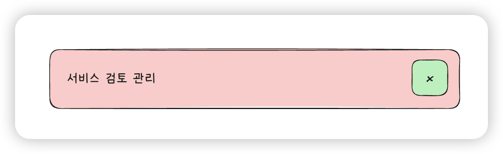

# 버튼 안에 버튼 넣지 않기

버튼이나 링크처럼 사용자가 상호작용하는 요소([interactive content](https://www.w3.org/TR/2011/WD-html5-20110405/content-models.html#interactive-content))는 HTML과 접근성(A11y) 기준에서 특별한 주의가 필요해요. 이 문서에서는 버튼 안에 또 다른 버튼이나 링크가 들어가면 왜 문제가 생기는지, 그리고 이를 어떻게 해결하면 좋을지 설명해요.

## 문제 1: 버튼처럼 보이는 링크

### 잘못된 예시

다음과 같이 `<a>` 태그 안에 `<button>` 을 출력하는 컴포넌트를 넣는 것은 잘못된 방법이에요. HTML에서는 상호작용하는 요소 안에 또 다른 상호작용 요소를 넣는 걸 허용하지 않기 때문이에요[^1]. 이런 구조에서는 접근성에 문제가 생기고, 브라우저에서 예측하지 못한 동작이 생길 수 있어요.

[^1]: <https://www.w3.org/TR/2011/WD-html5-20110405/text-level-semantics.html#the-a-element> 의 Content model 항목을 참고해 주세요.

```jsx
<a href="/go-to">
  <Button>확인했어요.</Button>
</a>
```

### ✅ 개선하기

Button 컴포넌트가 `<a>` 태그를 렌더링할 수 있도록 옵션을 제공하세요.

```jsx
<Button as="a" href="/go-to">
  확인했어요.
</Button>
```

## 문제 2: 버튼 안에 들어간 또 다른 버튼

UI 구성상 다음과 같이 버튼처럼 보이는 카드 안에 또 다른 버튼이 들어가야 할 때가 있어요. 이때 구조를 잘못 잡으면 접근성 문제가 생겨요.



### 잘못된 예시

버튼 안에 버튼을 중첩하고 `stopPropagation()` 을 사용하는 다음과 같은 방법은 피해야 해요. `stopPropagation()` 으로 이벤트 전파를 막으려고 해도, HTML 구조 자체가 잘못됐기 때문이에요. 이러한 중첩 구조는 스크린 리더에서 혼란을 줄 수 있고, 키보드 포커싱에 문제가 발생할 수 있어요.

```jsx
<button>
  서비스 검토 관리
  <button aria-label="삭제" onClick={(event) => event.stopPropagation()}>
    x
  </button>
</button>
```

### ✅ 개선하기

버튼 컨테이너와 하위 버튼을 구현할 때는 접근성과 HTML 표준을 준수하면서도 원하는 기능을 구현할 수 있습니다.

`div` 컨테이너와 절대 위치를 사용해서 다음과 같이 버튼을 레이어링 해보세요. 이 구조는 전체 영역을 가상의 버튼처럼 만들되, 시각적으로 보이지 않는 버튼(`상세보기`)을 위에 덮어둔 방식이에요. 삭제 버튼은 별도의 위치에 배치돼 있어 HTML 표준을 어기지 않아요.

```jsx
<div
  style="position: relative; isolation: isolate;"
  className="wrapper"
  role="listitem"
  aria-label="서비스 검토 관리"
>
  <button
    className="detail-button"
    style="position: absolute; inset: 0; opacity: 0"
  >
    상세보기
  </button>
  서비스 검토 관리
  <div style="position: relative; z-index: 2;">
    <button aria-label="삭제">x</button>
  </div>
</div>
```

::: tip 포커스 스타일도 같이 챙기기
위 예시에서 "상세보기" 버튼은 투명하게 설정되어 키보드 포커스가 갔을 때 포커스 표시가 보이지 않을 수 있어요. 부모 요소에 다음과 같이 CSS [`:focus-within` 의사클래스](https://developer.mozilla.org/ko/docs/Web/CSS/:focus-within)를 사용하면 자식 요소가 포커스를 받을 때도 스타일을 줄 수 있어요.

```css
.wrapper:focus-within {
  outline: 2px solid blue;
}
```

:::

## 이런 구조가 왜 문제가 될까요?

왜 버튼 안에 버튼을 넣으면 안 되는지 자세히 설명해 드릴게요.

### 접근성 관점에서의 문제

#### 1. 키보드 탐색이 혼란스러워요

스크린 리더나 키보드 사용자에게 어떤 버튼이 눌릴지 불분명해요. 외부 버튼 이벤트가 먼저 처리될지, 내부 버튼이 먼저일지 예측하기 어려워요.

#### 2. 스크린 리더가 잘못 읽을 수 있어요

스크린 리더가 "버튼 안에 또 다른 버튼"처럼 이상하게 읽어서 사용자가 혼란을 겪을 수 있어요.

#### 3. 포커스 순서가 꼬여요

포커스가 어디로 이동해야 하는지 애매해져서 사용자가 원하지 않는 동작을 할 수 있어요. 특히 모바일에서는 터치 시 의도치 않은 버튼이 눌릴 수 있어요.

### HTML 표준 관점에서의 문제

[W3C HTML5 명세](https://www.w3.org/TR/2011/WD-html5-author-20110809/the-a-element.html)에 따르면, `<a>` 요소는 content model로 transparent(사실상 아무거나)를 포함할 수 있지만, 상호작용 요소를 포함할 수 없습니다.

#### 상호작용 요소 목록

다음 요소들은 모두 상호작용 요소예요. 이 중 하나를 포함하는 요소 안에는 또 다른 상호작용 요소를 넣을 수 없어요.

| 요소         | 조건                                 |
| ------------ | ------------------------------------ |
| `<a>`        | -                                    |
| `<audio>`    | controls 속성이 있는 경우            |
| `<button>`   | -                                    |
| `<details>`  | -                                    |
| `<embed>`    | -                                    |
| `<iframe>`   | -                                    |
| ``      | usemap 속성이 있는 경우              |
| `<input>`    | type 속성이 Hidden state가 아닌 경우 |
| `<keygen>`   | -                                    |
| `<label>`    | -                                    |
| `<menu>`     | type 속성이 toolbar state인 경우     |
| `<object>`   | usemap 속성이 있는 경우              |
| `<select>`   | -                                    |
| `<textarea>` | -                                    |
| `<video>`    | controls 속성이 있는 경우            |
