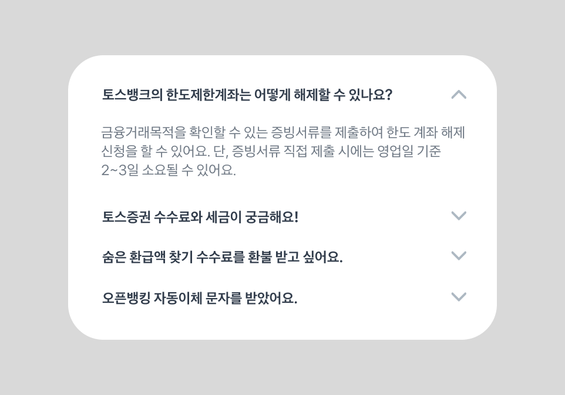

# 아코디언(Accordion)

아코디언은 정보를 공간을 절약해서 단계적으로 제공할 때 쓰는 컴포넌트예요.
스크린리더와 키보드 사용자가 **구조와 상태를 바로 이해하고 조작**하도록 구현하는 게 핵심이에요.  
아래 내용은 특히 `aria-expanded` 같은 상태 속성과 레이블 처리, 포커스 관리 등 실무에서 실수하기 쉬운 부분을 구체적으로 다뤄요.

---


## 이런 아코디언을 보여주려면 어떻게 구현해야 할까요?




```tsx
<div>
	<button>토스뱅크의 한도제한계좌는 어떻게 해제할 수 있나요?</button>
	<div>금융거래목적을 확인할 수 있는 증빙서류를 제출하여 한도 계좌 해제 신청을 할 수 있어요. 단, 증빙서류 직접 제출 시에는 영업일 기준 2~3일 소요될 수 있어요.</div>

	<button>토스증권 수수료와 세금이 궁금해요!</button>
  <div>토스증권에서 국내 주식 거래 시 수수료는 0.015%, 제세금은 0.20%가 부과됩니다.</div>
</div>
```

기본 구조에 핸들러를 추가하는 것만으로도 겉보기에는 아코디언을 위한 기본적인 기능이 구현된 것처럼 보여요. 그러나 실제 스크린리더는 사용자에게 정확한 정보를 전달하기 어려운 방식으로 전달하게 돼요.


::: ❌ 접근성을 챙기지 않으면 이렇게 들려요

토스뱅크의 한도제한계좌는 어떻게 해제할 수 있나요?, 버튼
금융거래목적을 확인할 수 있는 증빙서류를 제출하여 한도 계좌 해제 신청을 할 수 있어요. 단, 증빙서류 직접 제출 시에는 영업일 기준 2~3일 소요될 수 있어요.
토스증권 수수료와 세금이 궁금해요!, 버튼
토스증권에서 국내 주식 거래 시 수수료는 0.015%, 제세금은 0.20%가 부과됩니다.

:::

아코디언의 경우 각각의 개별적인 요소들로 이루어진 것이 아닌, 펼쳐짐/접힘 상태를 가진 하나의 그룹이에요.
때문에 어떤 요소가 현재 펼쳐져 있는지, 어떤 내용을 담고 있는지 사용자가 이해할 수 있어야 해요.

```tsx
<div>
	<button aria-expanded="true" aria-controls="panel-1">
    토스뱅크의 한도제한계좌는 어떻게 해제할 수 있나요?
  </button>
	<div id="panel-1" aria-labelledby="button-1">
    금융거래목적을 확인할 수 있는 증빙서류를 제출하여 한도 계좌 해제 신청을 할 수 있어요. 단, 증빙서류 직접 제출 시에는 영업일 기준 2~3일 소요될 수 있어요.
  </div>

	<button aria-expanded="false" aria-controls="panel-2">
    토스증권 수수료와 세금이 궁금해요!
  </button>
  <div id="panel-2" aria-labelledby="button-2" hidden>
    토스증권에서 국내 주식 거래 시 수수료는 0.015%, 제세금은 0.20%가 부과됩니다.
  </div>
</div>
```


::: ✅ 접근성을 챙기면 이렇게 들려요

토스뱅크의 한도제한계좌는 어떻게 해제할 수 있나요?, **버튼, 펼쳐짐**
금융거래목적을 확인할 수 있는 증빙서류를 제출하여 한도 계좌 해제 신청을 할 수 있어요. 단, 증빙서류 직접 제출 시에는 영업일 기준 2~3일 소요될 수 있어요.
토스증권 수수료와 세금이 궁금해요!, **버튼, 접힘**

:::


### 이런 것들을 챙겨야 해요

- 헤더는 **버튼**으로 구현해서 `aria-expanded`로 열림/닫힘 상태를 전달해요.
- 버튼의 `aria-controls`는 연관된 패널의 `id`로 연결해요.
- 패널에는 `role="region"`(선택)과 `aria-labelledby`로 버튼 id를 참조하면 문맥이 좋아요.
- 화면에 보이는 헤더 텍스트가 있다면 추가 `aria-label`은 보통 필요 없어요. 단, **아이콘만 있는 헤더**면 `aria-label`을 꼭 넣어주세요.
- 상태값(`aria-expanded`, `hidden`/`aria-hidden`)은 DOM에서 런타임으로 **동기적으로 업데이트**돼야 해요.


## aria-expanded와 hidden 동기화

```tsx
<div>
	<button aria-expanded="true" aria-controls="panel-1">배송 정보</button>
	<div id="panel-1" aria-labelledby="button-1">배송은 주문 후 2~3일 내 도착합니다.</div>
	
	<button aria-expanded="false" aria-controls="panel-2">교환·환불 안내</button>
	<div id="panel-2" aria-labelledby="button-2" hidden>교환 및 환불은 7일 이내 가능합니다.</div>
</div>
```

- 버튼의 `aria-expanded="true"` ↔ 대상 패널은 **`hidden` 속성이 없어야 함**
- 버튼의 `aria-expanded="false"` ↔ 대상 패널은 **`hidden` 상태여야 함**
- 사용자 이벤트(클릭/키보드) → 컴포넌트 상태 변경 → DOM에 `aria-expanded`와 `hidden` 동시에 반영


## 텍스트(레이블) 처리

- 헤더에 의미 있는 텍스트가 있으면 `aria-label` 이 필요하지 않아요.
- 아이콘만 있는 헤더, 또는 텍스트가 모호한 경우(예: "더보기")에는 `aria-label`로 문맥을 명확히 해요.
- 동적 숫자(예: 댓글 총 n개)는 `aria-label`에 포맷된 문자열로 넣어 스크린리더가 자연스럽게 읽게 해요.