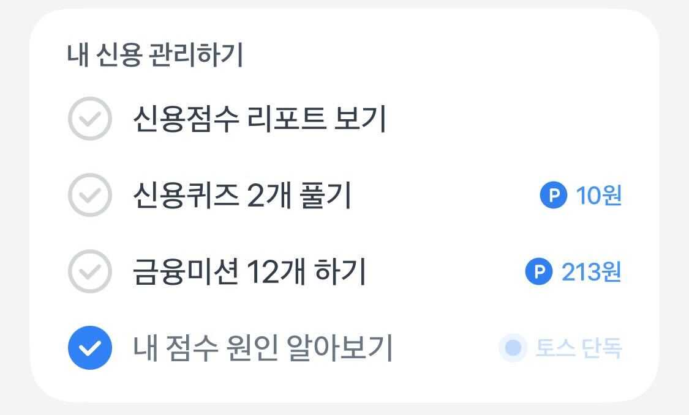

# 체크박스(Checkbox)

체크박스는 사용자가 여러 옵션 중에서 하나 이상을 선택할 수 있도록 하는 컴포넌트예요.

**선택 가능한 옵션들과 현재 선택 상태를 바로 이해하고 조작**할 수 있도록 구현하는 게 핵심이에요.

아래 내용은 특히 `aria-checked`, `role="checkbox"` 같은 상태 속성과 레이블 처리, 포커스 관리 등 실무에서 실수하기 쉬운 부분을 구체적으로 다뤄요.

## 이런 체크박스를 보여주려면 어떻게 구현해야 할까요?



이 코드는 `fieldset`과 `legend`를 사용하지 않아 체크박스들이 그룹으로 묶이지 않았고, `label`과 `input`이 연결되지 않아 스크린리더가 정확한 정보를 전달하지 못해요.

```tsx
<div>
  <div>
    <input type="radio" /> 이메일 수신 동의
  </div>
  <div>
    <input type="radio" /> 문자 수신 동의
  </div>
  <div>
    <input type="radio" /> 마케팅 수신 동의
  </div>
</div>
```

::: danger ❌ 접근성을 지키지 않으면 이렇게 들려요.

라디오<br />
이메일 수신 동의<br />
라디오<br />
문자 수신 동의<br />
라디오<br />
마케팅 수신 동의<br />

:::

체크박스의 경우 각각의 개별적인 요소들로 이루어진 것이 아닌, 선택 가능한 상태를 가진 하나의 그룹이에요.

때문에 어떤 옵션들이 선택되어 있는지, 어떤 내용을 담고 있는지 사용자가 이해할 수 있어야 해요.

`fieldset`과 `legend`로 체크박스 그룹을 묶고, 각 `input`과 `label`을 `id`와 `htmlFor`로 연결하여 접근성을 개선할 수 있어요.

```tsx
<fieldset aria-labelledby="consent-title">
  <legend id="consent-title">수신 동의 설정</legend>
  <div>
    <input type="checkbox" id="email" defaultChecked />
    <label htmlFor="email">이메일 수신 동의</label>
  </div>
  <div>
    <input type="checkbox" id="sms" />
    <label htmlFor="sms">문자 수신 동의</label>
  </div>
  <div>
    <input type="checkbox" id="marketing" />
    <label htmlFor="marketing">마케팅 수신 동의</label>
  </div>
</fieldset>
```

:::: info 예제 코드 해설

- `fieldset`/`legend`: 관련 체크박스들을 하나의 질문/그룹으로 묶어 목적을 알려요.
- `id`/`htmlFor`: 각 `input`과 `label`을 연결해 이름을 정확히 읽게 해요.
- `defaultChecked`: 초기 선택 상태를 표현해요.
  ::::

::: tip ✅ 접근성을 지키면 이렇게 들려요.

수신 동의 설정, **그룹**<br />
이메일 수신 동의, **체크박스**, **선택됨**<br />
문자 수신 동의, **체크박스**<br />
마케팅 수신 동의, **체크박스**<br />

:::

### input을 쓰지 않고 aria로만 구현해야 하는 경우엔 어떻게 해야할까요?

디자인적으로 기본 `<input type="checkbox">`를 사용할 수 없을 때는 `role="checkbox"`와 `aria-checked`를 사용해요.

핵심은 `role="checkbox"`, `aria-checked`, `tabIndex={0}`과 Space 키 처리예요.

특히, `tabIndex={0}`를 지정해 키보드나 스크린리더가 포커스할 수 있게 해야 해요, 또한 Space 키를 눌렀을 때 체크 상태가 전환되도록 `onKeyDown`에 핸들러를 등록해야 해요.

```tsx
const [checked, setChecked] = useState(false);

<div
  role="checkbox"
  aria-checked={checked}
  tabIndex={0}
  onClick={() => setChecked(!checked)}
  onKeyDown={(e) => {
    if (e.key === " ") {
      e.preventDefault();
      setChecked(!checked);
    }
  }}
>
  <span>커스텀 체크박스</span>
  {checked && <span>✓</span>}
</div>;
```

:::: info 예제 코드 해설

- `role="checkbox"`/`aria-checked`: 커스텀 요소를 체크박스로 인식시키고 상태를 전달해요.
- `tabIndex={0}`: 키보드 포커스를 받을 수 있게 해요.
- `Space` 키 처리: 키보드만으로도 상태를 토글할 수 있게 해요.
  ::::
