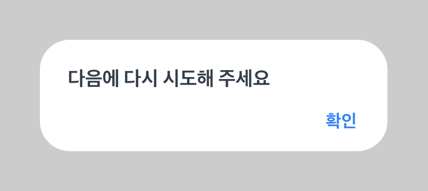

# 모달(Modal)

모달은 사용자의 주의를 끌어 중요한 정보나 작업을 처리할 때 사용하는 컴포넌트예요.

**모달의 존재와 내용을 인식하고, 모달 내부에서만 상호작용**할 수 있도록 구현하는 게 핵심이에요.

## 이런 모달을 보여주려면 어떻게 구현해야 할까요?



모달의 경우 일반적인 페이지 콘텐츠와 분리된 독립적인 영역이에요.

때문에 모달이 열렸다는 것을 사용자가 인식하고, 모달 내부에서만 상호작용할 수 있어야 해요.

겉보기에는 모달이 구성되어 있지만, `role="dialog"`와 `aria-modal` 속성이 없어 스크린리더가 모달을 인식하지 못해요.

```tsx
<div>
  <h3>다음에 다시 시도해 주세요</h3>
  <button onClick={closeModal}>확인</button>
</div>
```

:::: info 예제 코드 해설

- `role="dialog"`: 이 영역이 대화상자(모달)임을 알려요.
- `aria-modal="true"`: 모달이 떠 있는 동안 배경과의 상호작용을 차단해야 함을 나타내요.
- `aria-labelledby`/`aria-label`(추가 가능): 모달의 제목을 스크린리더에 전달해요.
  ::::

::: danger ❌ 접근성을 지키지 않으면 이렇게 들려요.

다음에 다시 시도해 주세요, 머리말<br />
확인, **버튼**<br />

:::

`role="dialog"`와 `aria-modal="true"`를 사용하여 모달을 명확히 표시할 수 있어요.

```tsx
<div role="dialog" aria-modal="true">
  <h3>다음에 다시 시도해 주세요</h3>
  <button onClick={closeModal}>확인</button>
</div>
```

::: tip ✅ 접근성을 지키면 이렇게 들려요.

제목은 한 줄로 써주세요, **대화상자**<br />
확인, **버튼**<br />

:::

### 체크리스트

- 모달은 `role="dialog"`와 `aria-modal="true"`로 구현해요.
- 모달 제목은 `aria-labelledby`로 연결하거나 `aria-label`로 제공해요.
- 모달이 열릴 때 포커스를 모달 내부로 이동시키고, 모달이 닫힐 때 원래 위치로 돌려보내요.
- `ESC` 키로 모달을 닫을 수 있도록 구현해요.
- 모달이 열려있는 동안 배경 콘텐츠와의 상호작용을 차단해요.

## role 속성으로 모달 컴포넌트 표현하기

`role="dialog"`는 모달이 대화상자 역할임을 나타내요.
`aria-modal="true"`는 모달이 열려있을 때 배경 콘텐츠와의 상호작용을 차단해야 함을 나타내요.

```tsx
<div role="dialog" aria-modal="true" aria-labelledby="modal-title">
  <h2 id="modal-title">제목은 한 줄로 써주세요</h2>
  <button onClick={closeModal}>확인</button>
</div>
```

::: tip ✅ role="dialog"와 aria-modal을 함께 사용하면 이런 이점이 있어요.

1. 스크린리더로 모달 인식이 가능해요
   - 모달이 대화상자임을 명확히 알려줘요
   - 모달 제목과 내용을 구분해서 읽어줘요
2. 포커스 관리가 자동화돼요
   - 모달이 열릴 때 자동으로 포커스가 모달로 이동해요
   - 모달이 닫힐 때 원래 위치로 포커스가 돌아가요
3. 배경 콘텐츠 차단이 가능해요
   - aria-modal="true"로 배경과의 상호작용을 차단해, 사용자가 모달에만 집중할 수 있어요

:::

## 포커스 트랩과 속성 관리 구현하기

모달을 접근 가능하게 만들려면 다음 네 가지를 구현해야 해요.

### 1. 포커스 저장과 복원

모달이 열릴 때 현재 포커스 위치를 저장하고, 닫힐 때 원래 위치로 돌려보내요.

`useRef`로 이전 포커스 위치를 저장하고, `useEffect`의 cleanup 함수에서 복원해요.

```tsx
const previousFocusRef = useRef(null);

useEffect(() => {
  if (!isOpen) return;

  // 모달 열릴 때 현재 포커스 저장
  previousFocusRef.current = document.activeElement;

  return () => {
    // 모달 닫힐 때 원래 위치로 포커스 복원
    previousFocusRef.current?.focus();
  };
}, [isOpen]);
```

### 2. ESC 키로 모달 닫기

사용자가 ESC 키를 눌렀을 때 모달이 닫히도록 해요.

`keydown` 이벤트 리스너를 등록하여 Escape 키 입력을 감지하고 모달을 닫아요.

```tsx
useEffect(() => {
  if (!isOpen) return;

  const handleEscape = (e: KeyboardEvent) => {
    if (e.key === "Escape") {
      onClose();
    }
  };

  document.addEventListener("keydown", handleEscape);
  return () => document.removeEventListener("keydown", handleEscape);
}, [isOpen, onClose]);
```

### 3. 배경 콘텐츠 숨기기 (aria-hidden)

모달이 열려있을 때 배경 콘텐츠가 스크린리더에 읽히지 않도록 해요.

배경 콘텐츠에 `aria-hidden="true"`를 설정하여 스크린리더가 해당 영역을 건너뛰도록 해요.

```tsx
useEffect(() => {
  const main = document.querySelector("main");

  if (isOpen) {
    main?.setAttribute("aria-hidden", "true");
  } else {
    main?.removeAttribute("aria-hidden");
  }

  return () => main?.removeAttribute("aria-hidden");
}, [isOpen]);
```

### 4. 스크롤 락

모달이 열려있을 때 배경 페이지가 스크롤되지 않도록 해요.

`document.body.style.overflow`를 `hidden`으로 설정하여 배경 스크롤을 막아요.

```tsx
useEffect(() => {
  if (isOpen) {
    document.body.style.overflow = "hidden";
  } else {
    document.body.style.overflow = "";
  }

  return () => {
    document.body.style.overflow = "";
  };
}, [isOpen]);
```

### 완성된 모달 컴포넌트

위의 모든 개념을 통합한 간단한 예제예요.

포커스 관리, ESC 키 처리, 배경 콘텐츠 숨기기, 스크롤 락을 모두 포함한 완성된 모달 컴포넌트예요.

```tsx
function Modal({ isOpen, onClose, children, title }) {
  const modalRef = useRef(null);
  const previousFocusRef = useRef(null);

  useEffect(() => {
    if (!isOpen) return;

    // 1. 포커스 저장 및 aria-hidden 설정
    previousFocusRef.current = document.activeElement;
    document.querySelector("main")?.setAttribute("aria-hidden", "true");
    document.body.style.overflow = "hidden";

    // 2. ESC 키 처리
    const handleEscape = (e: KeyboardEvent) => {
      if (e.key === "Escape") onClose();
    };
    document.addEventListener("keydown", handleEscape);

    return () => {
      // 3. 정리
      document.removeEventListener("keydown", handleEscape);
      document.querySelector("main")?.removeAttribute("aria-hidden");
      document.body.style.overflow = "";
      previousFocusRef.current?.focus();
    };
  }, [isOpen, onClose]);

  if (!isOpen) return null;

  return (
    <div
      role="dialog"
      aria-modal="true"
      aria-labelledby="modal-title"
      ref={modalRef}
    >
      <h2 id="modal-title">{title}</h2>
      <button onClick={onClose}>닫기</button>
      {children}
    </div>
  );
}
```

:::: info 예제 코드 해설

- 모달 열림 시: 이전 포커스 저장 → `aria-hidden="true"`로 배경 숨김 → body 스크롤 락.
- 모달 닫힘 시: 이벤트 정리 → 배경 `aria-hidden` 제거/스크롤 복원 → 저장한 포커스로 복귀.
- `role="dialog"`/`aria-modal`: 모달 영역과 배경 차단을 명시해요.
  ::::

### 핵심 요약

모달을 열 때 필요한 작업:

1. 현재 포커스 위치를 저장해요
2. 배경 콘텐츠에 `aria-hidden="true"`를 추가해요
3. 배경 스크롤을 막아요

모달을 닫을 때 필요한 작업:

1. 저장해둔 포커스 위치로 돌아가요
2. `aria-hidden`을 제거해요
3. 스크롤을 복원해요
