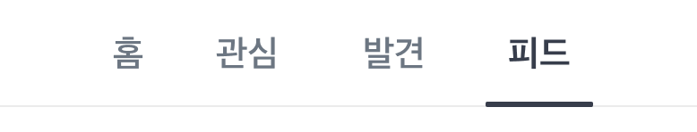
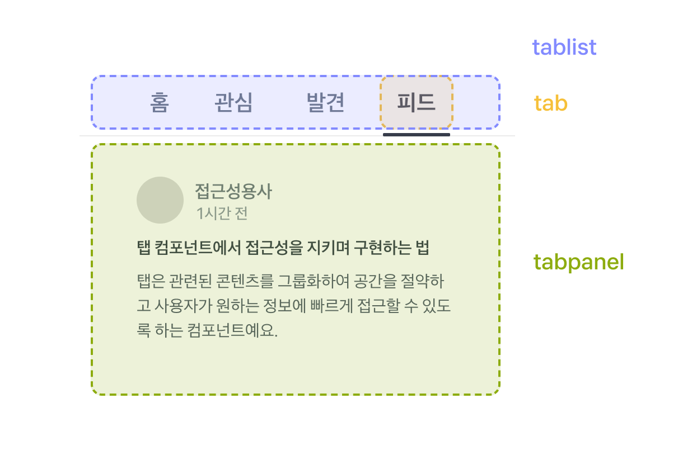

# 탭(Tab)

탭은 관련된 콘텐츠를 그룹화하여 공간을 절약하고 사용자가 원하는 정보에 빠르게 접근할 수 있도록 하는 컴포넌트예요.

스크린 리더와 키보드 사용자가 **탭 목록의 구조와 현재 활성 탭을 바로 이해하고 조작**하도록 구현하는 게 핵심이에요.

아래 내용은 특히 `aria-selected`, `role="tablist"` 와 `role="tab"` 의 차이 등 탭과 관련된 상태 속성을 다루는 법과 레이블 처리, 포커스 관리 등 실무에서 실수하기 쉬운 부분을 구체적으로 다뤄요.

## 예시: 스크린 리더가 잘 읽는 탭 만들기



```tsx
<div>
  <button>홈</button>
  <button>관심</button>
  <button>발견</button>
  <button>피드</button>
</div>
```

이 코드에서는 탭의 역할이나 구조를 알려주는 속성이 지정되지 않았어요. 겉보기에는 탭을 위한 기본적인 골격을 갖춘 것처럼 보이지만, 스크린 리더는 이를 명확하지 않은 정보로 전달하게 돼요.

::: danger ❌ 접근성을 챙기지 않으면 이렇게 들려요

홈, 버튼<br />
관심, 버튼<br />
발견, 버튼<br />
피드, 버튼<br />

:::

탭은 각각의 개별적인 버튼들로 이루어진 것이 아닌, 실제로는 어떤 탭이 선택됐는지를 함께 관리하는 하나의 그룹이에요.

따라서 탭이 어떤 그룹에 속해 있는지, 그리고 그 안에서 무엇이 선택되어 있는지를 사용자가 명확히 알 수 있어야 해요.

```tsx{1-2,5,8,11}
<div role="tablist" aria-label="메뉴">
  <button role="tab" aria-selected={false}>
    홈
  </button>
  <button role="tab" aria-selected={false}>
    관심
  </button>
  <button role="tab" aria-selected={false}>
    발견
  </button>
  <button role="tab" aria-selected={true}>
    피드
  </button>
</div>
```

::: tip ✅ 접근성을 지키면 이렇게 들려요
메뉴, **탭 목록**<br />
홈, **탭**<br />
관심, **탭**<br />
발견, **탭**<br />
피드, **선택됨**, **탭**<br />
:::

:::: info 예제 코드 해설

- `role="tablist"`: 탭 버튼들을 하나의 그룹으로 묶어 스크린 리더가 “탭 목록”으로 인식해요.
- `role="tab"`: 각 버튼이 탭임을 알려요.
- `aria-selected`: 현재 선택된 탭(`true`)과 선택되지 않은 탭(`false`)을 구분해요.
  ::::

### 체크리스트

- **역할:** 탭 목록은 `role="tablist"`로 감싸고, 각 탭은 `role="tab"`으로 구현해요.
- **상태:** 활성 탭에는 `aria-selected="true"`, 비활성 탭에는 `aria-selected="false"`를 설정해요.
- **레이블:** 화면에 보이는 탭 텍스트가 의미를 충분히 담고 있다면 추가 `aria-label`은 생략해도 돼요. 단, 아이콘만 있거나 텍스트가 모호할 경우엔 `aria-label`이 필요해요.

## role 속성으로 탭 컴포넌트 표현하기

탭을 구현하기 위해서는 **탭 버튼 영역**(사용자가 선택하는 버튼들)과 **탭 콘텐츠 영역**(선택된 탭에 맞는 콘텐츠) 두 영역이 일반적으로 필요해요.

각 영역을 `tablist`, `tab`, `tabpanel` 역할로 명확히 구분해주면 스크린 리더가 탭의 구조와 현재 선택 상태를 정확히 인식하고 전달할 수 있어요.



이제 각 역할이 담당하는 영역과 연결 방식, 그리고 역할을 올바르게 사용했을 때의 이점을 함께 살펴봐요.

### tablist와 tab 구분하기

```tsx
<div role="tablist" aria-label="메뉴">
  <button role="tab">홈</button>
  <button role="tab">관심</button>
  <button role="tab">발견</button>
  <button role="tab">피드</button>
</div>
```

`role="tablist"`는 탭들의 컨테이너 역할로, 여러 탭이 하나의 그룹임을 나타내요.
`role="tab"`은 개별 탭 요소로, 각각의 탭이 어떤 콘텐츠를 담당하는지 명시하는 역할이에요.

- 상태 정보를 제공해요.
  - tablist로 묶어주는 것만으로 현재 선택된 탭과 선택되지 않은 탭을 구분해서 읽어줘요.
- 스크린 리더로 효율적인 탐색이 가능해요.
  - 탭 그룹 전체를 한 번에 건너뛸 수 있어요.
  - 현재 활성화된 탭과 전체 탭 개수를 알려줘요.

### tabpanel

탭을 클릭하면 해당 탭과 관련된 콘텐츠가 보여야 해요. 이때 `role="tabpanel"`과 `aria-labelledby`를 사용하면 어떤 탭과 연결되어 있는지 명확히 알 수 있어요.

```tsx
<div role="tablist" aria-label="메뉴">
	<button role="tab" aria-selected={false} id="home-tab">홈</button>
	<button role="tab" aria-selected={false} id="interest-tab">관심</button>
	<button role="tab" aria-selected={false} id="discovery-tab">발견</button>
	<button role="tab" aria-selected={true} id="feed-tab" aria-controls="feed-panel">피드</button>
</div>
<ul role="tabpanel" id="feed-panel" aria-labelledby="feed-tab">
	<li>
		<h3>탭 컴포넌트에서 접근성을 지키며 구현하는 법</h3>
		<p>탭은 관련된 콘텐츠를 그룹화하여 공간을 절약하고 사용자가 원하는 정보에 빠르게 접근할 수 있도록 하는 컴포넌트예요.</p>
	</li>
</ul>
```

`role="tabpanel"`은 활성화된 탭의 콘텐츠가 담긴 영역이에요. tabpanel을 사용할 때는 `id`가 필수예요. 탭 버튼의 `aria-controls` 속성이 이 id를 참조해서 어떤 패널과 연결되어 있는지 알려주거든요.

또한 `aria-labelledby`를 추가할 수 있는데, 연결된 탭의 id를 참조해서 스크린 리더가 "피드 탭의 패널"처럼 명확하게 읽어줄 수 있어요.

이때, 비활성화된 탭의 패널은 `hidden` 속성으로 숨겨야 해요.
`aria-selected` 속성만으로는 스크린 리더가 비활성 탭의 패널과 구분하지 못하기 때문이에요. `hidden` 속성을 사용하지 않으면 스크린 리더가 모든 패널의 콘텐츠를 읽어버리게 돼요.

::: info 🔍 tabpanel을 사용하면 이런 이점이 있어요

tabpanel을 사용하면 탭과 해당 콘텐츠의 연결이 분명해져 스크린 리더가 "홈 탭의 패널"처럼 정확히 안내할 수 있고, 사용자는 어떤 콘텐츠가 어떤 탭에 속하는지 즉시 이해할 수 있어요.

또한 비활성 탭의 패널을 `hidden`으로 확실히 숨길 수 있어 불필요한 낭독을 막을 수 있으며, 화살표 키로 탭을 이동할 때 연결된 패널만 보여주도록 구현하기 쉬워져 키보드 네비게이션 경험도 자연스러워져요.

:::
