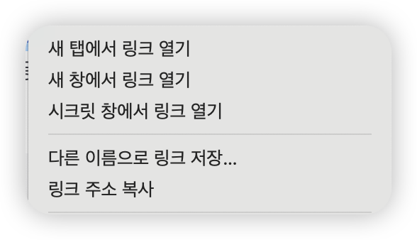

# 접근성을 지켜야 하는 이유

접근성을 지키면 장애인, 비장애인, 개발자 모두에게 효용이 있어요. 장애인 사용자는 스크린리더 같은 보조 기기를 통해 웹사이트를 원활하게 이용할 수 있고, 일반 사용자는 더 빠르고 편리한 웹 경험을 할 수 있어요. 또한 개발자는 더 견고하고 유지보수하기 쉬운 코드를 작성할 수 있어요.

## 장애인에게 필요한 이유

버튼의 색상, 아이콘 형태, 레이아웃 배치, 차트나 이미지 같은 웹 상의 시각적 정보를 볼 수 없는 사용자는 어떻게 웹사이트를 이용할까요? 바로 스크린리더 같은 보조 기기를 사용합니다. 이때, 올바른 역할(`role`), 레이블(`label`), 대체 텍스트(`alt`) 같은 접근성 속성이 제공되지 않으면 원하는 정보를 얻지 못하거나, 버튼·링크 같은 상호작용 요소를 놓쳐 웹사이트 사용에 큰 불편을 겪게 돼요.

예를 들어, 단순히 클릭 이벤트만 달아둔 `<div>` 는 스크린리더에서 버튼 요소로 인식되지 않아서 사용자가 해당 기능을 사용할 수 없어요.

## 일반 사용자에게도 유용한 이유

접근성을 지키면 장애가 없는 일반 사용자도 웹을 더 빠르고 편리하게 이용할 수 있어요. 익숙한 웹 동작이 자연스럽게 제공되기 때문이에요.

예를 들어, 링크(`<a>`)를 제대로 사용하면 마우스 오른쪽 버튼으로 '새 창에서 열기', '링크 복사'와 같은 동작을 할 수 있어요. 하지만 단순히 `<div>`나 `<span>`에 클릭 이벤트만 넣으면 이런 기본 기능을 사용할 수 없어요. 또, 폼을 만들 때 올바른 `<form>` 태그와 `<input>`, `<button type="submit">`을 사용하면 사용자가 Enter 키를 눌러 폼을 제출할 수 있어요. 하지만 그렇지 않으면 사용자는 익숙한 동작을 기대할 수 없어요.

또, 키보드를 주로 사용하는 사용자는 Tab 키와 Shift+Tab, Enter, Space, 방향키 등으로 웹사이트를 탐색해요. 버튼이나 링크, 폼 요소에 올바른 역할과 포커스가 지정되어 있지 않으면, 키보드로는 해당 기능을 사용할 수 없어요.

다음 이미지는 브라우저에서 링크를 우클릭했을 때 나타나는 컨텍스트 메뉴예요. 링크 요소를 제대로 사용하면 사용자가 기대하는 이런 기본적인 기능들을 모두 사용할 수 있어요.



이처럼 접근성은 장애인 사용자 뿐만 아니라 키보드를 사용하는 사용자, 그리고 일반적인 웹 경험을 기대하는 모든 사람들에게 불편함을 주지 않기 위해 꼭 지켜야 하는 기본 원칙이에요. 접근성을 고려하지 않으면 누구나 겪을 수 있는 불편함이 생길 수 있어요.

## 접근성을 지켰을 때 개발자가 얻는 효용

접근성을 잘 지키면 UI 테스트 코드에서 요소를 특정하기가 매우 쉬워져요. 예를 들어, [testing-library](https://testing-library.com/docs/dom-testing-library/intro)에서는 [`ByRole`](https://testing-library.com/docs/queries/byrole) 이라는 쿼리를 이용해 요소를 선택하는 것을 권장하고 있어요. 이 방법을 사용하면 버튼, 입력창, 링크 등 역할(role)이 명확하게 정의된 요소를 쉽게 찾을 수 있어요.

예를 들어, 다음과 같이 명확하게 "저장" 이라는 이름을 가진 "버튼" 을 선택할 수 있게 돼요.

```js
// 접근성을 잘 지킨 경우
render(<button>저장</button>);
expect(screen.getByRole("button", { name: "저장" })).toBeInTheDocument();
```

같은 이름을 가진 여러 요소가 있을 때도, 상위 요소의 접근성 레이블을 활용하면 구분도 쉽고, 사용자가 쉽게 선택할 수 있어요.

```js
// 같은 이름의 요소를 상위 접근성 역할 설정을 통해 특정 짓기
render(
  <ul>
    <li aria-labelledby="item1-title">
      <span id="item1-title">사과</span>
      <button>저장</button>
    </li>
    <li aria-labelledby="item2-title">
      <span id="item2-title">복숭아</span>
      <button>저장</button>
    </li>
  </ul>
);
const 복숭아 = screen.getByRole("listitem", { name: "복숭아" });
const 복숭아저장버튼 = within(복숭아).getByRole("button", { name: "저장" });
expect(복숭아저장버튼).toBeInTheDocument();
```

반면, `querySelector`를 사용해서 요소를 선택하면 마크업 구조가 조금만 바뀌어도 테스트가 쉽게 깨질 수 있어요. `ByTestId` 는 테스트를 위해 별도의 속성을 추가해야 하고, 이 값이 서비스 코드에 남는다는 단점이 있어요. 하지만 `ByRole`을 사용하면 실제 사용자와 동일한 방식으로 요소를 찾을 수 있고, 유일한 역할을 가진 요소를 쉽게 특정할 수 있어요. 이는 접근성을 잘 지킨 마크업 구조에서만 가능한 일이에요.

```js
// querySelector를 사용하는 경우 (마크업 구조가 바뀌면 깨질 수 있어요)
expect(
  document.querySelector("ul > li:nth-child(2) > button")
).toBeInTheDocument();

// getByTestId를 사용하는 경우 (테스트용 속성이 서비스 코드에 남아요)
render(<button data-testid="save-btn">저장</button>);
expect(screen.getByTestId("save-btn")).toBeInTheDocument();
```

즉, 접근성은 사용자 모두를 위한 것이면서, 개발자에게도 더 견고하고 유지보수하기 쉬운 코드를 만들 수 있게 도와줘요.
