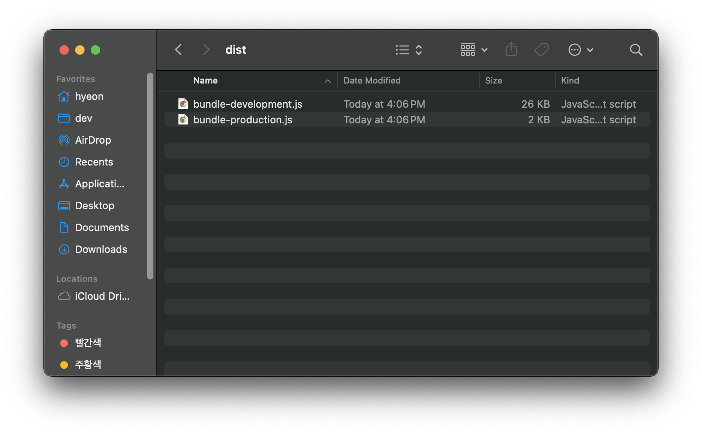

# 라이브러리 예제 코드로 번들링 이해하기

라이브러리를 만들 때 번들링 설정을 어떻게 해야 하는지 막막할 때가 많아요. 이 글에서는 간단한 JavaScript Math 유틸리티 라이브러리를 예제로 사용해서 번들링 설정을 하나씩 배워볼게요.

웹팩을 사용해서 번들링을 진행하고, 결과 파일을 Node.js 환경과 브라우저 환경에서 사용하는 방법까지 다뤄요.

## 1. 프로젝트 초기화

새 프로젝트를 위한 폴더를 만들고 번들링 도구 추가 등 초기 설정을 해요.

```bash
mkdir math-utils
cd math-utils
npm init -y
```

[`npm init`](https://docs.npmjs.com/cli/v8/commands/npm-init) 명령어를 실행하면 `package.json` 파일이 생성돼요. `package.json`은 프로젝트의 설정과 의존성을 관리해줘요.


이제 번들링 도구로 사용할 [웹팩](/reference/overview)을 설치해요.

```bash
npm install webpack webpack-cli --save-dev
```

`webpack-cli`는 웹팩을 터미널에서 명령어로 실행할 수 있도록 도와줘요.

## 2. 예제 파일의 src 옮겨오기

[JavaScript Math 유틸리티 라이브러리 예제](https://github.com/toss/frontend-fundamentals/blob/main/public/files/bundling-example.zip)를 다운로드하고 압축을 풀어주세요.  
`math-utils` 디렉토리 안에 `src` 폴더를 만든 다음, 압축을 푼 예제에서 `index.js`, `clamp.js`, `inRange.js` 등의 JavaScript 파일을 `src` 폴더로 옮겨주세요.

다음과 같은 구조로 만들면 돼요.

```plaintext
math-utils/
├── src/
│   └── index.js
│   └── clamp.js
│   └── inRange.js
│   └── ...
├── package.json
```


`index.js`는 라이브러리의 진입점(entry) 역할을 하는 파일이고, `clamp.js`, `inRange.js` 같은 파일에는 각각 유틸리티 함수가 들어 있어요.

## 3. 웹팩 설정하기

웹팩을 사용하려면 설정 파일이 필요해요. 프로젝트 루트에 다음과 같이 `webpack.config.js` 파일을 만들어 주세요.

```javascript
const path = require("path");

module.exports = {
  entry: "./src/index.js", // 번들링 시작 파일
  output: {
    path: path.resolve(__dirname, "dist"), // 번들 결과물이 저장될 경로
    filename: "bundle.js", // 번들 결과물 파일 이름
    library: "MathUtils", // 전역에서 접근할 라이브러리 이름
    libraryTarget: "umd", // UMD 형식으로 번들링
    globalObject: "this", // Node.js 환경과 브라우저 환경에서 모두 동작하도록 설정
  },
  mode: "production", // 웹팩 최적화 기능 활성화
};
```

- `libraryTarget`: `"umd"`를 사용하면 Node.js, 브라우저 등 환경에 관계없이 라이브러리를 사용할 수 있어요.
- `globalObject`: `"this"` 설정을 추가하면 브라우저에서는 `window`, Node.js 환경에서는 `global`을 사용해요.

웹팩 설정에 사용할 수 있는 옵션의 역할과 사용법에 대한 자세한 내용은 [웹팩 공식 문서](https://webpack.kr/configuration/)에서 확인해 보세요.

## 4. 빌드하고 사용해보기

이제 다음 커맨드로 웹팩을 실행해서 코드를 번들링해 볼 거예요.

```bash
npx webpack
```

커맨드를 실행하면 `dist` 폴더가 생성되고, 그 안에 `bundle.js` 파일이 만들어져요. 이 파일은 우리가 만든 유틸리티 함수들을 하나로 묶은 번들 파일이에요.

다음 이미지를 클릭해서 보면 `src` 폴더 아래에 있던 여러 파일들이 하나의 파일로 합쳐져 번들링 된 결과를 볼 수 있을 거예요.


이제 우리가 번들링한 `MathUtils`의 유틸 함수들을 Node.js 환경과 브라우저 환경에서 사용할 수 있는지 확인해 볼게요.

n부터 m까지의 랜덤한 정수를 리턴하는 `randomInt(n, m)`, 배열의 전체 수의 합을 구하는 `sum([n, m, ...])`, 배열의 수 중 중간값을 구하는 `median([n, m, ...])`을 사용해 볼게요.

### Node.js 환경에서 사용할 때

번들 파일을 `require`로 불러와 사용합니다.

```javascript
const { randomInt, sum, median } = require("./dist/bundle.js");
// 혹은 아래처럼 전체 utils 함수들을 `MathUtils`라는 이름으로 불러올 수 있어요
// const MathUtils = require("./dist/bundle.js");

console.log(randomInt(0, 10)); // 3 (0부터 10까지 정수 중 랜덤한 정수를 리턴해요)
console.log(sum([1, 2, 3, 4, 5])); // 15 (배열의 전체 수의 합을 구해요)
console.log(median([1, 2, 3, 4])); // 2.5 (배열의 수 중 중간값을 구해요)
```

### 브라우저에서 사용할 때

HTML 파일에서 `<script>` 태그로 번들 파일을 추가하면 전역 객체(`MathUtils`)에서 유틸리티 함수를 사용할 수 있어요.

```html
<script src="./dist/bundle.js"></script>
<script>
  console.log(MathUtils.randomInt(0, 10)); // 3 (0부터 10까지 정수 중 랜덤한 정수를 리턴해요)
  console.log(MathUtils.sum([1, 2, 3, 4, 5])); // 15 (배열의 전체 수의 합을 구해요)
  console.log(MathUtils.median([1, 2, 3, 4])); // 2.5 (배열의 수 중 중간값을 구해요)
</script>
```

## 5. 번들 파일 최적화하기

이번에는 번들링한 파일을 최적화까지 해볼게요.

번들링한 파일을 최적화해서 로딩 속도를 개선할 수 있어요.  
번들 크기가 커지면 브라우저에서 로드하는 데 시간이 오래 걸릴 수 있기 때문에, 불필요한 코드를 제거하고 압축하는 등 파일 크기를 줄이는 것이 중요해요.

번들을 최적화하는 대표적인 방법으로 트리 셰이킹과 코드 스플리팅이 있어요.

각 방법에 대한 자세한 내용은 [번들 파일 최적화](./reference/optimization/overview) 문서에서 확인하세요.

### `webpack.config.js`의 `mode` 설정하기

앞에서 설정했던 `webpack.config.js` 파일이에요. 여기서는 `production` 값을 넣어서 최적화 해볼게요.

```javascript
const path = require("path");

module.exports = {
  // ... webpack.config.js 설정들

  mode: "production", // 웹팩 최적화 기능 활성화
};
```

`mode` 옵션을 기본값인 `production`으로 설정하면 최소화, 코드 스플리팅, 트리셰이킹 등 웹팩에서 기본적으로 제공하는 최적화 기능을 사용할 수 있어요. `mode`를 `development`나 `none`으로 설정하면 최적화 기능을 사용하지 않아요.

다음 섹션에서 결과를 함께 확인해 볼게요.

### `development`와 `production` 비교하기

아래와 같이 `mode`를 `development`로 설정하고 웹팩을 실행하고 위 `production`일 때 결과와 비교해 볼게요.

```javascript
const path = require("path");

module.exports = {
  // ... webpack.config.js 설정들

  mode: "development", // 웹팩 최적화 기능 비활성화
};
```

#### 1. 번들 결과 비교하기


`development`로 번들링한 `bundle-development.js` 파일은 코드가 난독화나 최소화 되지 않아 **읽을 수 있는 형태이고 주석이 남아있어요.**

`production`으로 번들링한 `bundle-production.js` 파일은 읽기 힘들게 코드가 **난독화 및 최소화 되어있어요.**

#### 2. 번들 파일 크기 비교하기



`bundle-development.js` 파일은 26KB, `bundle-production.js` 파일은 2KB로 크기가 **열 배 이상** 차이나는 걸 확인할 수 있어요.

`math-util`은 최적화하기 전에도 굉장히 작은 사이즈라 로딩 속도에서 큰 차이를 느끼지 못할 수도 있지만, 만약 React 기반의 프로젝트나 [es-toolkit](https://github.com/toss/es-toolkit)같은 거대한 사이즈의 라이브러리의 번들 파일을 최적화를 하지 않는다면 로딩이 길어지는 문제가 발생할 수 있어요.
