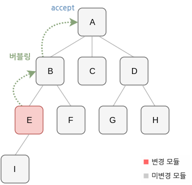

# HMR

HMR(Hot Module Replacement)은 프론트엔드 개발에서 변경된 코드 조각만 런타임에서 동적으로 교체하는 기능이에요. HMR이 적용되어 있다면 페이지를 새로고침하지 않고도 코드 수정 사항이 즉시 반영돼요. 

번들러는 코드의 수정 사항을 탐지해 변경된 모듈만 다시 번들링하고, 이를 브라우저에 알려요. 브라우저는 런타임에서 새로운 모듈을 요청해서 교체하고 화면을 업데이트할 수 있어요.

:::info Live Reload
HMR을 사용하지 않아도 웹팩 개발 서버를 사용하면 Live Reload 기능이 활성화돼요. Live Reload는 변경된 파일을 감지한 뒤, 브라우저를 새로고침해서 화면을 업데이트해요. 하지만 새로고침이 발생할 때 애플리케이션 상태가 초기화된다는 단점이 있어요. HMR은 이 문제를 해결해 상태를 유지하면서 화면을 업데이트할 수 있어요.
:::

## HMR의 동작 원리

### 1. 파일 변경 감지 및 번들링

HMR이 활성화되면 웹팩의 `watch` 기능이 변경된 파일을 감지해요. 감지된 파일은 다시 컴파일되고, 메모리에 저장된 번들로 생성돼요. 그런 다음 변경된 파일의 정보를 웹소켓으로 브라우저에 전달해요.

### 2. 브라우저에서 변경된 모듈 요청

브라우저는 웹소켓으로 받은 정보를 바탕으로 변경된 모듈을 서버에 요청하고 런타임에서 해당 모듈을 교체해요.

### 3. 런타임에서 변경 내용 반영

모듈이 교체되었지만 교체된 내용을 화면에 다시 그리는 작업도 필요해요. 런타임에서 동작을 구현하기 위해서는 [HMR API](https://webpack.kr/api/hot-module-replacement/)을 사용해요.

#### 이벤트 전파

[HMR API](https://webpack.kr/api/hot-module-replacement/)를 활용하면 실제로 더 복잡한 흐름 제어를 해줄 수 있어요. 하지만 문서에서는 간단한 원리만 알아볼게요.

특정 모듈이 업데이트 되면 해당 모듈에서 부터 이벤트가 버블링으로 전파돼요. 전파 과정에서 `accept`메서드의 핸들러를 통해서 렌더링 이벤트를 다시 호출해서 렌더링을 처리해줄 수 있어요.

<figure>

<figcaption style="font-size: 14px;opacity: 0.8;">
(출처: <a target="_blank" href="https://yoiyoy.gitbooks.io/dev/content/hot-module-replacement.html">https://yoiyoy.gitbooks.io/dev/content/hot-module-replacement.html</a>)
</figcaption>
</figure>

간단한 예시를 보여줄게요. `index.ts`에서는 화면을 렌더링하는 로직이 있고, `content.ts`에는 렌더링할 텍스트를 가져오는 로직이 있어요.

```typescript
// index.ts
import { getContent } from "./content.ts";
const root = document.getElementById("root");

export function render() {
  root.innerHTML = getContent();
}

// content.ts
export const getContent = () => "Hello World";
```

위 코드에서 `getContent`를 수정하면 이벤트를 받아주는 accept 핸들러가 없기 때문에 브라우저가 새로고침돼요.

## 사용하기

### 기본 설정

`webpack-dev-server`를 사용하는 경우, `devServer.hot` 옵션을 `true`로 설정하면 바로 HMR을 사용할 수 있어요. 별도의 추가 설정은 필요하지 않아요.

```javascript
// webpack.config.js
module.exports = {
  devServer: {
    hot: true, // HMR 활성화
  },
};
```

### 수동으로 HMR 적용하기

다음처럼 `module.hot.accept`를 사용해서 변경된 모듈만 교체하면서 전체 페이지를 새로고침하지 않고 업데이트할 수 있어요.

```typescript
// index.ts
import { getContent } from "./content.ts";
const root = document.getElementById("root");

export function render() {
  root.innerHTML = getContent();
}

if (module.hot) {
  module.hot.accept("./content.ts", () => {
    render();
  });
}
```

이렇게 `module.hot.accept`메서드의 첫 번째 인자에 처리할 모듈의 경로를 전달하고(반드시 `import`(혹은 `require`)하는 주소와 같게 해줘요) 두번째 인자에 핸들러를 등록해요.

이제 `getContent` 함수를 수정하면 새로고침 없이 화면이 새롭게 렌더링돼요.

## 리액트에서 HMR 활용

앞서 살펴본 것 처럼 HMR을 사용한다고 해서 마법처럼 화면을 새롭게 그려주지는 않아요. 그렇다면 리액트와 같이 복잡한 렌더링 로직을 가진 라이브러리는 어떻게 HMR을 통해서 렌더링 할 수 있을까요? 아마 엄청나게 복잡한 구현이 필요할 거예요.

바로 적용 가능한 방법은 [`react-refresh`](https://www.npmjs.com/package/react-refresh)와 [`react-refresh-webpack-plugin`](https://github.com/pmmmwh/react-refresh-webpack-plugin)와 같은 패키지를 사용하는 거예요. `react-refresh`는 리액트에서 공식적으로 제공해주고 있어요.
