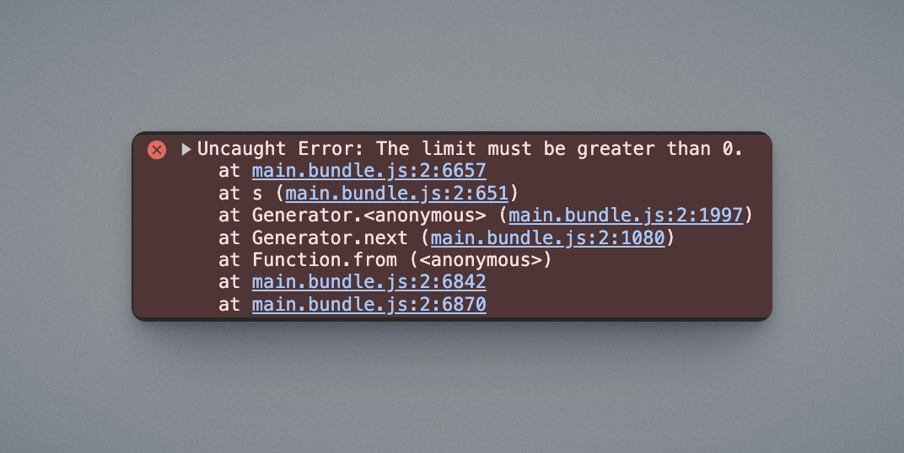
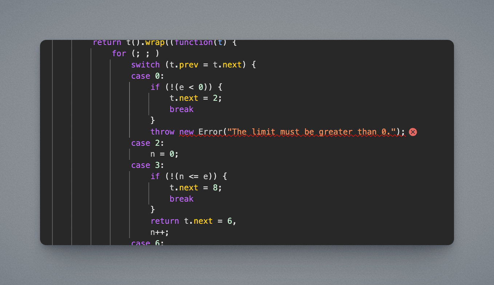
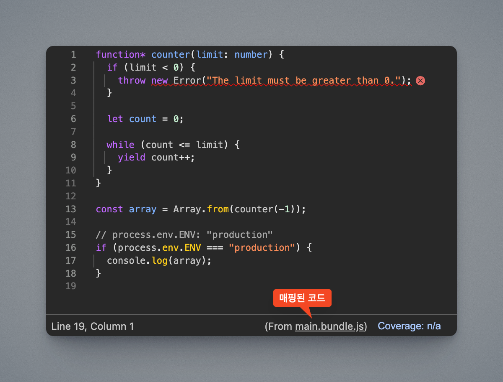

# 소스맵

소스맵(Source Map)은 번들링으로 만들어진 번들 코드와 소스 코드 간의 위치를 매핑해서, 번들 코드에서 소스 코드의 위치를 쉽게 파악할 수 있도록 도와줘요.

## 소스맵이 필요한 이유

소스맵이 없으면 브라우저에서는 번들된 코드만 보이기 때문에, 오류가 발생했을 때 원본 코드의 어느 부분에서 문제가 생겼는지 파악하기 어려워요.
코드가 난독화되어 있거나 여러 개의 파일이 하나로 합쳐져 있다면 디버깅이 훨씬 복잡해질 수 있어요. 소스맵이 어떻게 도움이 되는지 예시 코드와 함께 자세히 살펴볼게요.

### 코드의 변화

코드를 번들링하는 과정에서는 다양한 처리를 거쳐 소스 코드의 원래 형태가 크게 달라져요.

간단한 예로, 아래처럼 제너레이터와 환경 변수를 사용하는 코드가 있어요. 이 코드가 어떻게 변환되는지 확인해볼게요.

```ts
function* counter(limit: number) {
  if (limit < 0) {
    throw new Error("The limit must be greater than 0.");
  }

  let count = 0;

  while (count <= limit) {
    yield count++;
  }
}

const array = [...counter(5)];

// process.env.ENV: "production"
if (process.env.ENV === "production") {
  console.log(array);
}
```

바벨(Babel)을 사용해 타입스크립트 구문을 제거하고, `DefinePlugin`을 사용해 `process.env.ENV`를 치환해서 `true`로 평가된 값을 넣은 후, 스코프를 제한하기 위해 IIFE(즉시실행함수)로 감싸요.

::: details 코드보기

```js
/******/ (() => {
  // webpackBootstrap
  function* counter(limit) {
    if (limit < 0) {
      throw new Error("The limit must be greater than 0.");
    }
    let count = 0;
    while (count <= limit) {
      yield count++;
    }
  }
  const array = [...counter(5)];

  // process.env.ENV: "production"
  if (true) {
    console.log(array);
  }
  /******/
})();
```

:::

만약 바벨에서 `targets` 옵션을 설정하지 않았다면 브라우저 호환성을 위해 코드를 ES5 수준으로 변환해요. 이 과정에서 제너레이터는 `_regeneratorRuntime` 함수를 사용하는 코드로 바뀌어요.

::: details 코드보기

```js
/******/ (() => {
  // webpackBootstrap
  function _regeneratorRuntime() {
    /** _regeneratorRuntime Implementation */
  }
  var _marked = /*#__PURE__*/ _regeneratorRuntime().mark(counter);
  function counter(limit) {
    var count;
    return _regeneratorRuntime().wrap(function counter$(_context) {
      while (1)
        switch ((_context.prev = _context.next)) {
          case 0:
            if (!(limit < 0)) {
              _context.next = 2;
              break;
            }
            throw new Error("The limit must be greater than 0.");
          case 2:
            count = 0;
          case 3:
            if (!(count <= limit)) {
              _context.next = 8;
              break;
            }
            _context.next = 6;
            return count++;
          case 6:
            _context.next = 3;
            break;
          case 8:
          case "end":
            return _context.stop();
        }
    }, _marked);
  }
  var array = [].concat(counter(5));
  if (true) {
    console.log(array);
  }
  /******/
})();
```

:::

만약 웹팩의 `mode`가 `production`이라면 코드의 minify(압축)와 uglify(난독화), 최적화 작업(불필요한 조건문 제거 등)을 진행해요.

::: details 코드보기

```js
/*! For license information please see main.bundle.js.LICENSE.txt */
(() => {
  function t() {
    /** _regeneratorRuntime Implementation */
  }
  var r = t().mark(e);
  function e(e) {
    var n;
    return t().wrap(function (t) {
      for (;;)
        switch ((t.prev = t.next)) {
          case 0:
            if (!(e < 0)) {
              t.next = 2;
              break;
            }
            throw new Error("The limit must be greater than 0.");
          case 2:
            n = 0;
          case 3:
            if (!(n <= e)) {
              t.next = 8;
              break;
            }
            return (t.next = 6), n++;
          case 6:
            t.next = 3;
            break;
          case 8:
          case "end":
            return t.stop();
        }
    }, r);
  }
  var n = [].concat(e(5));
  console.log(n);
})();
```

:::

처음의 소스 코드와 비교해보면 상당히 달라졌다는 것을 알 수 있어요.

이렇게 번들링을 하면 코드가 많이 바뀌지만, 런타임에서는 정상적으로 동작해요. 하지만 에러가 발생하면 어떻게 될까요?

### 에러 추적

만약 `counter` 제너레이터 함수에 `-1`을 전달하면 에러가 발생해요. 브라우저는 다음과 같이 표시해요.



에러 로그를 확인해보면, 에러가 발생한 지점을 번들 코드 기준으로 보여줘요.



하지만 번들 코드만 보고 원본 소스 코드를 바로 파악하기는 어려워요. 지금처럼 에러 메시지로 추적할 수도 있지만, 프로젝트 규모가 커지면 이 작업은 점점 어려워질 거예요.

소스맵을 사용하면 원본 코드를 바로 추적할 수 있어요.



## 소스맵의 동작 원리

소스맵은 보통 `.map` 확장자를 가진 파일로 제공돼요. 개발 환경에서는 코드에 포함시킬 수도 있어요. 이 파일은 JSON 형태로 매핑 정보를 저장하며, 그중 `mappings` 필드에는 [VLQ base64 인코딩](https://developer.chrome.com/blog/sourcemaps?hl=ko#base64_vlq_and_keeping_the_source_map_small)으로 압축된 매핑 정보가 들어 있어요. 브라우저는 이를 통해 번들 코드와 소스 코드를 연결해요.

소스맵의 작동 방식에 대해 더 알고 싶다면 [구글의 소스 맵 문서](https://web.dev/articles/source-maps?hl=ko)를 참고하세요.

## 웹팩에서 사용하기

웹팩에서는 [`devtool`](https://webpack.kr/configuration/devtool/#devtool) 속성을 사용해 소스맵 파일을 설정할 수 있어요.

### 개발 환경에서 사용

다음은 [개발 환경에서는 사용하는 것을 권장하는 옵션](https://webpack.kr/configuration/devtool/#development)들이에요.

- `eval-source-map`: [`eval()`](https://developer.mozilla.org/ko/docs/Web/JavaScript/Reference/Global_Objects/eval)을 사용해 모듈 코드 내부에 소스맵을 포함해요. 초기 빌드는 느리지만, 이후 빌드는 빠르게 진행돼요.
- `eval-cheap-module-source-map`: `eval-source-map`과 비슷하지만, 행 단위로만 매핑해서 열 단위 정보는 제공하지 않아요. 대신 속도가 더 빨라요.

### 배포용 빌드에서 사용

배포용 빌드에서는 주로 아래 옵션을 사용해요.

- `source-map`: 별도의 소스맵 파일을 생성하고, 번들 파일과 연결해요.

배포용 빌드에서는 소스맵을 코드에 포함하지 않는 것이 일반적이에요. 소스맵은 배포된 서비스에서 특정 오류를 추적하거나, 모니터링 서비스(예: 센트리)와 통합할 때 주로 사용돼요.

::: warning 소스맵을 같이 배포하지 마세요
배포용 번들에는 난독화 작업을 거쳐 소스 코드를 숨기는데, 소스맵을 함께 배포하면 원본 코드가 노출될 위험이 있어요.
:::
