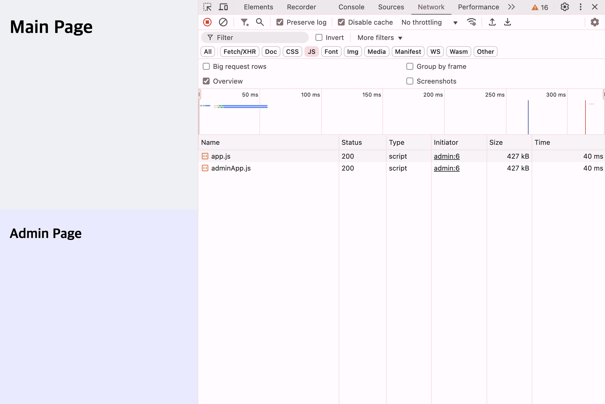
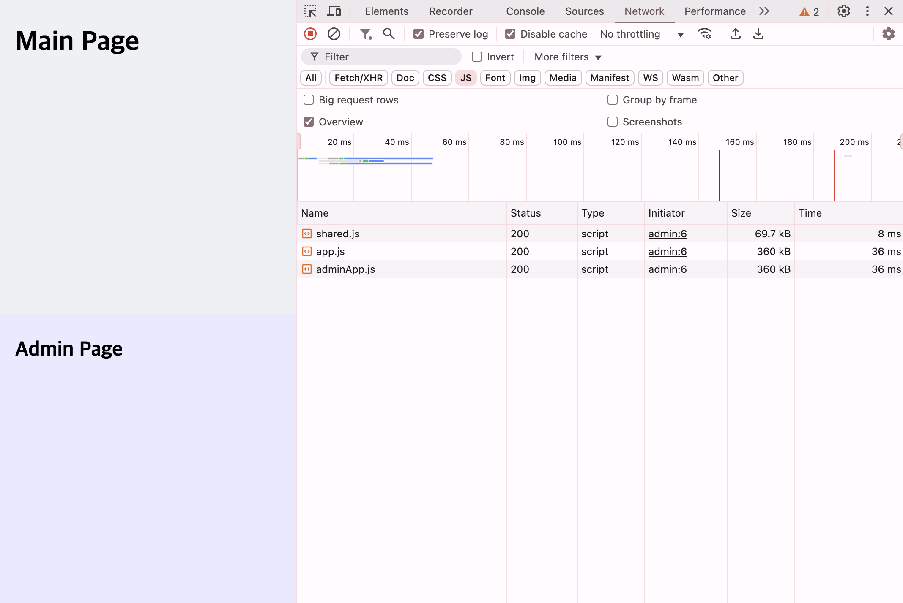

# 진입점

진입점(Entry Points)는 애플리케이션을 실행하는 시작점으로, 웹팩이 가장 먼저 읽는 파일이나 경로예요. 웹팩은 이 진입점에서부터 모든 의존성 파일들을 추적하고 하나로 묶어 **배포 가능한 파일**을 만들어요.

<!-- - 차이점
- 언제 사용하는지 -->

진입점을 설정하는 방식에는 **단일 엔트리 구문**과 **객체 구문** 두 가지가 있어요.
두 방식의 차이점은 생성되는 번들 파일 개수예요.

## 구문 방식 비교

프로젝트의 규모와 성격에 따라 적절한 방식을 선택하세요.

<!-- prettier-ignore-start -->
|            | 단일 엔트리 구문                            | 객체 구문                                 |
| ------------------  | --------------------------------------- | --------------------------------------- |
| **번들 파일 개수**     | 하나의 번들 파일                             | 여러 개의 번들 파일                        |
| **성능 영향**         | 규모가 커질수록 번들 파일이 커져 로딩 속도 저하 가능 | 필요한 코드만 로드하여 성능 최적화 가능          |
| **적합한 프로젝트 규모** | 규모가 작은 애플리케이션, 라이브러리              | 규모가 큰 애플리케이션                      |
| **사용 사례**         | 간단한 웹사이트, 라이브러리                    | 다중 페이지 애플리케이션, 기능별 번들 분리 필요 시 |
<!-- prettier-ignore-end -->

## 단일 엔트리 구문

단일 엔트리 구문(Single Entry Syntax)은 **번들 파일을 하나만 생성**하도록 진입점을 지정하는 방식이에요.

브라우저가 번들 파일을 로드할 때 파일 하나만 요청하기 때문에 설정과 관리가 간단해요.

웹팩 설정 파일의 `entry` 필드에서 **문자열** 또는 **배열**을 지정하여 진입점을 설정할 수 있어요.

:::info 기본 시작 경로
진입점을 따로 설정하지 않으면, 웹팩은 `src/index.js`파일을 기본 진입점으로 사용해요.
:::

### 문자열로 지정하기

`entry` 필드에 특정 경로를 작성하면, 웹팩은 해당 파일을 번들링하여 단일 번들 파일을 생성해요.

```tsx{3}
// webpack.config.js
module.exports = {
  entry: "./src/index.tsx",
  // ...
};
```

`yarn build` 명령을 실행하면, output 경로에 번들 파일이 출력된 것을 확인할 수 있어요.

```text{2}
├─ dist
│   └─ main.js
├─ src
│   └─ index.tsx
├─ public
│   └─ index.html
```

### 배열로 지정하기

`entry` 필드에 여러 개의 경로를 배열로 작성하면, 웹팩은 각 파일을 개별적으로 번들링하고 이를 하나의 단일 번들 파일로 병합해요.

```tsx
// webpack.config.js
module.exports = {
  // ...
  entry: ["./src/index1.tsx", "./src/index2.tsx"],
};
```

`yarn build` 명령을 실행하면, output 경로에 번들 파일이 출력된 것을 확인할 수 있어요.

```text{2}
├─ dist
│   └─ main.js
├─ src
│   ├─ index1.tsx
│   └─ index2.tsx
├─ public
│   └─ index.html
```

### 예제: 단일 엔트리 구문으로 생성한 번들 파일 로드하기

단일 엔트리 구문으로 생성된 JavaScript 번들 파일이 브라우저에서 어떻게 로드되는지 살펴볼게요.

다음과 같이 `<script>`에 번들 파일 경로를 추가하고, `yarn dev` 명령으로 개발 서버를 실행해요.

```html{16}
<!-- public/index.html -->

<!DOCTYPE html>
<html lang="ko">
  <head>
    <meta charset="UTF-8" />
    <meta name="viewport" content="width=device-width, initial-scale=1.0" />
    <title>Webpack Test</title>
  </head>
  <body>
    <div id="root"></div>

    <!-- webpack-dev-server는 dist 폴더를 루트에 있는 것처럼 가상 경로로 취급해요.
     그래서 브라우저에서 접근할 때는 실제 파일이 dist 폴더에 있더라도
     마치 루트(/)에 있는 것처럼 번들 파일에 접근할 수 있어요. -->
    <script src="/app.js"></script>
  </body>
</html>
```

이제 브라우저의 개발자 도구(DevTools) → 네트워크(Network)탭을 열어보면, 웹팩이 단일 번들 파일 하나만 로드되는 것을 확인할 수 있어요.


### 문제 해결하기: 번들 파일 경로 추가 자동화하기

원칙적으로 HTML에 필요한 번들 파일이 추가되거나 변경될 때마다 HTML을 직접 수정해야 해요. 하지만 이런 방식은 유지보수에 비효율적일 뿐만 아니라 경로와 관련된 에러가 발생할 가능성도 높아요.

이 과정을 자동화해 수고를 덜어주는 유용한 도구가 있는데, 바로 [HtmlWebpackPlugin](https://webpack.kr/plugins/html-webpack-plugin/)이라는 플러그인이에요. 이 플러그인은 HTML 파일을 템플릿처럼 사용해서, 빌드 과정에서 번들 파일 경로를 자동으로 삽입하고 완성된 HTML을 출력 경로에 생성해줘요.
덕분에 매번 수동으로 HTML을 수정하지 않아도 되고, 브라우저에서도 번들 파일 경로가 바르게 설정된 HTML을 사용할 수 있어요.

## 객체 구문

객체 구문(Object Syntax)은 **여러 개의 번들 파일을 생성**하기 위해 여러 개의 진입점을 지정하는 방식이에요.

이 방식을 사용하면 페이지별로 독립적인 번들링이 가능해서, 각 페이지에서 필요한 코드만 로드할 수 있어 불필요한 코드 로드를 줄이고 초기 로딩 속도를 개선할 수 있어요. 또한, 기능별로 번들 파일을 나누어 불필요한 코드 로드를 줄일 수 있어 대규모의 애플리케이션에 적합해요.

예를 들어, 사용자 페이지와 관리자 페이지를 각각 독립된 번들 파일로 분리하면, 필요할 때만 로드할 수 있어 성능이 향상돼요.

웹팩 설정 파일의 `entry` 필드에서 key에 생성될 번들 파일의 이름을, value 객체에는 해당 번들 파일의 진입점과 관련된 설정을 정의할 수 있어요.

### 시작 파일 지정하기: [`import`](https://webpack.kr/concepts/entry-points/#entrydescription-object)

`import` 옵션에는 웹팩이 진입점으로 사용할 시작 **파일의 경로 또는 모듈**을 작성해 주세요.

예를 들어, 다음과 같이 두 개의 번들 파일의 이름과 경로를 설정해볼게요.

```tsx{5,8}
// webpack.config.js
module.exports = {
  entry: {
    app: {
      import: "./src/index.tsx",
    },
    adminApp: {
      import: "./src/admin.tsx",
    },
  },
  //...
};
```

`yarn build` 명령을 실행하면, output 경로인 dist 폴더에 설정한 이름으로 두 개의 번들 파일이 생성돼요.

```text{2-3}
├─ dist
│  ├─ adminApp.js
│  └─ app.js
├─ src
│   ├─ app.tsx
│   └─ admin.tsx
├─ public
│   └─ index.html
```

### 공통 모듈로 코드 중복 줄이기: [`dependOn`](https://webpack.kr/configuration/entry-context/#dependencies)

`dependOn` 옵션은 여러 진입점에서 공통 모듈을 공유할 때 사용해요. 이 옵션을 사용하면 공통 모듈이 한 번만 번들링되며, 각 진입점에서 중복으로 포함되지 않아요. 그 결과 번들 크기가 줄어들어 로딩 속도를 최적화할 수 있어요.

예를 들어, 다음과 같이 `app`에 `dependOn` 옵션으로 `shared`를 지정하면,
`app` 번들 파일을 만들 때 `shared` 번들 파일을 참조해요.

- `shared`에는 공통 모듈만 포함돼요.
- `app`은 `shared`에 의존해요.

```js{6}
// webpack.config.js
module.exports = {
  entry: {
    app: {
      import: "./src/admin.tsx",
      dependOn: "shared",
    },
    shared: {
      import: "./src/shared.js",
    },
  },
  //...
};
```

자세한 동작 방식에 대해서는 [예제2: 중복 모듈 제거하기](#예제2-중복-모듈-제거하기)를 참고하세요.

### 예제1: 브라우저에서 객체 구문 번들 파일 로드하기

객체 구문으로 생성된 JavaScript 번들 파일들이 브라우저에서 어떻게 로드되는지 살펴볼게요.

다음과 같이 `<script>`에 각 번들 파일 경로를 추가하고, `yarn dev` 명령으로 개발 서버를 실행해요.

```html{17-18}
<!-- public/index.html -->

<!DOCTYPE html>
<html lang="ko">
  <head>
    <meta charset="UTF-8" />
    <meta name="viewport" content="width=device-width, initial-scale=1.0" />
    <title>Webpack Test</title>
  </head>
  <body>
    <!-- 사용자 애플리케이션 루트 -->
    <div id="root"></div>

    <!-- 관리자 애플리케이션 루트 -->
    <div id="admin-root"></div>

    <script src="/app.js"></script>
    <script src="/adminApp.js"></script>
  </body>
</html>
```

이제 브라우저의 개발자 도구(DevTools) → 네트워크(Network)탭을 열어보면, 두 개의 번들 파일이 각각 로드되는 것을 확인할 수 있어요.


### 예제2: 중복 모듈 제거하기

Main 페이지와 Admin 페이지는 `getSum`이라는 공통 모듈을 `utils`로부터 가져와 사용해요.

```tsx
// src/index.jsx에서 MainPage를 import해요
import { getSum } from "../utils/add";

function MainPage() {
  const sum = getSum(10, 20);
  return (
    <div className="main-page">
      <h1>Main Page</h1>
    </div>
  );
}
export default MainPage;
```

```tsx
// src/admin.jsx에서 AdminPage를 import해요
import { getSum } from "../utils/add";

function AdminPage() {
  const sum = getSum(1, 2);

  return (
    <div className="admin-page">
      <h2> Admin Page </h2>
    </div>
  );
}
export default AdminPage;
```

두 페이지에서 공통으로 사용하는 `getSum` 공통 함수를 `app` 번들 파일에서만 가져오도록 `dependOn` 옵션을 설정했을 때, 어떻게 동작하는지 살펴볼게요.

```js{6}
// webpack.config.js
module.exports = {
  entry: {
    app: {
      import: "./src/index.tsx",
      dependOn: "shared",
    },
    adminApp: {
      import: "./src/admin.tsx",
      dependOn: "shared",
    },
    shared: "./src/utils/add.ts",
  },
  optimization: {
    // 번들 파일을 살펴보기 위해 압축을 비활성화는 옵션을 넣었어요!
    minimize: false,
  },
  //...
};
```

`yarn build` 명령을 실행하면, output 경로인 `dist` 폴더에 다음과 같이 번들 파일들이 생성돼요.

```text{2-4}
├─ dist
│  ├─ adminApp.js
│  ├─ app.js
│  └─ shared.js
```

`shared` 번들 파일에만 `getSum` 공통 함수가 들어있는 것을 확인할 수 있어요. 웹팩은 `getSum`을 별도의 번들 파일로 분리하고, 해당 모듈에 **고유한 모듈 ID**를 할당해요. 여기서는 `getSum` 모듈에 810을 할당했어요.

```js{3}
// shared.js

/***/ 810:
/***/ ((__unused_webpack_module, exports) => {
Object.defineProperty(exports, "__esModule", {
  value: true,
});
exports.getSum = getSum;
function getSum(a, b) {
  return a + b;
}
```

각 번들 파일을 보면, `shared` 번들 파일에 포함된 `getSum`이 모듈 ID(810)를 통해 참조되는 것을 알 수 있어요.

```js{6,8}
// app.js
Object.defineProperty(exports, "__esModule", ({
  value: true
}));
var jsx_runtime_1 = __webpack_require__(425);
var add_1 = __webpack_require__(810);
function MainPage() {
  var sum = (0, add_1.getSum)(10, 20);
  return (0, jsx_runtime_1.jsx)("div", {
    className: "main-page",
    children: (0, jsx_runtime_1.jsx)("h1", {
      children: "Main Page"
    })
  });
}
exports["default"] = MainPage;
```

```js{6,8}
// admin.js
Object.defineProperty(exports, "__esModule", ({
  value: true
}));
var jsx_runtime_1 = __webpack_require__(425);
var add_1 = __webpack_require__(810);
function AdminPage() {
  var sum = (0, add_1.getSum)(1, 2);
  return (0, jsx_runtime_1.jsx)("div", {
    className: "admin-page",
    children: (0, jsx_runtime_1.jsx)("h2", {
      children: " Admin Page "
    })
  });
}
exports["default"] = AdminPage;
```

`dependOn` 설정 전후 `app`과 `adminApp` 번들 파일의 크기를 비교해 볼게요.

공통 모듈을 분리하기 전에는 각 번들 파일의 크기는 427kB였어요.



하지만 `shared` 공통 모듈을 분리해 중복 코드가 제거되면서, 각 번들 파일의 크기가 360kB로 줄어들었어요.



이처럼 `dependOn` 옵션을 활용하면, 공통 모듈을 별도로 관리해 번들 크기를 최적화할 수 있어요! 🚀
