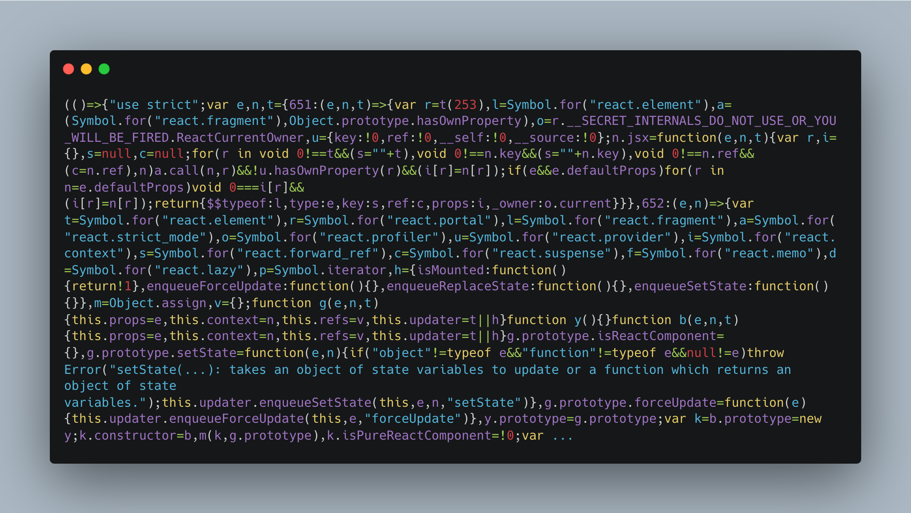

# 번들 파일 최적화

웹 애플리케이션을 빌드하면 아래 이미지처럼 보통 모든 코드가 하나의 큰 자바스크립트 파일로 번들링돼요.
애플리케이션이 커질수록 번들 파일의 크기도 함께 증가하고, 그 결과 로딩 속도가 느려져 성능에 영향을 줄 수 있어요.
이를 방지하려면 불필요한 코드를 줄이고, 필요한 코드만 효율적으로 로드하는 **최적화** 과정이 필요해요.

## 최적화가 필요한 이유

#### 1. 번들 크기 감소와 로드 속도 향상

불필요한 코드가 포함되면 번들 크기가 커지고, 로딩 속도가 느려질 수 있어요. 최적화를 통해 꼭 필요한 코드만 포함하면 더 가벼운 번들을 만들 수 있고, 사용자도 더 빠르게 페이지를 이용할 수 있어요.

#### 2. 네트워크 비용 절감

파일 크기가 작아지면 네트워크에서 다운로드해야 하는 데이터 양도 줄어들어요. 특히, 모바일 환경처럼 네트워크 속도가 느린 환경에서는 최적화가 더욱 중요해요.

#### 3. 성능 개선

브라우저가 실행해야 할 코드가 줄어들면, 불필요한 연산을 줄일 수 있어요. 그만큼 페이지가 빠르게 로드되고, 애플리케이션도 원활하게 동작할 수 있어요.

#### 4. 유지보수성 향상

불필요한 코드가 줄어들면 코드 구조가 더 단순해지고, 디버깅과 유지보수도 쉬워져요. 어떤 코드가 실제로 번들에 포함되는지 명확하게 파악할 수 있어 불필요한 의존성을 줄이고 프로젝트를 효율적으로 관리할 수 있어요.

## 최적화 기술

번들 파일의 최적화를 위해 **코드 스플리팅**과 **트리셰이킹** 등의 기술을 사용할 수 있어요.  
코드 스플리팅은 필요한 코드만 분리해 로드하는 방식으로, 초기 로딩 속도를 개선하는 데 효과적이에요.  
트리셰이킹은 사용되지 않는 코드를 제거하는 기법으로, 번들 크기를 줄이고 성능을 최적화할 수 있어요.

더 자세한 내용은 [코드 스플리팅](./code-splitting)과 [트리셰이킹](./tree-shaking) 문서에서 확인하세요.
