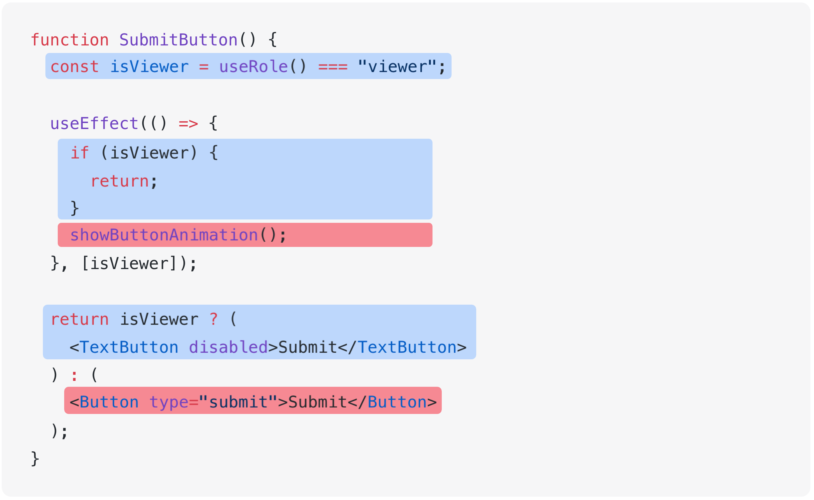
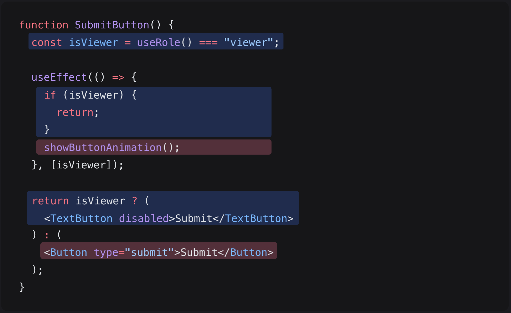

# 分离不一起运行的代码

<div style="margin-top: 16px">
<Badge type="info" text="可读性" />
</div>

如果不同时运行的代码被放在同一个函数或组件中，就很难一眼看清他们各自的作用。
实现过程中内含复杂的分支，很难理解代码各个部分的作用。

## 📝 代码示例

`<SubmitButton />` 组件会根据用户的权限以不同的方式运行。

- 如果用户的权限是仅查看（`"viewer"`），邀请按钮会处于非激活状态，不会播放动画。
- 如果用户是普通用户，邀请按钮处于激活状态，并且播放动画。

```tsx
function SubmitButton() {
  const isViewer = useRole() === "viewer";

  useEffect(() => {
    if (isViewer) {
      return;
    }
    showButtonAnimation();
  }, [isViewer]);

  return isViewer ? (
    <TextButton disabled>Submit</TextButton>
  ) : (
    <Button type="submit">Submit</Button>
  );
}
```

## 👃 闻代码

### 可读性

`<SubmitButton />` 组件同时处理用户可能具有的两种权限状态，且该两种状态都在同一组件中进行处理。
所以代码阅读者需要考虑的语境过多。

例如，在下面的代码中，蓝色部分表示当用户具有仅查看权限（`'viewer'`）时运行的代码，红色部分表示当用户是普通用户时运行的代码。
由于不同时运行的代码交织在一起，理解代码时产生负担。

{.light-only}
{.dark-only}

## ✏️ 尝试改善

以下代码是将用户具有仅查看权限时和作为普通用户时的状态完全分开来管理的代码示例。

```tsx
function SubmitButton() {
  const isViewer = useRole() === "viewer";

  return isViewer ? <ViewerSubmitButton /> : <AdminSubmitButton />;
}

function ViewerSubmitButton() {
  return <TextButton disabled>Submit</TextButton>;
}

function AdminSubmitButton() {
  useEffect(() => {
    showButtonAnimation();
  }, []);

  return <Button type="submit">Submit</Button>;
}
```

- 随着原本分散在 `<SubmitButton />` 代码各处的分支合并为一，分支数量减少。
- `<ViewerSubmitButton />` 和 `<AdminSubmitButton />` 各自仅管理一个分支，所以代码阅读者需要考虑的语境减少。
