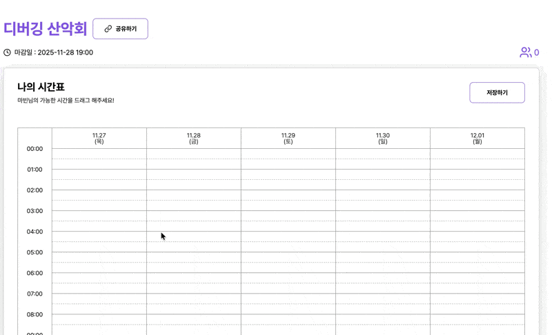
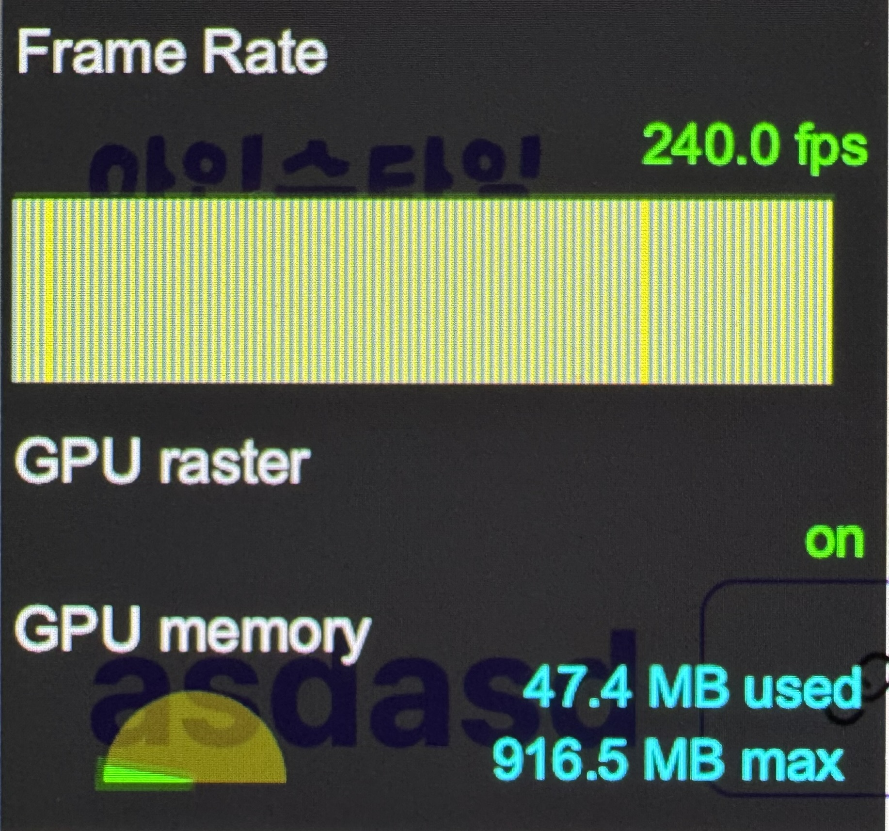

# 고주사율 모니터에서만 깜빡이던 시간표 셀을 잡기까지

<ContributorHeader
  name="spoyodevelop"
  githubUrl="https://github.com/spoyodevelop"
  avatar="https://avatars.githubusercontent.com/u/73924592?v=4"
  date="2025.11.23"
/>

버그에는 두 종류가 있습니다.

`undefined` 보물 찾기처럼 2~4시간이면 고쳐지는 버그들이 있는 반면, 1주일이 지나도 원인을 알 수 없는 버그들도 있습니다. 이 글은 후자에 대한 이야기입니다.

## 증상



제가 참여한 프로젝트 아인슈타임에는 드래그로 시간표 셀을 선택하는 기능이 구현되어 있습니다.

드래그 구현 위에 최적화 작업에서 캐싱부터 시작해서 레이아웃 이벤트를 격리하는 온갖 best practice를 적용하고 난 뒤에, requestAnimationFrame을 적용해서 모니터 주사율에 맞춰 부드럽게 드래그가 연동되게 만들었어요. 120~240fps까지 깔끔하게 프레임이 올라가는 것을 확인하고는 꽤 만족했습니다.

이렇게 끝나면 좋았겠지만, QA 과정에서 고주사율 모니터(120Hz+)를 쓰는 데스크톱 Chrome에서만 선택된 셀이 간헐적으로 깜빡이는 버그를 발견했습니다.


같은 기능이 60Hz 모니터, Firefox, Safari, 심지어 120Hz 모바일 Chrome에서는 멀쩡했기 때문에, 위에서 말한 특정 조건에서만 재현되는 엣지 케이스였습니다. QA가 없었다면 몰랐겠죠. 야속하게도, 이 버그는 하필 추석 직전에 발견됐습니다.

추석 연휴가 시작됐고, 모든 게 귀찮아져서 일단 미뤄 뒀습니다. 그런데 머릿속에서는 계속 그 깜빡이는 셀이 맴돌았습니다.

## 첫 시도

추석 3일째, 제사를 지냈습니다. 그날 남은 나물로 비빔밥을 해 먹었고, 맛있었어요. 배는 부르고 행복했는데, 마음 한구석의 찝찝함과 그 깜빡임은 여전히 남아 있었습니다.

그날 새벽 두 시쯤, 다시 문제를 떠올려 보기 시작했습니다.

가장 먼저 `will-change`를 적용했습니다.

브라우저에게 `will-change`, 말 그대로 "이 요소가 곧 변할 거야"라고 힌트를 주면 레이어를 미리 승격시켜서 렌더링 성능이 좋아질 거라 기대했습니다. 하지만 아무 효과가 없었습니다.

왜 그런지 살펴봤습니다.


이 친구가 문제였던 것으로 보였습니다. 이 뒤집어지는 효과를 위해서는 `backface-visibility`라는 CSS 속성이 필요했고, 이 CSS 속성이 이미 3D 컨텍스트를 형성하고 있었습니다.

`will-change`는 어디까지나 "힌트"입니다. 실제로 composite 레이어 분리를 보장하지 않습니다. 그래서 이 경우에는 크게 효과가 없었던 것이죠.

## 찾아낸 원인

추석 6일째, 더 이상 미룰 수가 없어서 테크니컬 라이팅을 하면서 드래그 로직을 처음부터 다시 복기했습니다. 글을 다 쓰고 나니 새벽 2시쯤이었는데, 심심한 김에 여기저기 코드를 뒤져보다가 결국 새벽 5시까지 이 버그를 붙잡고 있었습니다. 한 손에는 송편을 쥐고, 다른 한 손은 키보드에 올린 채로요.

첫 시도가 소용없다는 걸 확인하고 나서, 아예 가설을 새로 세웠습니다.

"이 페이지가 다른 페이지와 정확히 뭐가 다른가?" 여기에 집중해서 코드를 정리해 보니, 세 가지 특징이 보였습니다.

3D 컨텍스트와 복잡한 쌓임 맥락
`backface-visibility` 때문에 이미 3D 컨텍스트와 쌓임 맥락이 꽤 복잡하게 구성되어 있었습니다.

고주사율 환경 + 대량 셀 업데이트
7일 × 24시간 × 30분 단위의 336개 셀이 고주사율 환경에서 매 프레임마다 업데이트되고 있었습니다.

CSS-in-JS 기반의 런타임 스타일 주입
선택 상태 스타일을 CSS-in-JS로 런타임에 주입하고 삭제하는 구조였습니다.

120Hz 기준으로 약 8.3ms마다 rAF 콜백이 실행되는데요, 이 콜백 안에서는 336개 셀에 대해 히트박스 충돌 검사와 선택 상태 토글이 일어납니다. 그리고 상태가 바뀔 때마다 CSS-in-JS가 스타일을 런타임에 주입하고 있었습니다. 이 모든 일이 3D 컨텍스트 안에서 반복되니, paint와 composite 사이에서 충돌이 나면서 깜빡임이 발생한 것으로 보였습니다.

조건을 하나씩 껐다 켰다 하면서 테스트해 본 결과, `backface-visibility`만 꺼도 깜빡임이 사라지는 것을 확인했습니다.

정리하면, 이 버그는:

"복잡한 3D 컨텍스트 + 고주사율 + 잦은 DOM 업데이트 + 런타임 스타일 주입"

이 네 가지가 동시에 겹칠 때만 나타나는 엣지 케이스였습니다. 다시 생각해 보면 왜 버그가 안 터지는지 알 수 없을 정도로 demanding한 연산을 굉장히 잦게 시키고 있었네요.

## 해결책

추석 7일째, 일어나자마자 바로 책상에 앉았습니다. 전날 새벽에 잡았던 실마리를 코드에 적용해 볼 차례였습니다.

1. `opacity`로 composite 레이어 분리
   먼저, `background-color` 대신 `opacity`를 이용해서 composite 레벨로 효과를 분리했습니다. `::after` 가상 요소를 하나 추가하고, 여기에서만 `opacity`를 애니메이션했습니다.

```css
.time-table-cell {
  position: relative;
  background-color: var(--background);
}

.time-table-cell::after {
  content: "";
  position: absolute;
  inset: 0;
  background-color: var(--primary);
  opacity: 0;
  transition: opacity 0.15s cubic-bezier(0.2, 0, 0, 1);
  pointer-events: none;
}

.time-table-cell.selected::after {
  opacity: 1;
}
```

이렇게 하면 셀의 기본 배경은 한 번만 paint되고, 선택 효과는 opacity composite만 수행하게 됩니다.
3D 컨텍스트의 간섭을 최소화하면서 paint와 composite를 분리한 셈입니다.
이 단계만으로도 깜빡임은 사라졌습니다. 하지만 opacity가 1까지 올라가지 않고 0.9 정도에서 살짝 멈춘 것 같은 미묘한 잔상(비주얼 아티팩트)이 남았습니다.

2. CSS-in-JS를 정적 클래스로 대체
   남은 원인으로, CSS-in-JS의 런타임 스타일 주입 오버헤드를 의심했습니다. 대개의 상황에서는 상관없는데, 너무 빠르게 업데이트되면 이것도 부담이 되거든요.

그래서 선택 상태를 아예 정적 CSS 클래스로 바꾸었습니다.

```css
.time-table-cell.selected {
  background-color: var(--primary);
  transition: background-color 0.15s cubic-bezier(0.2, 0, 0, 1);
}
```

정리하면:

시각 효과는 `::after` + opacity composite로 분리하고,
선택 상태 자체는 정적 클래스 + 정적 CSS로 관리
이렇게 두 가지를 함께 적용하니, 깜빡임과 잔상 아티팩트가 모두 사라졌습니다.

트레이드오프
추석 8일째, prod에 이 패치를 배포하고 나서 이 문제를 다시 복기해 보니 다음과 같은 추가 문제가 발생할 수 있다고 추정했습니다.

`::after`가 별도 레이어로 승격되면서, 이론상 최대 336개 레이어를 관리해야 합니다.
저사양 기기에서는 그만큼 메모리와 GPU 부담이 늘어날 수 있습니다.
`backface-visibility` 자체도 여전히 남아 있어서, 다른 고비용 CSS와 조합되면 또 다른 이슈가 생길 여지가 있습니다.
더 원인을 파고들고 싶었지만, 그 이상 추적하기에는 너무 로우레벨까지 온 것 같은 생각이 들었습니다. 어떤 리스크가 남는지, 어떤 조건에서 다시 문제가 생길 수 있는지 팀과 공유한 뒤 사용자 경험, 일정, 구현 복잡도를 함께 고려해서 이 회피책을 선택했습니다.

## 재발 방지를 위한 대책

브라우저 렌더링 파이프라인의 더 하위 레벨까지 깊게 파고들기는 쉽지 않습니다. 브라우저마다 구현체가 조금씩 다른 문제도 크지요.

결국 우리가 직접 건드릴 수 있는 건 API와 DOM 조작 레벨이라, 그 안에서 할 수 있는 선에서 대응했고, 현실적이고 가장 실용적인 해결책을 제시했다고 생각합니다.

원인을 100% 말끔하게 규명했다기보다는, 현실적인 회피책을 하나 찾은 셈에 가깝습니다.

혹시라도 여러분이 DOM을 너무 많이 조작하고 있다면, 이런 질문들도 한번씩 해보면 좋겠네요.

기본적으로 한번쯤은 체크해야 하는 질문은 다음과 같습니다.

React의 diff 과정에서 너무 많은 re-render를 하지 않는가?
너무 많은 layout 이벤트를 발생시키고 있지 않는가?
그리고 이것보다 더 나아가면,

지금 paint 단계에서 과한 연산이 들어가고 있는 건 아닌가?
이걸 composite-only로 오프로드할 수 있나?
CSS-in-JS가 생각 외의 오버헤드를 발생시키지 않는가?
이런 질문도 필요할 수 있습니다.

결국 이 드래그 기능은 240fps까지 잘 동작하게 되었습니다.


만약 이 정도 고성능을 노린다면, 이 정도의 파인튜닝도 신경을 써야 할수도 있겠군요.

그리고 한 가지 더, localhost에서라도 직접 런타임을 돌려보는 간단한 QA는 정말 중요합니다. 자동화 테스트만 믿지 말고, 한 번쯤은 실제로 화면을 보면서 확인해 보세요.

혹시 비슷한 상황에서 머리 싸매고 계신 분들이 있다면, 이 글이 작은 힌트 정도는 되었으면 좋겠습니다!
