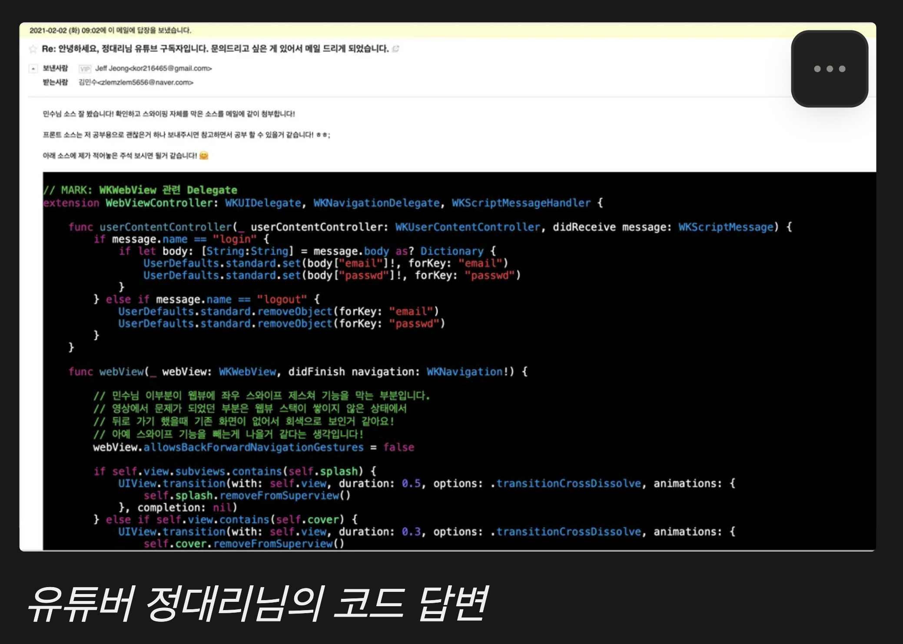
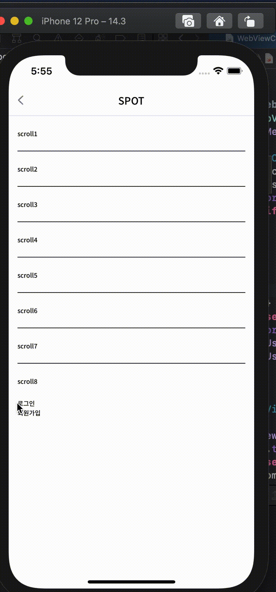

# iOS 웹뷰에서 스와이프 뒤로가기 시 회색 화면이 표시되는 현상 디버깅

 
<ContributorHeader name="김민수" githubUrl="https://github.com/minsoo-web" avatar="https://ca.slack-edge.com/E01JAGTHP8R-U077AFXLDU0-d52a2afee622-512" />

## 진단하기

Vue.js로 개발한 하이브리드 앱에서 iOS의 스와이프 뒤로가기 제스처를 사용할 때 이전 화면이
정상적으로 표시되지 않고 회색 화면만 보이는 버그가 발생했습니다.

문제는 조금이라도 스크롤을 하고 난 다음에만 발생했기 때문에, 원인이 웹 프론트엔드 코드에
있다고 판단했습니다. 스크롤이 없는 상태에서는 정상 동작했지만, 스크롤 후 뒤로가기를 하면 항상
회색 화면이 나타났습니다.

## 재현하기

문제를 재현하기 위한 조건은 다음과 같았습니다

1. Vue.js 기반 웹앱을 iOS WKWebView에서 실행
2. 페이지에서 스크롤 동작 수행
3. iOS의 스와이프 뒤로가기 제스처 사용

`Vue Router`의 ``scrollBehavior`` 옵션과 관련이 있을 것으로 추정하고, 공식 GitHub 저장소의 이슈를
검색했습니다. 비슷한 현상을 보고한 이슈에서 Evan You의 답변을 확인할 수 있었습니다. 그는
이것이 Vue의 문제가 아니라 WKWebView 환경에서 swipe navigation 시 발생할 수 있는 환경적
문제라고 설명했습니다.

이슈에 제시된 여러 해결 방법을 모두 시도해봤지만 문제가 해결되지 않았습니다. Vue는 공부와
개인 프로젝트를 통해 충분히 경험했다고 생각했지만, iOS와 WKWebView 환경은 처음이었기에
전문가의 도움이 필요하다고 판단했습니다.

주변에 선배 프론트엔드 개발자나 하이브리드 웹 개발 경험자가 없었기에, 지푸라기라도 잡는
심정으로 평소 자주 보던 [유튜버](https://www.youtube.com/@dev_jeongdaeri)에게 자문 메일을
보냈습니다. 정대리님은 Vue와 iOS(Swift) 개발을 모두 다루는 분이었기에 해결책을 알 수 있을 것
같았고, 답변을 기대하진 않았지만 그만큼 절실했습니다.

## 수정하기

정대리님은 Swift 코드 변경으로 답변을 주셨지만, 함께 작업하던 iOS 개발자분은 이 방법이 swipe
자체를 없애는 방법이라 근본적인 해결이 아니라고 판단했습니다.

문제의 원인이었던 스크롤 옵션 처리를 제거하면 간단히 해결되지만, 그러면 네이티브 환경처럼
뒤로가기 시 스크롤 위치가 유지되지 않는다는 새로운 문제가 생깁니다. 단편적인 해결이 아닌
완벽한 해결을 원했기에, `Vue Router` 라이브러리의 옵션에 의존하지 않고 직접 스크롤 유지 기능을
개발하기로 결정했습니다.

최종 해결 방법은 다음과 같았습니다

- 페이지를 떠나기 전: `Vue Router`의 beforeEach 메서드로 현재 페이지의 이름과 스크롤 위치를
`Vuex store`에 저장
- 페이지에 진입하기 전: `store`에 저장된 `stack`의 길이와 브라우저 `history`의 길이를 비교하여
뒤로가기인지 새로운 페이지 진입인지 판단
- 스크롤 위치 복원: 뒤로가기로 판단되면 저장된 스크롤 위치로 복원

이 방식으로 `Vue Router`의 `scrollBehavior`에 의존하지 않고도 네이티브와 같은 스크롤 유지 경험을
구현할 수 있었습니다.

{width=300}

[관련 자료](https://www.notion.so/0bcf62449c554b8f8b8e1556b710e0dc?pvs=21)

## 재발 방지하기

환경의 제약사항을 고려한 개발의 중요성웹 기술로 개발하더라도 실행 환경(WKWebView)의 특성과
제약사항을 이해하는 것이 중요해요. 프레임워크의 공식 기능이 모든 환경에서 완벽하게 동작한다고
가정하지 말고, 특수한 환경에서는 직접 구현을 고려해야 해요.

커뮤니티와 전문가의 도움 활용하기일주일이 넘는 구글링과 GitHub 이슈 검색으로도 해결하지 못할
때, 커뮤니티나 전문가에게 도움을 요청하는 것을 주저하지 말아야 해요. 이 경우처럼 예상치 못한
답변이나 조언이 문제 해결의 실마리가 될 수 있어요.

라이브러리 의존성 최소화특정 라이브러리의 기능이 환경 제약으로 동작하지 않을 때, 해당 기능을
직접 구현하는 것도 좋은 해결책이에요. 이를 통해 라이브러리 의존성을 줄이고, 문제 상황에 더
유연하게 대응할 수 있어요.