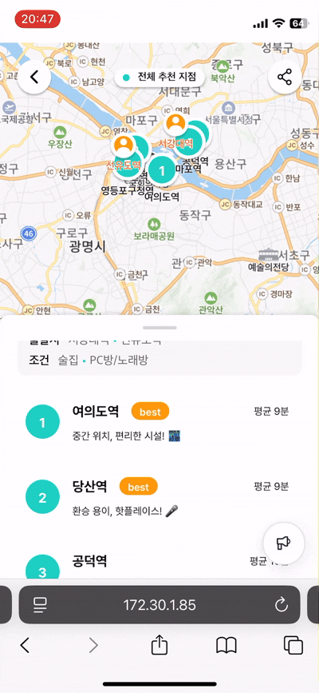
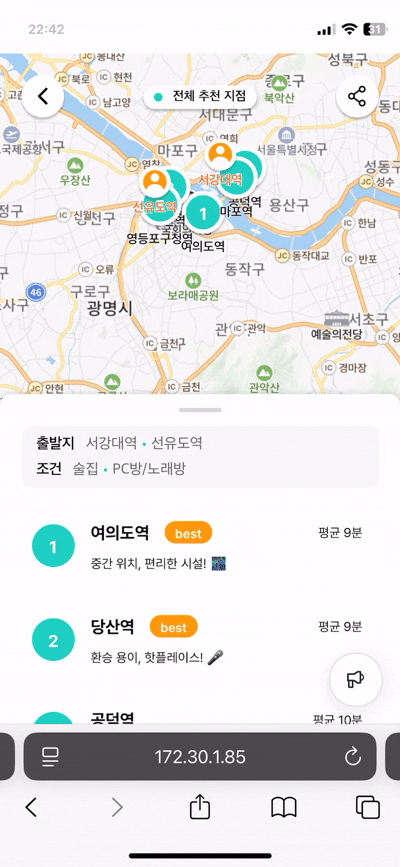
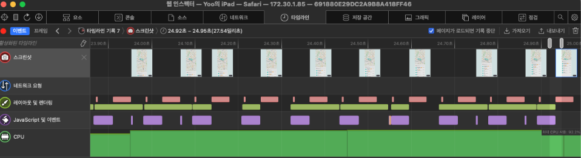
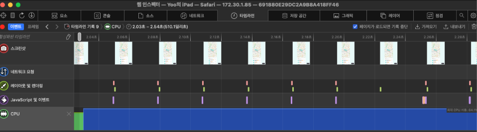

# React Rerendering 퍼포먼스 문제 디버깅

<br/>
<ContributorHeader name="kaori-killer" githubUrl="https://github.com/kaori-killer" avatar="https://avatars.githubusercontent.com/u/75800958?v=4" date="2025.11.16"/>

## 진단하기
바텀시트 애니메이션에 문제가 발생했다. 사용자가 바텀시트를 위아래로 드래그하면 이를 따라 부드럽게 이동해야 하지만, 애니메이션이 느리고 버벅였다. 바텀시트가 사용자의 손가락 움직임을 따라오지 못하고 프레임이 끊기는 현상이 나타났다.

문제는 다음과 같은 상황에서만 발생했다.

모바일 기기에서만 발생 (데스크탑 환경에서는 문제 없음)
프로덕션 빌드에서만 발생 (개발 환경에서는 문제 없음)

| Before | After |
| ----- | ----- |
|  |  |


## 재현하기
### 첫 번째 시도: 데스크탑에서 성능 프로파일링
문제가 모바일에서만 발생한다는 점에서 낮은 CPU 성능이 원인일 것이라고 가정했다. 데스크탑 DevTools의 Performance 패널로 확인해보니, 애니메이션 구간에서 Main Thread 내 리플로우가 반복적으로 발생하고 있었다.

애니메이션이 자연스럽게 보이려면 초당 60프레임(60FPS)을 안정적으로 그려야 한다. 드래그하는 동안 매 프레임마다 위치가 바뀌기 때문에, 그때마다 레이아웃을 다시 계산하면 CPU가 바빠질 수밖에 없다.

그래서 `transform: translateY`를 사용해 리플로우를 줄이는 방법을 시도했다. transform을 사용하면 브라우저 렌더링 과정에서 레이아웃과 페인트 단계를 생략하고 컴포지트 단계만 수행할 수 있다. 해당 요소가 별도의 레이어로 분리되고, GPU로 작업이 위임되기 때문이다.

`transform: translate3d(...)`, `will-change: transform` 속성도 함께 고려했다. 브라우저가 해당 요소를 미리 레이어로 분리하도록 유도해 애니메이션 진행 시 더 빠르게 반응할 수 있게 도와준다.

### 결과: 효과는 미미했다
DevTools에서 CPU 부담이 다소 줄어든 것을 확인했고, 체감상으로도 조금 부드러워졌다. 그러나 모바일 기기의 프로덕션 환경에서는 여전히 느리고 둔한 움직임을 보였다.

### 두 번째 시도: 모바일 환경에서 직접 프로파일링
데스크탑 DevTools의 CPU Throttling 기능을 이용해 4×, 6× 정도로 성능을 낮춰봤지만 문제를 재현할 수 없었다. 20× slowdown에서는 페이지 렌더링 자체가 너무 느려 정상적인 테스트가 불가능했다.

그래서 실제 모바일 기기에서 프로덕션 빌드를 실행하고, 이를 데스크탑에서 DevTools로 확인하는 방식으로 문제를 재현하기로 했다.

모바일 기기와 데스크탑을 케이블로 연결한다.
데스크탑 로컬에서 프로덕션 빌드를 띄운다.
모바일 기기에서 해당 로컬 서버에 접속한다.
데스크탑에서 모바일 기기의 DevTools를 열어 성능을 분석한다.

```
npm run build
npx serve -s dist
```

[참고: 사파리 브라우저에서 개발자 도구 여는 방법](https://dev-chim.tistory.com/entry/beginner-safari-dev-tool-setting) 

모바일 환경에서 프로파일링 결과를 확인하니 문제가 명확하게 보였다.

불규칙적으로 화면을 그리고 있다.
CPU의 최대 사용률이 93%까지 올라간다.
스타일 재계산이 매 터치 이벤트마다 발생한다.

## 찾아낸 원인
transform으로 해결되지 않는 이유를 알 수 있었다. transform은 브라우저 렌더링 단계 중 레이아웃과 페인트를 건너뛴다. 그러나 문제는 그 이전 단계인 스타일 재계산에서 리소스를 과하게 쓰고 있었다. 뒤에서 단계를 생략해도 앞에서 병목이 생기면 큰 효용을 얻지 못하는 것이다.

로직을 확인해보니 바텀시트 위치(positionPercent)를 React State로 관리하고 있었다.
```tsx
const onPointerMove = (e) => {
  // 매 터치 이벤트마다 호출 (초당 60~120회)
  setPositionPercent(newValue); // React 상태 업데이트
};
```

이 코드의 실행 흐름은 다음과 같다.

```
터치 이벤트 발생 (초당 60~120회)
    ↓
setPositionPercent() 호출
    ↓
React 리렌더링
    ↓
Emotion 스타일 객체 재생성 및 해싱
    ↓
CSSOM 업데이트 + Style 재계산
    ↓
transform → GPU
```

구현 당시에는 위치 변경 → 리렌더링 → 화면 갱신이 문제가 될 줄 몰랐다. React의 리렌더링이나 런타임 CSS-in-JS의 작업이 많은 것 역시 브라우저 메인 스레드의 부담을 주는 것이었다.

## 수정하기
바텀시트 위치를 State로 상태관리했던 것을, useRef를 사용한 DOM 직접 조작으로 바꿨다. 선언적 패러다임을 일부 포기하고 성능이 중요한 구간에 명령형을 넣었다고 볼 수 있다.

```tsx
const onPointerMove = (e) => {
  // React 상태 업데이트 없이 ref에만 저장
  currentPercentRef.current = clampedPercent;
  
  // DOM 직접 조작
  containerRef.current.style.transform = `translateY(${100 - clampedPercent}%)`;
};

const onPointerUp = (e) => {
  // 인라인 스타일 제거하여 React가 다시 제어
  containerRef.current.style.transform = '';
  
  // 스냅할 때만 상태 업데이트
  setPositionPercent(target);
};
```

갑자기 DOM 조작이라니, 괜찮을까? [공식문서](https://ko.react.dev/learn/manipulating-the-dom-with-refs)를 찾아봤는데 괜찮다고 한다. useRef가 존재하는 이유이기도 했다.

React는 렌더링 결과물에 맞춰 DOM 변경을 자동으로 처리하기 때문에 컴포넌트에서 자주 DOM을 조작해야 할 필요는 없습니다. 하지만 가끔 특정 노드에 포커스를 옮기거나, 스크롤 위치를 옮기거나, 위치와 크기를 측정하기 위해서 React가 관리하는 DOM 요소에 접근해야 할 때가 있습니다. React는 이런 작업을 수행하는 내장 방법을 제공하지 않기 때문에 DOM 노드에 접근하기 위한 ref가 필요할 것입니다.

## 결과
수정 후 Safari 프로파일러 결과는 극적으로 개선되었다.

| 항목 | Before	| After|
| --- | ---	| --- |
| 애니메이션 |  |  |
| 퍼포먼스 탭 |	 |  |
| CPU 사용률 | 최대 92%, 불규칙적 프레임 드랍 | 최대 64%, 안정적인 60FPS 유지 |
| 렌더링 파이프라인	| 스타일 재계산 → CSSOM 업데이트 → 레이아웃 재계산 반복 | Composite 단계만 실행 |
| 상태 관리 | React State로 height 관리 (리렌더링 발생) | useRef로 DOM 직접 조작 (리렌더링 없음) |

이제 개발/프로덕션 환경 구분 없이 바텀시트 애니메이션이 부드럽게 동작한다.

## 재발방지하기
고빈도 업데이트에서 React 상태 사용 주의

애니메이션이나 드래그처럼 초당 60회 이상 업데이트가 필요한 인터랙션에서는 React 상태 업데이트가 병목이 될 수 있다. 특히 CSS-in-JS 라이브러리를 함께 사용할 경우 스타일 재계산 비용이 추가된다. 이런 경우 useRef를 활용한 DOM 직접 조작을 고려해야 한다.

실제 환경에서의 프로파일링 중요성
개발 환경과 프로덕션 환경, 데스크톱과 모바일에서 동일한 코드가 다른 성능을 보일 수 있다. 실제 사용 환경에서 프로파일링을 수행하고, CPU와 네트워크 조건을 변경해가며 테스트하는 것이 중요하다. 앞으로 애니메이션 개발 시에는 다양한 환경에서 성능을 검증할 것이다.

## 여전히 궁금한 점
- 브라우저가 레이어를 나누는 규칙은 무엇일까?
- React Profiler로 리렌더링이 얼마나 줄었는지 수치로 확인해볼 수 있을 것 같다.
- 프로덕션 빌드에서만 문제가 심했던 정확한 이유는 무엇일까? (React 배치 업데이트 차이? Emotion 최적화 방식?)