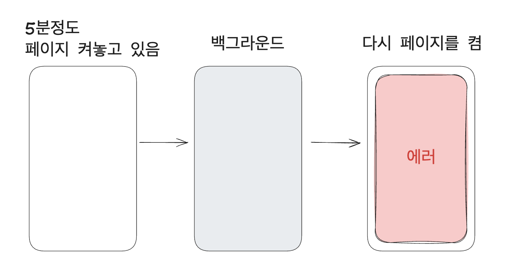
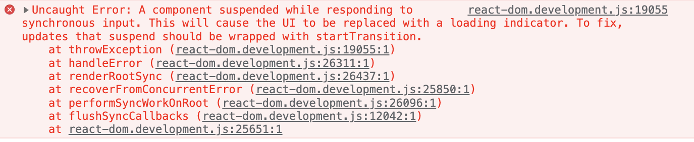
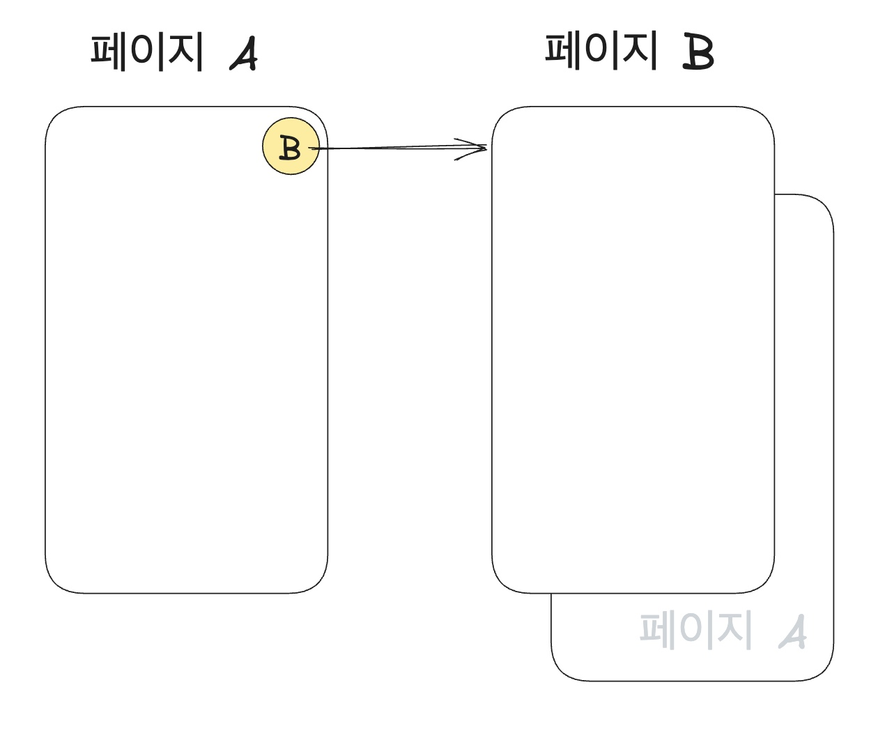
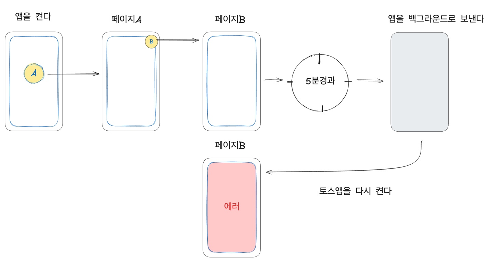
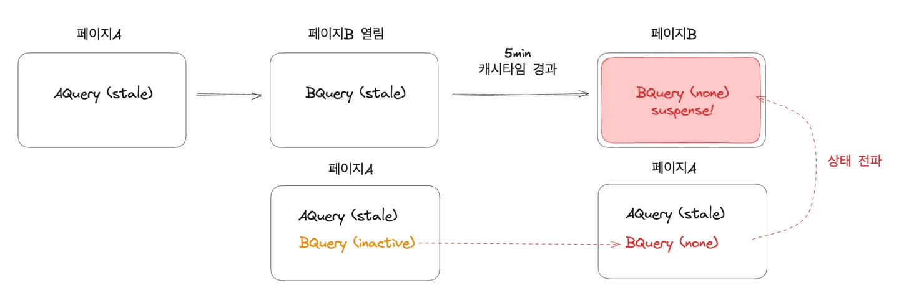

# Suspense Error 디버깅
### 부제: react-query 상태는 어떻게 돌아가는가?
<br/>
<ContributorHeader name="김형규" avatar="../../images/contribute/suspense-error/hyungkyu.png" />

토스 내부 디버깅 실무 사례를 소개드리기 위해 토스의 프론트엔드 개발자 김형규님을 인터뷰 했어요. 이 인터뷰는 웹뷰 간 tanstack-query 캐시 동기화 도구인 broadcast query client를 사용할 때 발생할 수 있는 Suspense 현상 문제의 원인과 해결 과정을 담고 있어요.

## 1. 진단하기

### Q1. 처음 맞닥뜨리신 에러 현상과 에러 메세지에 대해 짧게 소개해주실 수 있을까요?

먼저 현상부터 간략히 말씀드리자면, "웹뷰를 5분 정도 켜놓고 있다가, 앱을 백그라운드 상태로 두었다가 다시 앱을 키면 갑자기 Suspense에러가 발생한다." 는 현상이었어요.



<br/>
에러메세지는 다음과 같았는데요,



```
A component suspended while responding to synchronous input.
This will cause the UI to be replaced with a loading indicator.
To fix, updates that suspend should be wrapped with startTransition.
```

이 에러 메세지는 컴포넌트가 `suspense`를 일으킬때 나타나는 에러메세지인데, 보통 토스 프론트엔드 환경에서 `suspense`가 일어났다는 것은 곧 "준비되지 않은 쿼리가 있음"을 의미해요. 컴포넌트 렌더 시점에 컴포넌트에서 캐시가 존재하지 않는 쿼리를 사용할 때 일어나는 에러에요.

### Q2. 문제의 증상과 에러 메시지를 처음 접했을 때 어떤 생각을 하셨나요?

에러 메세지와 현상이 매칭이 잘 안됐어요. 저 시점까지만 해도 react-query에서 캐시를 관리하는 자세한 동작에 대해서 알고 있진 못했어요.
react-query 유저로서 생각해봤을 때 잘 사용되고 있던 페이지에 focus가 다시 된 시점에 기존에 사용하던 `cache`가 제거되고 `suspense`가 발생하는 것이 의도된 동작이 아니라고 생각했어요. 그래서 이 현상이 말이 안된다고 생각했어요.

이후에 찾아보니 현재 랜더링 되고 있는 컴포넌트들에서 쿼리를 사용하고 있다면, 해당 쿼리는 `staleTime`, `cacheTime`이 지났다고해서 날아가지 않더라구요.

`suspense`가 발생한 것으로 보아 캐시 관련된 문제는 맞는 것 같고, 에러가 재현되는 5분이라는 시간이 `cacheTime`(gcTime)과 연관이 있긴 한 것 같은데, 정상적으로 페이지에서 사용 중인 쿼리가 제거되진 않았을거고, 다른 의존성에 의한 사이드 이팩트가 캐시를 날렸을 것이라고 의심하기 시작했어요.

### Q3. 그 사이드 이펙트로 의심하게 된 부분이 있었나요? 있다면, 의심하게 된 결정적 근거는 무엇이었나요?

이 설명을 위해서는 간략히 서비스의 구조를 설명드려야 할 것 같은데요, 페이지A에는 페이지B로 들어갈 수 있는 진입점이 있어요. 페이지A와 페이지B는 모두 네이티브 위에 띄워진 웹뷰이고, 페이지A에서 페이지B로 진입하면 페이지A 위에 페이지B가 스택으로 쌓이는 구조예요.



문제 상황을 재현하기 위해 페이지를 껐다가 켰다가도 해보고, 페이지A에서 페이지B로 들어갔다가 나왔다 등을 반복하던 중, 페이지B만 껐다 켰을때 일어나지 않던 에러가 페이지A에서 페이지B를 열었다가 닫으면 재현되었어요.

여기서 힌트를 얻을 수 있었어요. "서로 다른 웹뷰 사이에 발생한다"는 것이에요. 이 에러는 웹뷰 하나에서는 발생하지 않았어요.

그래서 다중 웹뷰 환경을 위해 따로 설정된 것이 있는지 살펴보았고, `broadcast query client`가 사용되고 있다는 사실을 알게되었어요. `broadcast query client`는 여러 탭(또는 윈도우)간에 쿼리 캐시를 `동기화(broadcast)`하기 위한 유틸 함수예요. 쿼리 캐시를 문제의 원인으로 의심하고 있던터라 이때부터는 강력하게 `broadcast query client`를 의심하게 되었어요. 진단과 동시에 재현에 성공한거죠.

## 2. 재현하기

### Q. 해당 문제의 재현에 100% 성공하신 경로를 조금만 더 자세히 설명해주실 수 있으실까요?

```
1. 서비스로 들어간다.
2. 페이지A를 연다.
3. 페이지 B로 들어간다.
4. 5분이 지난다.
5. 앱을 백그운드로 보낸다
6. 다시 앱을 켠다. (페이지B가 켜진다)
```

이렇게 입니다.



### Q. 문제가 발생하는 구조를 명확히 확인하기 위해 어떤 값이나 상태를 주의 깊게 추적하셨는지 궁금해요.

일단, 로컬에서 재현되는게 문제를 해결하는 가장 빠른 길이라고 생각해서 로컬에서 재현을 시도했어요. 재현을 위해 로컬에서 query client dev tool을 설치했어요. 로컬 호스트에서 서비스를 띄우고, 페이지A에서 페이지B를 열어가며 쿼리 상태가 어떻게 변하는지 확인했어요.

행동 액션을 쪼개서 확인하기 위해 디버거를 걸어서 각 액션에서 어떤 일이 발생하는지 확인했어요. 마우스를 클릭해서 윈도우에 포커스할 때 쿼리 상태가 어떻게 변경되는지
등이요.

### Q. 쿼리의 상태값에서 원인을 찾으셨나요?

결론은 캐시 상태와 관련이 있었어요. 캐시 상태에는 아래의 상태들이 있어요.
|상태 |의미|
|---|--|
|none| none 캐시에 데이터가 전혀 없어요 (설명을 위한 가상의 상태)|
|fresh|fetch 이후, staleTime 이내 – 데이터가 유효해요|
|stale| staleTime 이후 – 데이터가 오래되어 다시 불러올 수 있어요|
|inactive| 컴포넌트에서 더 이상 사용하지 않지만 아직 캐시는 남아있어요 (cacheTime 이후 삭제됨)|

여기서 `staleTime`과 `cacheTime`은 완전히 별도의 개념이에요.

```
캐시 삭제 조건:
  - `inactive` 상태일 때만 `cacheTime` 경과 후 삭제 가능
  - 컴포넌트에서 참조 중이면 절대 자동 삭제되지 않음
fresh 상태라도 사용 중인 컴포넌트가 없으면 `inactive` 상태가 될 수 있음.
```

페이지A와 페이지 B에는 서로 동일한 쿼리를 공유하고 있었는데, 페이지A에서 사용되지 않는 쿼리가 5분이 경과해 `inactive`상태가 되고, `cacheTime`이 지나 결국 삭제된 거에요. 이 때, 삭제된 쿼리의 상태가 페이지 B로까지 전이된 것이었어요.
<br/>



### Q. 재현에 신경쓰신 부분이 있나요?

캐시 관련된 문제라고 생각해서 캐시 타임을 1초로 설정하고 `inactive` 이후 캐시가 제거된 상황을 빠르게 재현했어요.

### Q. 재현 중 가장 어려웠던 순간이 있었나요?

결국, 컴포넌트에서 리랜더링이 트리거되며 에러가 발생하는 것일텐데, 이 리랜더링이 언제 트리거 되는지 알아내는데 여러 과정이 필요했어요.

처음에는 단순히 캐시가 사라지는 순간일 것이라 생각했어요. 그래서 query client dev tool에서 직접 캐시를 삭제해서 재현해보기도 했어요. 하지만 재현이 안되더라고요.

두번째로는 window를 포커스하는 순간 리패치가 일어나 리랜더링이 일어날 것이라고 생각했어요. 하지만 이때도 아니더라고요.

그래서 query-client의 코드를 찾아보았어요. 리패치 시점을 확인했더니, 리패치하여 리랜더링을 하는 정확한 요건은 아래와 같더라고요.

```
- refetch option에 지정된 시점인 경우 (refetchOnWindowFocus..)
- query 상태가 하나라도 존재할 경우
```

query 상태가 하나라도 존재할 때라는 조건이 리패치 조건에 있었어요. 쿼리 상태를 하나만 두고 테스트를 했었는데, 그 캐시를 지웠기 때문에 존재하는 캐시가 하나도 남지 않게 되어 리패치가 안일어나고, 리랜더가 안일어났던 거였어요.

테스트 당시엔 분명히 'query option이 refetchOnWindowFocus가 설정되어있는데, 왜 리패치가 안일어나는거지?'하며 애먹었던 기억이 납니다.

## 3. 수정하기

### Q. 문제를 해결하기 위해 가장 먼저 고려한 수정 방향은 무엇이었고, 그것을 선택한 이유는 무엇이었나요?

간단한 방법으로는 캐시타임을 늘려서 전파가 안되도록 inifinty로 바꾸면 된다는 생각이었어요. 하지만 이 옵션을 선택했을 때 useQuery에 의존하는 코드들이 많이 있었기 때문에 사이드이팩트가 있을 우려가 있었어요.

'`broadcast query client experimental`의 코드를 수정한 버전을 패치해서 사용하면 되겠다'는 생각을 하고 코드를 확인하러 라이브러리 코드를 찾아보다가 해당 버그가 수정되었다는 사실을 발견했어요. 다른 웹뷰에서 전파된 쿼리 제거 broadcast 메세지가 현재 웹뷰에서 사용되고 있는 쿼리라면 삭제되지 않도록 보완해주는 변경이었어요. 따라서 해당 버전으로 업데이트하면 되겠다고 생각했어요.
그리고 문제가 해결되었습니다. 👏🏼

## 추가질문

### Q. 디버깅 중 포기하고 싶은 순간도 있을 것 같아요. 어떤 생각이 끝까지 디버깅을 하게 하는지 궁금해요.

처음 에러 메세지나 현상을 봤을 때 `useQuery`, `cache-time` 사이 어딘가에 존재하는 이슈일 것 같아 크게 어렵지 않은 이슈일 것이라 생각했어요. 또 그냥 순수 재미와 궁금증으로 파보고 싶었어요. 그리고 이 문제를 해결하면 러닝이 생길 것 같았거든요. “결국에 해결은 될 것이다” 라는 믿음이 있었습니다 ^-^

### Q. 디버깅 꿀팁이 있다면?

로컬과 같은 접근하기 쉬운 환경에서 최대한 비슷한 재현 조건을 만드는 것입니다. "재현에 성공한다는 것 === 문제를 해결하는 것"이라고 생각해요.
그래서 재현 조건을 만드는 것 자체도 여러 과정을 거쳐서 재현에 성공해요. 대충 비슷한 재현조건을 만드는 것은 오히려 디버깅과 멀어질 수 있어요. 확실한 재현조건을 만드는데에도 시간을 많이 투자하는 것 같아요.

첫째로, 어떻게 하면 사용자 환경과 가장 똑같은 로컬 재현 환경을 만들 수 있을까에 집중해요. 에를들어, "새로운 웹뷰를 여는것 === 새로운 localhost:3000를 띄우는것"과 같이, 정말 기본이고 단순한 내용부터 최대한 같은 환경을 만들며 재현해려고 해요.

둘째로는, 재현중간 과정에서도 재현이 안되는 이유를 공부하는 편이에요. 예를들어, "hydration 문제인가? 사내 라이브러리에서 뭔가 특별하게 하는게 있나?" 의문이 드는 지점이 생기면 코드를 살펴보면서 가설을 검증해보는 과정을 통해서 해결방법에 좀 더 가까워지는 것 같아요.
