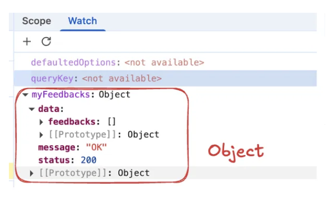
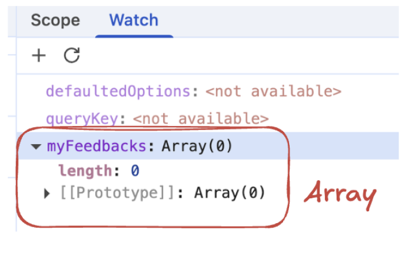
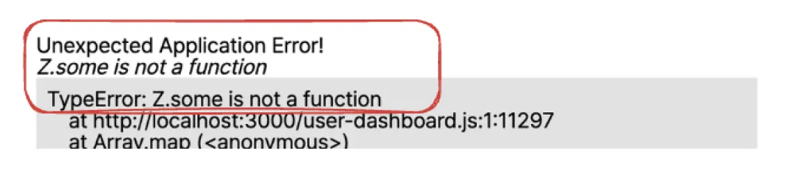
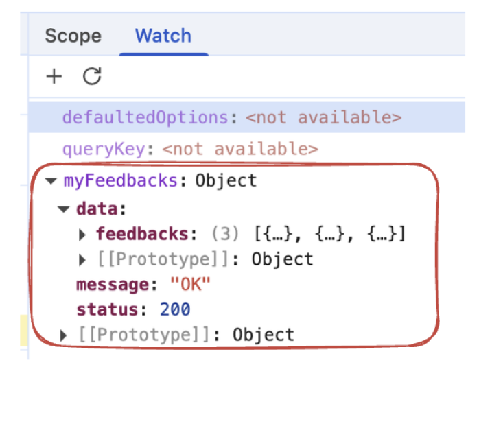
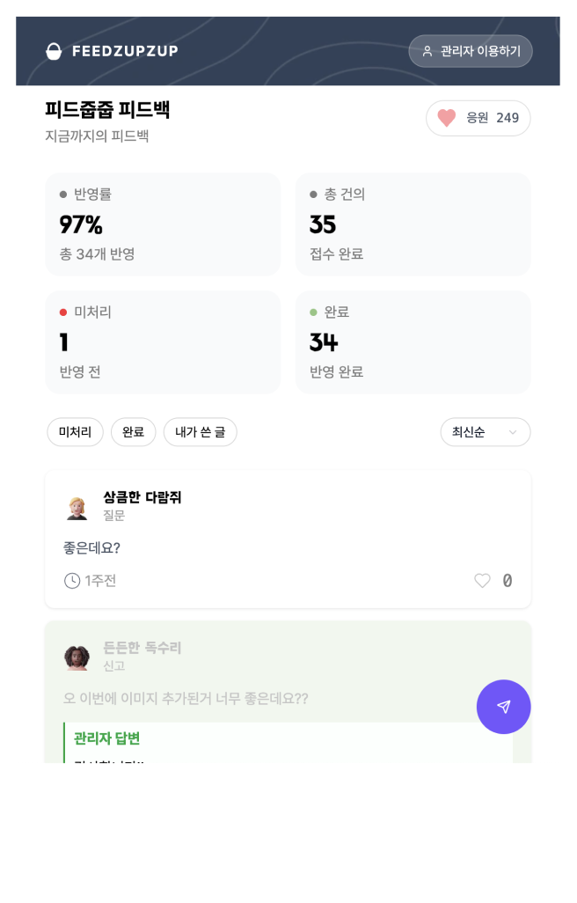
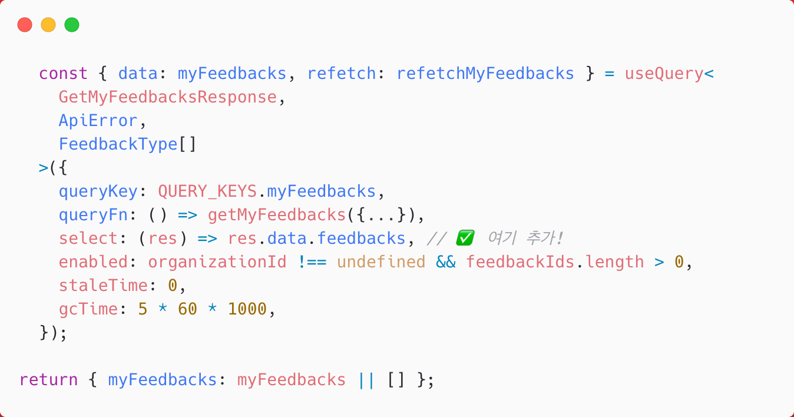
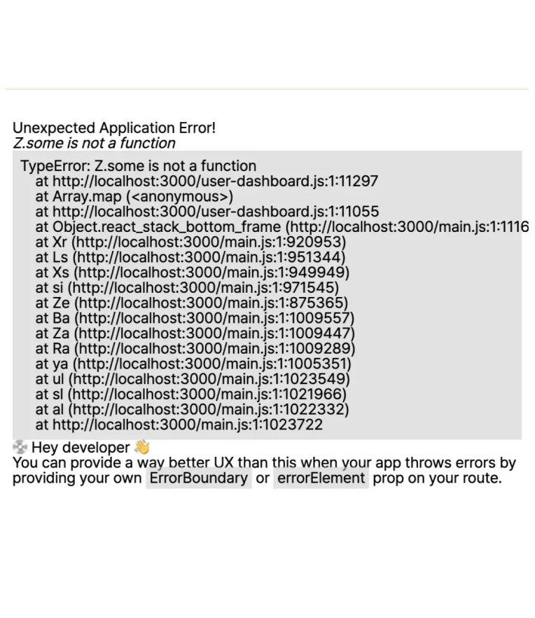
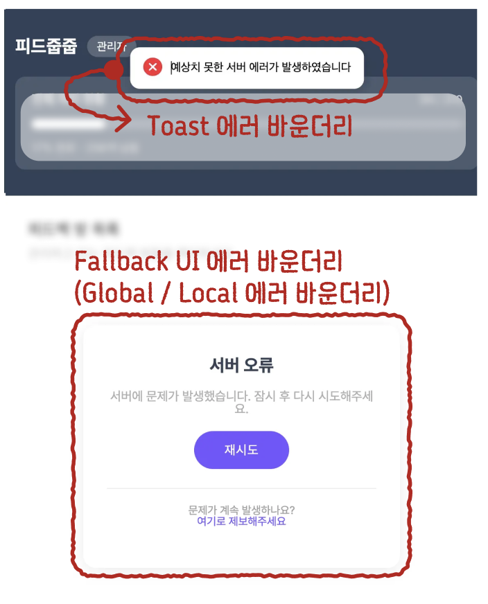

# React Query 사용 중 반환 타입 단언 오류

<br/>
<ContributorHeader name="mun-kyeong" githubUrl="https://github.com/mun-kyeong" avatar="https://avatars.githubusercontent.com/u/96461334?v=4" date="2025.11.17"/>

React Query 사용 중 반환 타입 단언 오류로 인해 런타임 크래시가 발생했고, 이를 크롬 디버거로 추적해 해결한 사례입니다.

## 진단하기

애플리케이션 실행 중 `Z.some is not a function` 오류와 함께 UI가 깨지는 현상이 발생했습니다.

UI가 깨져 콘솔 로그 확인이 어려운 상황이라, 크롬 디버거를 활용해 값을 직접 추적하기로 했습니다.


## 재현하기

### 2-1. 디버거를 통한 런타임 값 관찰

첫 번째 재현: Z.some 을 호출한 대상이 배열이 아닐 것이라는 가설을 세우고, 디버거의 Watch 탭을 통해 .some 함수를 호출하는 myFeedbacks 변수를 관찰했습니다.
결과: myFeedbacks 변수에 배열이 아닌 객체(Object) 형식이 들어오고 있음을 확인할 수 있었습니다.
문제를 좁히기 위해 myFeedbacks를 호출하는 두 지점(useEffect의 refetch와 useQuery의 queryFn) 중, useEffect 내부의 refetch 로직을 먼저 제거했습니다.

그 결과, myFeedbacks의 값이 배열로 전달되는 것을 확인하고 잠시 문제를 해결한 듯했습니다.

| Before (Object 형식)                                                                        | After (useEffect 내부의 refetch 제거 ➡️ 빈 배열 형식)                                     |
| ------------------------------------------------------------------------------------------- | ----------------------------------------------------------------------------------------- |
|  |  |

### 2-2. useQuery의 타입 단언 문제 (근본 해결)

refetch 와 queryFn이 동일한 함수를 호출하고 있음에도 서로 다른 값을 받는 상황은 비정상적이었습니다.

refetch를 제거하자 문제가 사라지는 건 단순히 “가려진 것”이라고 판단하고, useQuery의 타입 정의를 다시 확인했습니다.

```tsx
  const { data: myFeedbacks, refetch: refetchMyFeedbacks } = useQuery<
    GetMyFeedbacksResponse,
    ApiError,
    FeedbackType[]          // 👈 여기서 최종 return 타입을 배열로 단언/선언
  >({
    queryKey: QUERY_KEYS.myFeedbacks,
    queryFn: () => getMyFeedbacks({...}),   // ✅ 호출지점 1
    enabled: organizationId !== undefined && feedbackIds.length > 0,
    staleTime: 0,
    gcTime: 5 * 60 * 1000,
  });

  useEffect(() => {
   ....
    refetchMyFeedbacks(); // ✅  호출지점 2
  }, [...]);

return { myFeedbacks: myFeedbacks || [] };
```

발견: useQuery사용부에서 최종 반환 타입을 배열(FeedbackType[])로 단언하고 있었지만, 실제 API 응답의 리턴 타입은 객체 형식이었습니다. 여기서의 리턴 타입을 단언한 부분이 문제의 근원이였습니다.

번외 : queryFn 에서는 왜 문제가 생기지 않았을까?

1. enabled 조건에 의한 초기 실행 방지
   queryFn이 실행되지 않았던 진짜 원인은 useQuery에 설정된 enabled 조건 때문임을 확인하게 되었습니다. 이 조건으로 인해 쿼리가 즉시 실행되지 않아, 초기에는 myFeedbacks 변수에 데이터가 존재하지 않았습니다.

2. 레거시 로직에 의한 문제 은폐
   useQuery의 enabled 조건 때문에 쿼리 함수가 실행되지 않아 myFeedbacks 값이 존재하지 않았습니다.
   첫 번째 ‘재현’ 단계에서 배열의 길이가 0으로 나왔던 것은 바로 이 훅 내부의 분기 처리 로직이 빈 배열을 반환하며 실제 문제를 가리고 있었기 때문이라는 것을 알 수 있었습니다.

```tsx
return { myFeedbacks: myFeedbacks || [] }; // 👈 이 로직이 문제를 가리고 있었음
```

이를 검증하기 위해 의도적으로 myFeedbacks를 생성해보았고, 그 순간 useEffect를 사용하지 않았음에도 맨 첫 페이지와 동일한 문제를 발견할 수 있었습니다. 또한 디버깅 툴에서도 생성된 myFeedbacks 들이 객체 형식으로 들어가고 있음을 확인할 수 있었습니다.

| 런타임 크래시 발생                                                              | 생성된 3개의 피드백이 Object 형식으로 들어감                                    |
| ------------------------------------------------------------------------------- | ------------------------------------------------------------------------------- |
|  |  |

## 수정하기

✅ 최종 수정 : select 옵션을 통한 타입 조정 및 레거시 제거
결론적으로, API 응답 객체에서 필요한 배열 데이터만 추출하여 useQuery의 최종 반환 값으로 전달해야 했고, select 옵션을 사용하여 이 문제를 해결했습니다.

```tsx
select: (res) => res.data.feedbacks, // ✅ 응답 객체에서 배열만 추출
```

또한, React Query의 queryKey 조건만으로도 충분히 데이터 상태를 관찰할 수 있음을 깨닫고, 레거시 코드인 useEffect의 refetch 호출 로직을 최종적으로 제거했습니다.

그 결과, 정상적으로 피드백을 확인할 수 있었습니다.

| 정상적으로 보이는 화면                                                          | 수정된 코드 (select 추가)                                                       |
| ------------------------------------------------------------------------------- | ------------------------------------------------------------------------------- |
|  |  |

## 재발 방지하기

타입 단언 전수 조사: React Query 마이그레이션 직후였기에, 다른 부분에서 유사한 타입 단언으로 인한 문제가 없는지 팀원들과 함께 코드 검토 시간을 가졌습니다.
API 응답 타입 명확화: API를 호출하는 함수의 response 타입을 VS Code가 정확히 추론할 수 있도록 타입을 명시적으로 정의했습니다.
에러 바운더리 도입: 런타임 오류로 인한 화면 깨짐-UI 크래시으로 사용자 불편함을 고려하여, 에러 바운더리의 필요성을 확인했습니다.
이를 도입하여 에러 종류에 따라 적절한 Fallback UI나 토스트 에러 메시지를 제공하도록 조치하여 애플리케이션의 강건성을 높였습니다.

| before : 런타임 크래시로 인한 UI 깨짐 현상                                      | after : 에러 바운더리 도입                                                      |
| ------------------------------------------------------------------------------- | ------------------------------------------------------------------------------- |
|  |  |

## 참고자료

- [우아한 에러 바운더리 만들기 - 블로그](https://mun-kyeong.github.io/woowa-level4-error-boundary/)
- [크롬 디버거로 진단한 타입 오류 - 블로그](https://mun-kyeong.github.io/woowa-level4-troubleshooting-return-type/)
