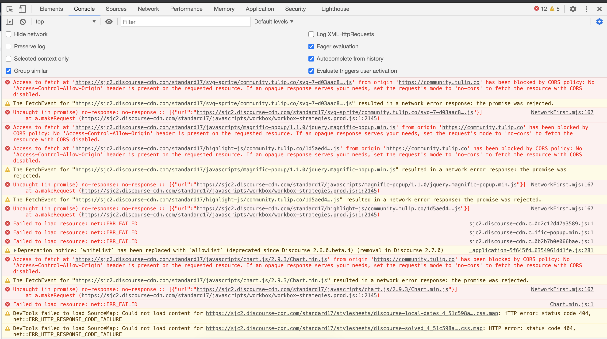
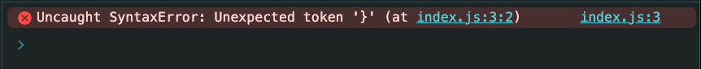
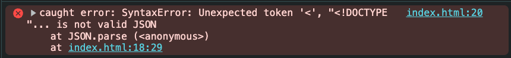
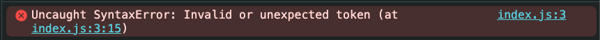
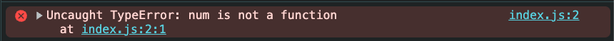
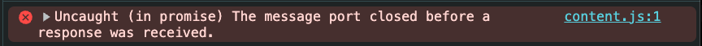
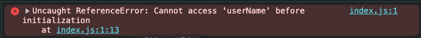
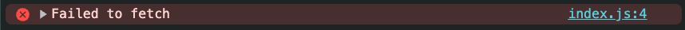
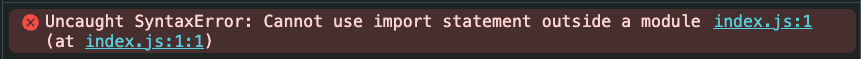

# 에러 메시지로 진단하기



빨간 줄의 거대한 양의 에러 메세지를 보면 우리는 순간 당황해서 에러 메시지를 통째로 복사해 검색창에 붙여넣곤 해요. 하지만 에러 메시지는 의외로 친절하게 오류 원인을 알려 주고 있어요. 한 단어씩·한 문장씩 차근차근 해석하면 문제 발생 지점을 짐작할 수 있는 중요한 단서를 얻을 수 있어요.

에러 메세지는 문제의 범위를 빠르게 좁힐 수 있는 가장 강력한 힌트예요. 에러를 진단할 때는 단순히 메시지를 보는 것에 그치지 않고, 해당 메시지가 **무엇을 의미하는지**, **어떤 맥락에서 발생했는지**, **어떤 가능성부터 확인하면 좋은지** 차근히 살펴보는 게 중요해요.

## 문법 오류 (`SyntaxError`)



코드에 문법적인 문제가 있을 때는 보통 `"SyntaxError: ~"`로 시작하는 에러 메시지가 출력돼요. 이 메시지는 자바스크립트 엔진이 **코드를 실행하기도 전에 문법을 해석하다가 실패했음을 알려주는 신호**예요.

`unexpected '}'`는 `}` 괄호에 문제가 있다는 뜻이에요. 괄호가 닫히지 않았거나, 불필요한 괄호가 추가되었을때, 혹은 `export`나 `return` 같은 예약어를 잘못 썼을 때 아래와 같은 메시지를 볼 수 있어요.

```tsx 6
function run() {
  const name = 'Hello'
  if (true) {
    console.log(name)
  }
}}
```

<br>



`Unexpected '<'` 에러 메세지는 보통 잘못된 URL로 인해 HTML 응답을 JSON으로 파싱하려는 시도에서 발생해요. 에러 메세지의 'html...is not valid JSON' 이라는 문구에서 `JSON.parse`의 인자로 잘못된 타입의 데이터가 들어갔음을 추측해볼 수 있어요.

```js
JSON.parse("<!DOCTYPE html><html><body>oops</body></html>");
```

<br/>



작은따옴표와 큰따옴표의 매칭이 잘못된 경우에도 "기대하지 않은 '(' 가 보인다" 라는 에러 메세지가 보여요.

```tsx
JSON.parse('{ foo: "bar" }");
```

### 확인할 것

- 문법에 맞게 작성되었는지 확인해요.
- 사용자가 코드를 작성하는 동안 IDE가 구문 오류를 실시간으로 감지해 강조 표시를 해줘요. 그래서 코드를 작성하면서 문법 오류를 바로 파악하고 고칠 수 있어요.

## 타입 오류 (`TypeError`)


값의 타입이 예상과 다를 때는 `"TypeError: ~"`로 시작하는 에러 메시지가 출력돼요. 이 에러는 주로 **정의되지 않았거나, 잘못된 값에 접근하거나, 함수가 아닌 값을 함수처럼 호출했을 때** 발생해요.

예를 들어 객체가 `null`이나 `undefined`인 상태에서 속성에 접근하려고 하면 이런 메시지를 볼 수 있어요.

```tsx 2
const user = null;
console.log(user.name);
```

<br/>



함수가 아닌 객체를 호출하면 다음과 같은 에러 메세지가 나요

```tsx 2
const num = 42;
num();
```

<br/>




`async` 함수 안에서 비동기 작업을 실행할 때 `await`를 빠뜨리면 의도하지 않은 동작이나 `Promise` 타입 관련 오류가 발생할 수 있어요. 예를 들어, 함수가 `Promise`를 반환하는데 이를 `await`하지 않고 그대로 사용하면 타입스크립트는 `Promise<T>`와 `T`를 혼동해서 에러를 발생시켜요.

```tsx 10
async function getMessage() {
  return "Hello, world!";
}

function printMessage(msg) {
  console.log(msg);
}

function main() {
  const message = getMessage();
  printMessage(message);
}
main();
```

### 확인할 것

- 객체가 실제로 존재하는지 확인해요
- API 응답 데이터 구조가 맞는지 확인해요
- `typeof`, `Array.isArray()` 등으로 미리 검사했는지 확인해요
- `await` 누락 여부를 확인해요.

## 참조 오류 (`ReferenceError`)



`ReferenceError`는 **정의되지 않은 식별자(변수나 함수 이름 등)를 사용하려고 할 때** 발생해요. 즉, 자바스크립트 엔진이 해당 이름을 찾을 수 없을 때 나타나는 에러예요.

예를 들어, 아래처럼 변수를 선언하지 않고 사용하면 에러가 발생해요.

```tsx 1
console.log(userName);
let userName = "Alice";
```

### 확인할 것

- 변수가 선언되었는지 확인해요
- 선언보다 먼저 접근한 건 아닌지 확인해요
- 외부 스코프 참조가 의도한 것인지 확인해요

## 리소스 로딩 오류



외부 자원을 가져오는 요청이 네트워크 단계에서 실패하면 브라우저는 `fetch`에서 `TypeError`를 던져요. 브라우저에 따라 `"TypeError: Load failed"` 또는 `"TypeError: Failed to fetch"`로 나타나요. 이 에러는 **HTTP 4xx, 5xx 같은 응답 에러와 다르게** 네트워크 자체가 실패했거나 보안 정책으로 차단됐을 때 발생해요. 이 경우엔 **reject**되어 바로 catch로 넘어가요.

```tsx 1
fetch("https://api.otherdomain.com/data")
  .then((res) => res.json())
  .catch((err) => {
    console.error(err.message);
  });
```

<br/>

참고로, **HTTP 4xx, 5xx 같은 응답 에러**가 발생했을 때는 **reject하여 catch로 넘기지 않고** `res.ok`가 `false`인 응답을 돌려줘요.

```ts
fetch("/api/data")
  .then(async (res) => {
    if (!res.ok) {
      const text = await res.text();
      throw new Error(
        `서버 오류: HTTP ${res.status} ${res.statusText} ${text}`
      );
    }
    return res.json();
  })
  .catch((err) => console.error(err));
```

### 확인할 것

- 콘솔에 `TypeError: Load failed`나 `Failed to fetch`가 보이면 네트워크, CORS, 인증서, CSP(Content Security Policy), 확장 프로그램 차단 가능성을 먼저 의심해요.

## 모듈 import 오류



모듈을 import 하는 과정에서도 문법 오류(`SyntaxError`)가 발생할 수 있어요. 특히 ES 모듈(ESM)과 CommonJS(CJS) 방식이 혼합된 환경에서는 설정이 서로 충돌해서 문법 오류처럼 보이는 에러가 나타날 수 있어요. 
이때 모듈 관련 에러 메시지를 보면 단순 문법 문제가 아니라 **모듈 시스템 설정에 문제가 있을 가능성**을 유추할 수 있어요.

예를 들어, .js 파일에 import 구문을 사용하게 되면 아래와 같은 에러 메시지가 나타나요. Node.js는 기본적으로 .js 파일을 CommonJS로 해석하기 때문에, `import`를 사용할 수 없고 `require()`를 써야 해요.

```js
// example.js
import fs from "fs";

fs.readFile("example.txt", "utf8", (err, data) => {
  if (err) throw err;
  console.log(data);
});
```

### 확인할 것

- 프로젝트의 모듈 시스템 설정이 올바른지 확인해요
  - ESM 사용 시: `package.json`에 `"type": "module"` 설정을 확인해요
  - CommonJS 사용 시: `"type"` 필드를 생략하거나, `"type": "commonjs"`로 명시해도 돼요
- `.mjs`, `.cjs`, `.js` 확장자가 적절히 사용됐는지 확인해요
- 잘못된 번들 경로로 `esm` 전용 모듈을 가져오지 않았는지 확인해요

---

### 📚 더 알아보기

- [MDN: SyntaxError](https://developer.mozilla.org/ko/docs/Web/JavaScript/Reference/Global_Objects/SyntaxError)
- [MDN: TypeError](https://developer.mozilla.org/ko/docs/Web/JavaScript/Reference/Global_Objects/TypeError)
- [MDN: ReferenceError](https://developer.mozilla.org/ko/docs/Web/JavaScript/Reference/Global_Objects/ReferenceError)
- [Node.js ESM 가이드](https://nodejs.org/api/esm.html)
- [CORS 이해하기](https://developer.mozilla.org/ko/docs/Web/HTTP/CORS)
