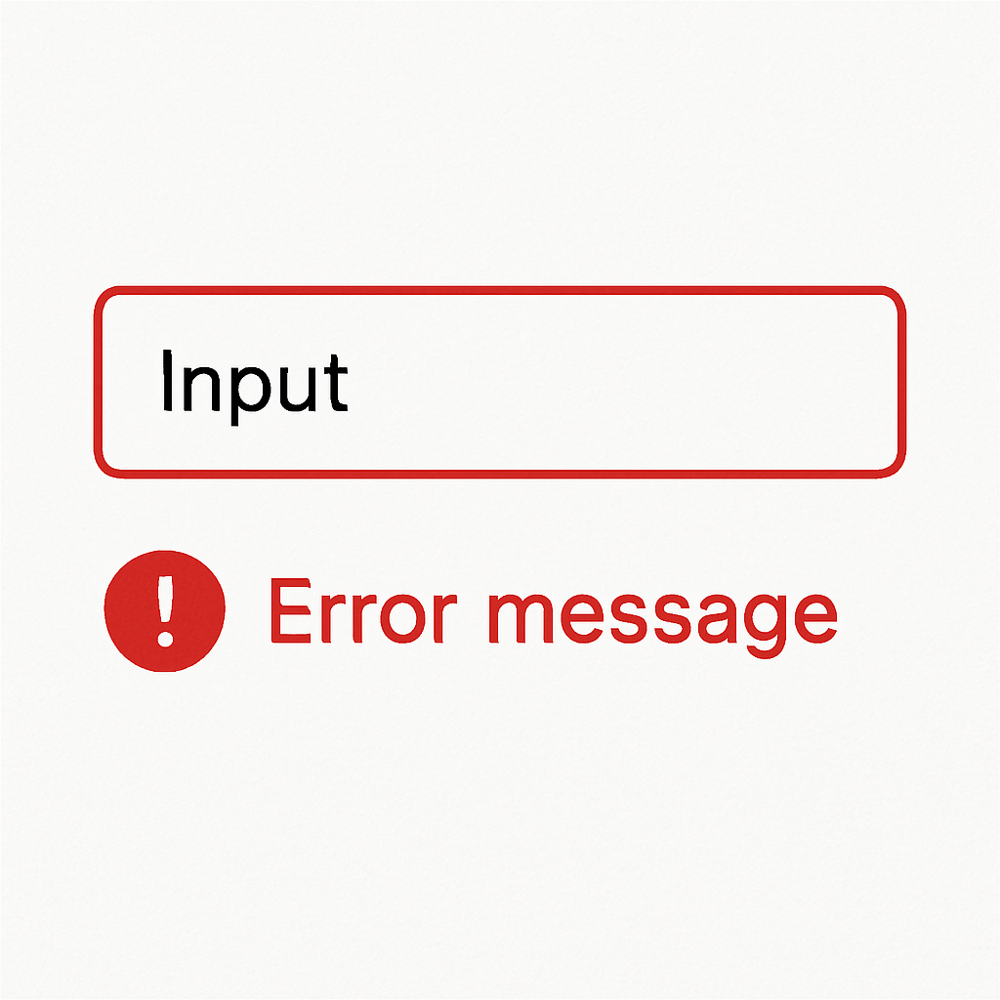
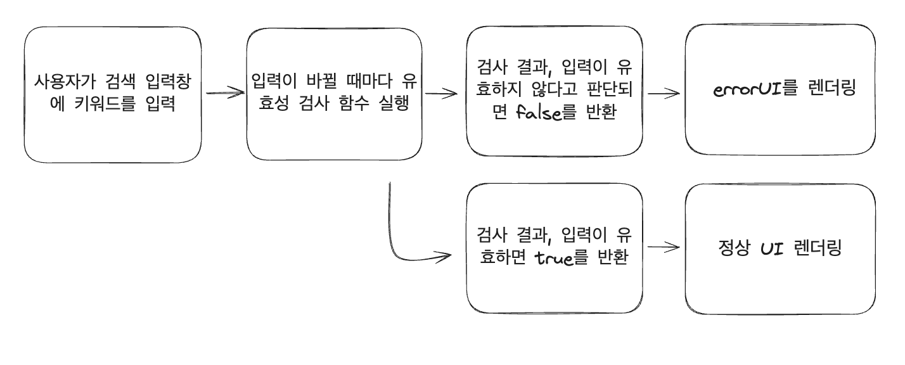
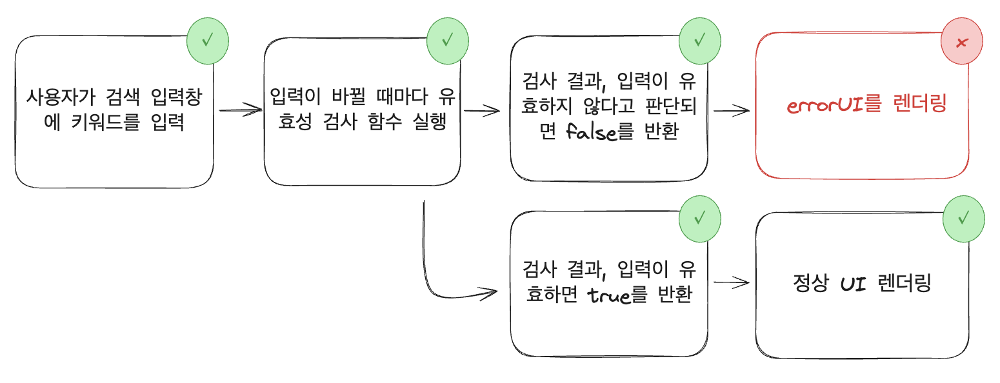

# 작업 지도 그리기

에러를 진단하는 방법 중 하나는 **작업 지도 그리기**예요. 전체 작업 흐름을 시각적으로 정리하면 어떤 과정에서 문제가 생겼는지 더 쉽게 파악할 수 있어요.

특히 데이터가 어떻게 흘러가는지를 단계별로 정리하면, 실제 동작한 결과와 기대한 결과를 비교해가며 에러의 원인을 좁혀갈 수 있어요. 이 방식은 비동기 요청, 상태 변화, 복잡한 사용자 입력 처리 흐름을 분석할 때 특히 유용해요.

## 예시

유효성 검사 입력창을 예시로 들어볼게요. 입력값이 어떻게 처리되고 어떤 검증 단계를 거치는지를 살펴볼 수 있는 간단한 예시예요.

{width=200}

## 동작 순서

1. 사용자가 검색 입력창에 키워드를 입력해요.
2. 입력이 바뀔 때마다 유효성 검사 함수가 실행돼요.
3. 검사 결과, 입력에 따라 `true / false`를 반환해요.
4. 검사 결과가 `false`이면 오류 메시지나 경고 아이콘 같은 에러 UI를 보여줘요.
5. 검사 결과가 `true`이면 정상 UI를 보여줘요.

## 작업지도

위의 동작 순서에 따라 작업지도를 그려보아요. 코드를 실행했을때 아래의 순서를 모두 통과하면 이 코드는 문제가 없다는 뜻이에요.


## 코드

아래 코드에는 치명적인 오류가 있는데요, 작업지도를 하나씩 검증하며 어디에 문제가 발생하는지 살펴보아요.

```tsx 8,15,19,26
import React, { useState } from "react";

const ValidatedInput = () => {
  const [input, setInput] = useState("");
  const [isValid, setIsValid] = useState(true);

  const validate = (value) => {
    //2. 입력이 바뀔 때마다 유효성 검사 함수가 실행돼요:"
    const valid = value.length < 5;
    return valid;
  };

  const handleChange = (e) => {
    const value = e.target.value;
    //1. 사용자가 검색 입력창에 키워드를 입력해요
    setInput(value);

    const result = validate(value);
    //3. 검사 결과에 따라 true/false를 반환해요
    setIsValid(result);
  };

  return (
    <div>
      <input type="text" value={input} onChange={handleChange} />
      {/* 4. isValid값이 false이면 에러메세지를 출력해요 */}
      {isValid && <div style={{ color: "red" }}>Error message</div>}
    </div>
  );
};
export default ValidatedInput;
```



## 에러 도출

검증 결과, `isValid &&` 조건으로 작성된 에러 UI 렌더링 부분에 **논리 오류**가 있었어요.`isValid === false`로 작성해야 하는데, `isValid &&`로 되어 있어서, **정상적인 UI가 아닌, 잘못된 조건에 의해 오류 메시지가 렌더링**되고 있었어요.

```tsx 4
  return (
    <div>
      <input type="text" value={input} onChange={handleChange} />
      {isValid && (
        <div style={{ color: 'red' }}>Error message</div>
      )}
    </div>
  );
};
```

이처럼 작업 지도를 그리고 단계별로 동작을 검증해 나가면, 코드 흐름이 머릿속에 명확하게 그려지고 문제를 빠르게 찾아낼 수 있어요. 특히 UI 상태 변화나 비동기 처리처럼 복잡한 로직에서는 작업 지도가 강력한 디버깅 도구가 될 수 있어요.
