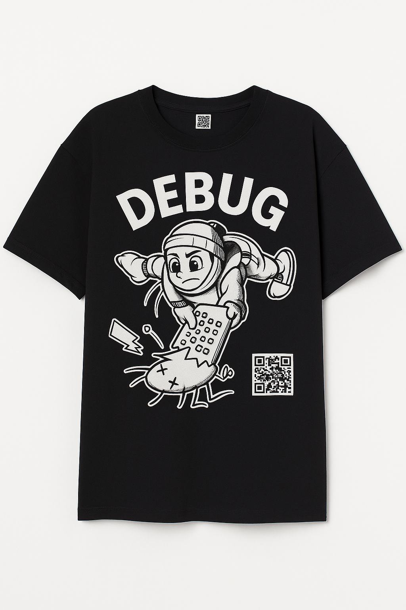

# 참여 이벤트
자신의 디버깅 사례를 정리하는 시간을 가져보세요! 디버깅 실무 사례를 올려주신 분들 중 3분을 당첨하여 디버깅 티셔츠를 드려요! (간단한 사례 환영)

{width=200}

## 참여 기간
10/13부터 11/13까지 한달간 진행돼요.

## 참여 방법
아래의 순서대로 참여해주세요.

1. [디버깅 실무 사례 > 기여하기 탬플릿](../pages/experience/contribute.md)을 복사하여 debug/experience폴더에 새로운 파일로 생성
2. 탬플릿에 맞게 디버깅 사례를 작성
3. config.mts 파일에서 목록 중 디버깅 실무 사례 > items에 item 추가
4. PR로 올리기

💌 상품 수령 안내는 11월 23일에 Github에 등록된 이메일을 통해 개별로 안내를 보내드려요.

