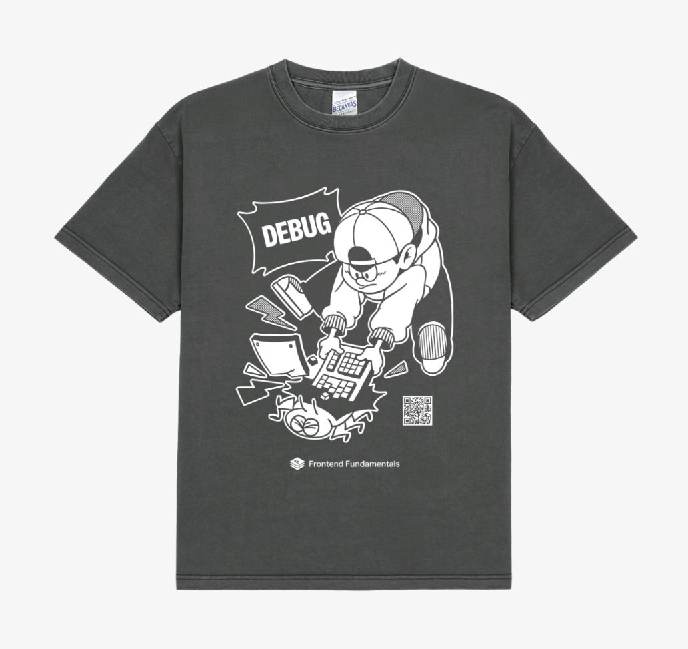

---
head:
  - [
      meta,
      {
        property: "og:image",
        content: "https://static.toss.im/illusts/debug_x_1200x627_event.png"
      }
    ]
  - [
      meta,
      {
        name: "twitter:image",
        content: "https://static.toss.im/illusts/debug_x_1200x627_event.png"
      }
    ]
  - [meta, { name: "twitter:card", content: "summary_large_image" }]
---

# 참여 이벤트

자신의 디버깅 사례를 정리하는 시간을 가져보세요! 디버깅 실무 사례를 올려주신 분들 중 5분을 추첨하여 디버깅 티셔츠를 드려요!

{width=400}

## 참여 방법

아래의 템플릿을 복사하여 내용을 채워주신 후 댓글로 남겨주세요!
<br/>
간단한 사례부터 복잡한 사례까지 다양한 사례를 남겨주세요.

```
- 증상
- 첫 시도
- 찾아낸 원인
- 해결책
- 재발방지를 위한 대책 (선택)
```

## 이벤트 기간

이벤트는 11/3 ~ 12/3 한달간 진행됩니다.


## 🎉 디버깅 문서 이벤트 결과 안내

안녕하세요,
지난 한 달간 진행된 디버깅 문서 댓글 이벤트에 참여해주신 모든 분들께 진심으로 감사드립니다!
총 10명이 소중한 디버깅 경험과 멋진 인사이트를 공유해주셨고, 그중 5명을 티셔츠 당첨자로 추첨하였습니다.

이번 이벤트에 참여해주신 모든 분들의 디버깅 내용은 문서 하단의 <디버깅 실무 사례>에 추가될 수 있도록 PR 올려드릴 예정입니다. 모두 귀중한 경험을 공유해주셔서 정말 감사합니다! (게시를 원치 않으시다면 `toss.nbsp3@toss.im`로 별도 연락 부탁드립니다 🙇‍♀️ )

## 🏆 당첨자 안내 (총 5명)

```
ted-pool
bingbing-ba
sanghyeon
parkcool
spoyodevelop
```

당첨되신 분들은 티셔츠 수령을 위해 아래 수신 정보를 `toss.nbsp3@toss.im`로 제출 부탁드립니다!

- 택배 수령 주소
- 휴대폰 번호
- 성함

수집된 정보는 배송만을 위해 이용되며, 별도로 저장하지 않아요.
