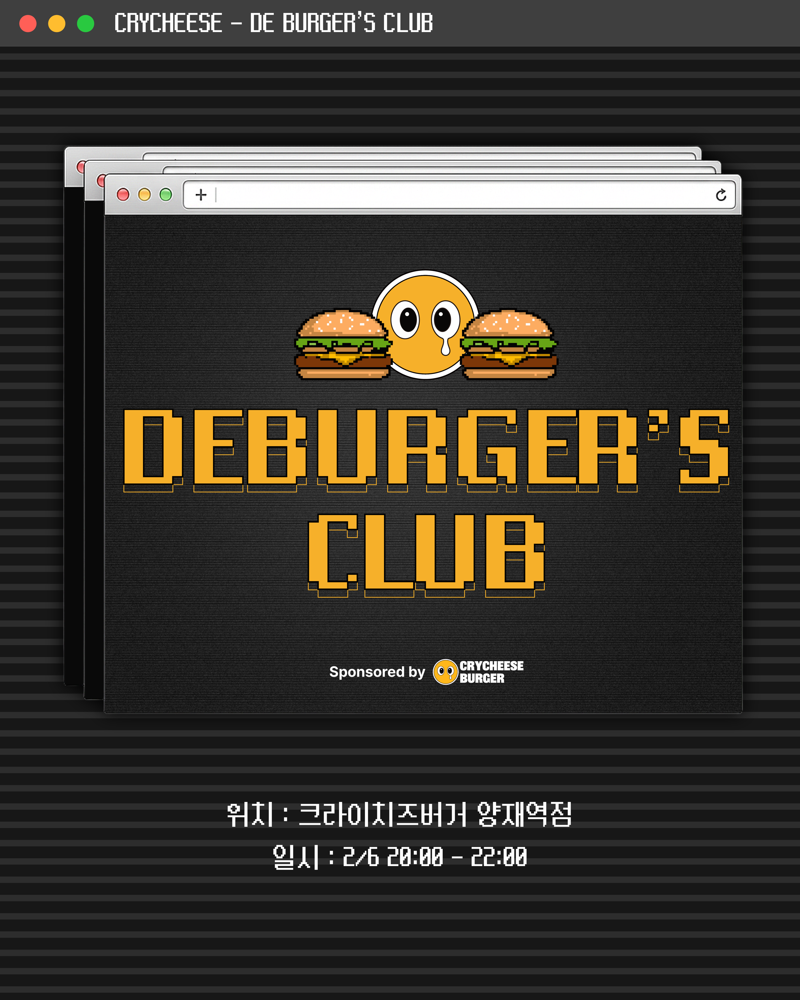

# DEBUGER'S CLUB 사전 이벤트 🍔

<br/>

{width=600}

## 이벤트 내용

자신의 디버깅 사례를 정리하는 시간을 가져보세요!
디버깅 실무 사례를 올려주신 분들 중 3분을 추첨하여 디버깅 티셔츠를 드려요! (한정 수량으로 티셔츠는 M, 3XL 사이즈로 준비되어 있습니다)

{width=500}


💡 모든 분야의 개발자를 환영합니다!
프론트엔드, 백엔드, 모바일, DevOps 등 개발 분야를 불문하고 누구나 참여 가능합니다. 디버깅은 모든 개발자의 숙명이니까요!


## 참여 방법

아래의 템플릿을 복사하여 내용을 채워주신 후 댓글로 남겨주세요!
<br/>
간단한 사례부터 복잡한 사례까지 다양한 사례를 남겨주세요.

```
- 증상
- 첫 시도
- 찾아낸 원인
- 해결책
- 재발방지를 위한 대책 (선택)
```

## 참고 예시 
[이전에 진행되었던 이벤트를 참고해보세요](https://frontend-fundamentals.com/debug/pages/event.html)

## 이벤트 기간

이벤트는 2월 2일부터, 디버거스 클럽이 진행되는 2월 6일까지 진행됩니다.