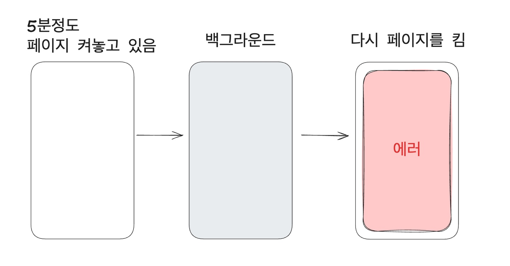
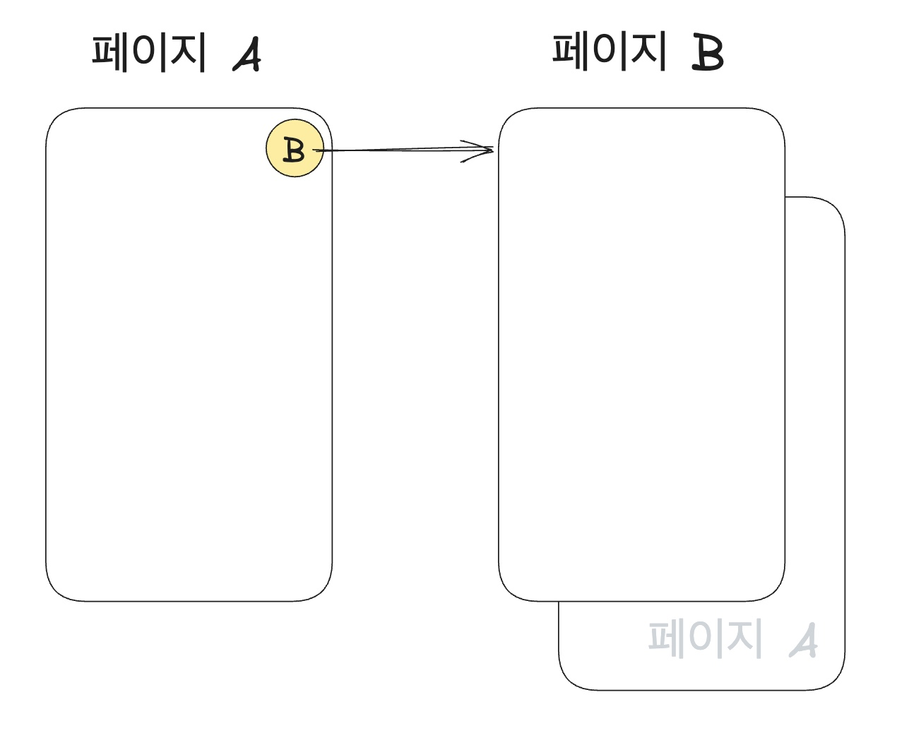

# 1. 진단하기

### Q1. 처음 맞딱뜨리신 에러 현상과 에러 메세지에 대해 짧게 소개해주실 수 있을까요?
먼저 현상부터 간략히 말씀드리자면, `웹뷰를 5분 정도 켜놓고 있다가, 앱을 백그라운드 상태로 두었다가 다시 앱을 키면 갑자기 Suspense에러가 발생한다.` 는 현상이었어요.



<br/>
에러메세지는 다음과 같았는데요,

```
A component suspended while responding to synchronous input. 
This will cause the UI to be replaced with a loading indicator.
To fix, updates that suspend should be wrapped with startTransition.
```

이 에러 메세지는 컴포넌트가 `suspense`를 일으킬때 나타나요. `suspense`가 일어났다는 것은 곧 `준비되지 않은 쿼리가 있음`을 의미해요. 삭제되었거나 로딩 중이라 준비되지 않았거나, 존재하지 않는 쿼리를 컴포넌트에서 사용할 때 일어나는 에러에요.


### Q2. 문제의 증상과 에러 메시지를 처음 접했을 때 어떤 생각을 하셨나요?

에러 메세지와 현상이 매칭이 잘 안됐어요. 컴포넌트에서 사용 중인 쿼리인데 `suspense`가 발생했다는 것은 쿼리가 삭제된 상황일 거라 생각했어요. 하지만 페이지에서 쿼리가 사용되고 있다면 해당 쿼리는 `staleTime`이나 `cacheTime`이 지났다고해서 삭제되지 않는 것이 원칙이에요. 그래서 이 현상이 말이 안된다고 생각했어요.

캐시 관련된 문제는 맞는 것 같고, 가바지 컬랙터와 연관이 있긴 한 것 같은데, 페이지에서 사용 중인 쿼리가 혼자 날라가진 않았을거고, 다른 무언가가 사이드 이팩트가 캐시를 날렸을 것이라고 의심하기 시작했어요.

### Q3. 그 사이드 이펙트로 의심하게 된 부분이 있었나요? 있다면, 의심하게 된 결정적 근거는 무엇이었나요?

이 설명을 위해서는 간략히 서비스의 구조를 설명드려야 할 것 같은데요, 페이지A에는 페이지B로 들어갈 수 있는 진입점이 있어요. 페이지 A와 페이지B는 모두 네이티브 위에 띄워진 웹뷰이고, 페이지A에서 페이지B로 진입하면 페이지A 위에 페이지B가 스택으로 쌓이는 구조예요.



문제 상황을 재현하기 위해 페이지를 껐다가 켰다가도 해보고, 페이지A에서 페이지B로 들어갔다가 나왔다, 껐다가, 켰다가 등을 반복하던 중, 페이지B만 껐다 켰을때 일어나지 않던 에러가 페이지A에서 페이지B를 열었다가 닫으면 재현되었어요.

여기서 힌트를 얻을 수 있었어요. `서로 다른 웹뷰 사이에 발생한다`는 것이에요. 이 에러는 웹뷰 하나에서는 발생하지 않았어요.

그래서 다중 웹뷰 환경을 위해 따로 설정된 것이 있는지 살펴보았고, broadcast query client가 사용되고 있다는 사실을 알게되었어요. broadcast query client는 여러 탭(또는 윈도우)간에 쿼리 캐시를 `동기화(broadcast)`하기 위한 라이브러리에요. 이때부터는 강력하게 broadcast query client를 의심하게 되었어요.

### 진단과 동시에 재현에 성공하신거군요!