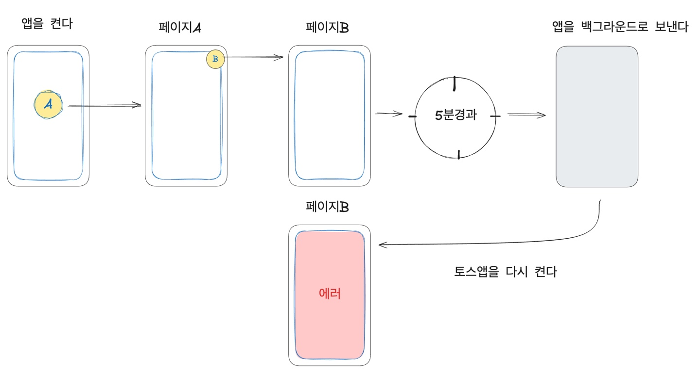
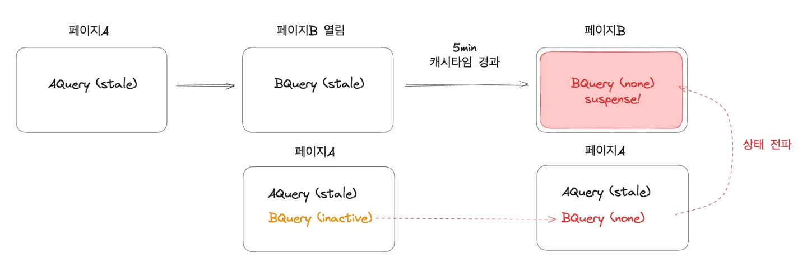

# 2. 재현하기

## Q1. 재현에 성공하신 경로를 한번만 더 말씀해주세요

```
1. 서비스로 들어간다.
2. 페이지A를 연다.
3. 페이지 B로 들어간다.
4. 5분이 지난다.
5. 앱을 백그운드로 보낸다
6. 다시 앱을 켠다. (페이지B가 켜진다)
```

이렇게 입니다.



## Q2. 재현에 특별히 신경쓰신 점이 있으실까요?

로컬에서 재현을 했는데, `페이지를 연다`는 것을 새로운 웹뷰가 뜨는 과정이라 생각해서 꼭 새로운 로컬호스트 3000을 띄워가며 재현했어요.

캐시 타임 관련해서는, 캐시 관련된 문제라고 생각해서 캐시 타임인 5분 경과도 똑같이 기다려봤어요. (형규님한테 맞는지 물어봐야함)

## Q3. 문제가 발생하는 구조를 명확히 확인하기 위해 어떤 값이나 상태를 주의 깊게 추적하셨는지 궁금해요.

일단, 로컬에서 재현되는게 문제를 해결하는 가장 빠른 길이라고 생각해서 로컬에서 재현을 시도했어요. 재현을 위해 로컬에서 react dev tool을 설치했어요. 로컬 호스트에서 서비스를 띄우고, 페이지 A에서 페이지B를 열어가며 쿼리 상태가 어떻게 변하는지 확인했어요.

행동 액션을 쪼개서 확인하기 위해 디버거를 걸어서 각 액션에서 어떤 일이 발생하는지 확인했어요. 마우스를 클릭해서 윈도우에 포커스할 때 쿼리 상태가 어떻게 변경되는지
등이요.

## Q4. 쿼리의 상태값에서 원인을 찾으셨나요?

결론은 캐시 상태와 관련이 있었어요. 캐시 상태에는 아래의 상태들이 있어요.
|상태 |의미|
|---|--|
|none| none 캐시에 데이터가 전혀 없어요 (설명을 위한 가상의 상태)|
|fresh|fetch 이후, staleTime 이내 – 데이터가 유효해요|
|stale| staleTime 이후 – 데이터가 오래되어 다시 불러올 수 있어요|
|inactive| 컴포넌트에서 더 이상 사용하지 않지만 아직 캐시는 남아있어요 (cacheTime 이후 삭제됨)|

사용 중인 컴포넌트가 없으면 쿼리는 `inactive` 상태가 되요. 쿼리의 상태가 `inactive` 상태일때만 `cacheTime`를 참조하고, `cacheTime`이 경과 하면 그때 삭제되요. 컴포넌트에서 쿼리를 참조 중이면 그 쿼리는 절대 자동 삭제되지 않아요.

<br/>



페이지 A와 페이지 B에는 서로 동일한 쿼리를 공유하고 있었는데, 페이지A에서 사용되지 않는 쿼리가 5분이 경과해 `inactive`상태가 되고, `cacheTime`이 지나 결국 삭제된 거에요. 이 때, 삭제된 쿼리의 상태가 페이지 B로까지 전이된 것이었어요.

## Q5. 재현 중 가장 어려웠던 순간이 있었나요?

컴포넌트에서 리랜더링이 일어나는 순간 에러가 발생하는 것은 확실한데, 이 리랜더링이 언제 트리거 되는지 알아내는데 시간이 좀 걸렸어요.

처음에는 단순히 캐시가 사라지는 순간 리랜더링이 발생할 것이라 생각했어요. 그래서 react dev tool에서 직접 캐시를 삭제해서 재현해보기도 했어요. 하지만 재현이 안되더라고요.

두번째로는 윈도우를 포커스하는 순간 리패치가 일어나 리랜더링이 일어날 것이라고 생각했어요. 하지만 이때도 아니더라고요.

query-client의 오픈소스에서 리패치 시점을 확인했더니, 리패치하여 리랜더링을 하는 정확한 요건은 아래와 같더라고요.

```
- refetch option에 지정된 시점인 경우 (refetchOnWindowFocus..)
- query 상태가 하나라도 존재할 경우
```

query 상태가 하나라도 존재할 때라는 조건이 리패치 조건에 있었어요. 위의 테스트에서 쿼리 상태를 하나만 두고 테스트를 했었는데, 그 캐시를 지웠기 때문에 존재하는 캐시가 하나도 없어지며 리패치가 안일어나고, 리랜더가 안일어났던 거였어요.

테스트 당시엔 분명히 '리패치 옵션에 refetchOnWindowFocus가 설정되어있는데, 왜 리패치가 안일어나는거지?'하며 애먹었던 기억이 납니다.
