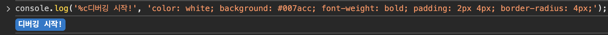
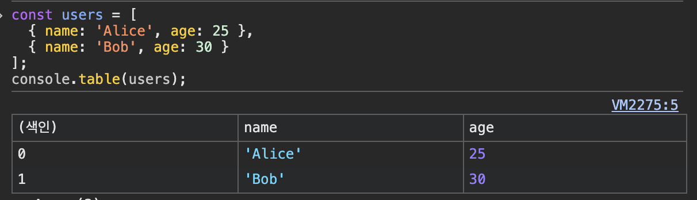
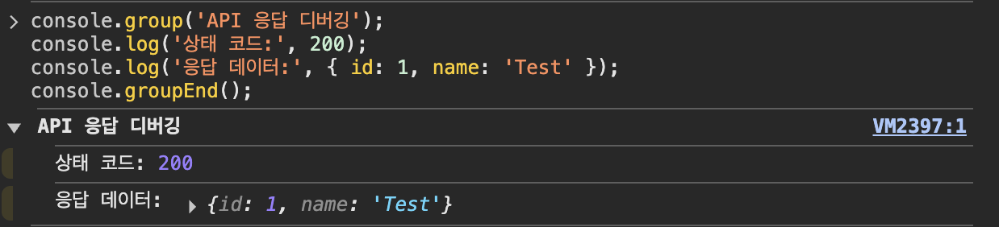
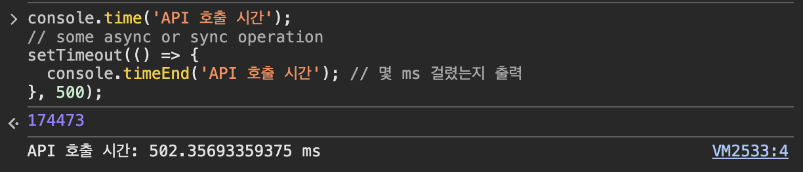
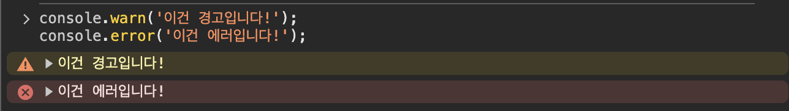
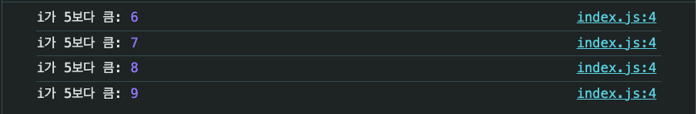
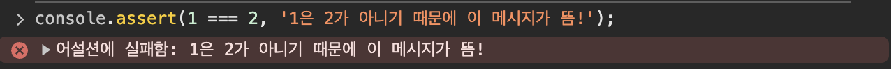
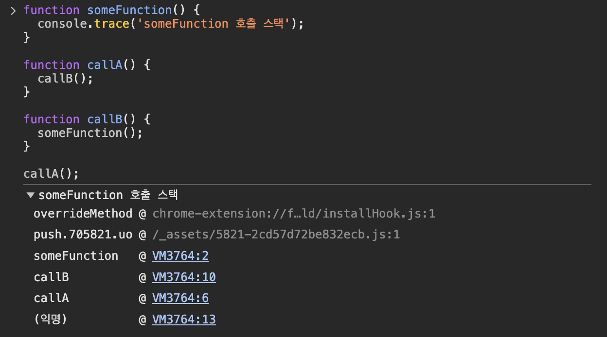
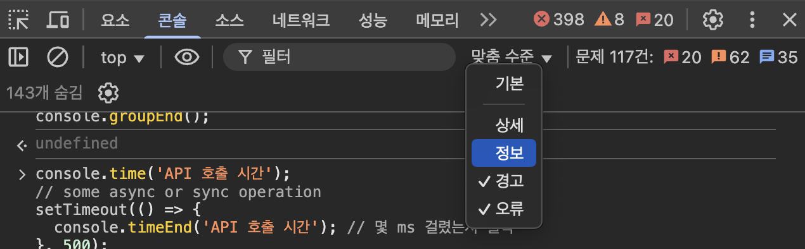

# 디버거와 콘솔로그 활용하기
재현 상황을 만들기 위해서는 디버거와 콘솔로그를 잘 활용할 수 있어야 해요. 앞에서 에러의 원인이 되는 **핵심 로직만 남기고**, 나머지 코드를 최대한 제거했어요. 코드를 간단하게 줄인 후에는, 중점적으로 봐야하는 곳에 `break-point`를 달거나 `console.log`를 찍어보며 상태값이 어떻게 변화하는지 추적해요.

## 콘솔 로그
단순히 console.log만 쓰기보다는, 다양한 방법으로 로그를 꾸미고, 정리하고, 조건을 걸어서 더 효율적으로 디버깅할 수 있어요.

#### 1. style
console을 꾸며서 문자열에 스타일을 줄 수 있어요.
```js
  console.log('%c디버깅 시작!', 'color: white; background: #007acc; font-weight: bold; padding: 2px 4px; border-radius: 4px;');
```


#### 2. console.table
배열/객체를 표 형태로 보기 쉽게 출력할 수 있어요.
```js
  const users = [
    { name: 'Alice', age: 25 },
    { name: 'Bob', age: 30 }
  ];
  console.table(users);
```


#### 3. console.group
관련 로그 묶어볼 수 있어요. 여러 로그를 그룹으로 묶어서 보기 쉽게 해줄 수 있어요
```js
  console.group('API 응답 디버깅');
  console.log('상태 코드:', 200);
  console.log('응답 데이터:', { id: 1, name: 'Test' });
  console.groupEnd();
```


#### 4. console.time / console.timeEnd
코드 실행 시간 측정할 수 있어요. 함수나 코드 블록의 실행 시간을 볼 때 유용해요.
```js
  console.time('API 호출 시간');
  // some async or sync operation
  setTimeout(() => {
    console.timeEnd('API 호출 시간'); // 몇 ms 걸렸는지 출력
  }, 500);
```


#### 5. console.warn / console.error
로그 레벨 구분할 수 있어요. 중요한 경고나 에러는 눈에 띄게할 수 있어요
```js
  console.warn('이건 경고입니다!');
  console.error('이건 에러입니다!');
```



#### 6. 조건부 디버깅
특정 조건일 때만 로그 출력하면 불필요한 로그를 제외할 수 있어요
```js
  const value = 10;
  if (value > 5) {
    console.log('value가 5보다 큼:', value);
  }
```


#### 7. console.assert
조건이 거짓일 때만 에러 출력할 수 있어요.
```js
  console.assert(1 === 2, '1은 2가 아니기 때문에 이 메시지가 뜸!');
```


#### 8. Tagged Logging
로그에 태그 붙이면 검색에 용이해요.
```js
  console.log('[UserModule]', '유저 정보 로드됨:', userData);
  console.log('[API][POST /login]', '로그인 요청 결과:', response);
```

#### 9. console.trace
호출 스택 추적할 수 있어요.
```js
  function someFunction() {
    console.trace('someFunction 호출 스택');
  }

  function callA() {
    callB();
  }

  function callB() {
    someFunction();
  }

  callA();
```


#### 10. 브라우저 콘솔 필터링 기능을 활용해 보아요.
Chrome DevTools에서는 로그를 레벨별로 필터링 가능해요. 특정 레벨만 빠르게 보고 싶을 때, 탭 분리로 효율적 디버깅이 가능해요
  - `console.debug` → **Verbose (상세)**
  - `console.log` → **Default (기본)**
  - `console.warn` → **Warnings (경고)**
  - `console.error` → **Errors (오류)**

