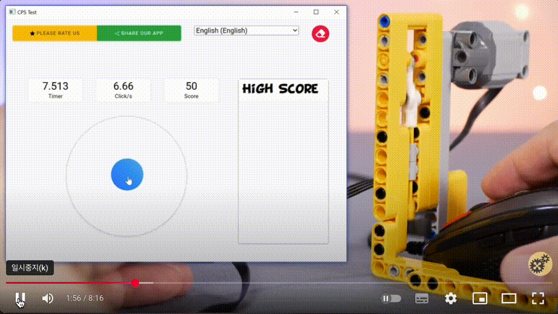

# 반복적인 재현 과정을 자동화하기

일부 버그는 특정 조건에서만 발생해서, 매번 수동으로 조건을 맞춰 재현하기 어려워요. 이런 작업은 비효율적일 뿐 아니라 개발자의 집중력을 떨어뜨리기도 해요.

**재현 과정을 자동화하면** 분석과 수정이 훨씬 빨라져요. 자동화는 특히 상태 변화가 복잡하거나, 연속 클릭이나 빠른 입력처럼 사용자 행동에 민감한 UI 문제를 다룰 때 큰 도움이 돼요.



## 자동화 코드

예를 들어, 동일한 요청이 여러 번 반복될 때 비정상적인 화면이 보여지는 버그 리포트를 받았다고 가정해 볼게요. 이 문제를 재현하기 위해, 다음처럼 **자동 클릭 함수**를 만들어 반복적인 클릭 상황을 만들어 볼 수 있어요. 그리고 디버거를 걸어서 중간 중간 값이 어떻게 변경되는지 추적해볼 수 있어요.

```tsx
import React, { useState } from "react";

function simulateRapidClicks(
  target: HTMLElement,
  count: number,
  interval: number
) {
  let i = 0;
  const clickInterval = setInterval(() => {
    target.click();
    i++;
    if (i >= count) clearInterval(clickInterval);
  }, interval);
}

const DoubleClickTest = () => {
  const [count, setCount] = useState(0);
  const [disabled, setDisabled] = useState(false);

  const handleClick = () => {
    if (disabled) return;
    setDisabled(true);
    setTimeout(() => setDisabled(false), 1000);
    setCount((prev) => prev + 1);
  };

  const handleAutoClick = () => {
    const button = document.getElementById("click-button");
    if (button) {
      simulateRapidClicks(button, 10, 50);
    }
  };

  return (
    <div>
      <button id="click-button" onClick={handleClick} disabled={disabled}>
        클릭
      </button>
      <p>클릭 횟수: {count}</p>
      <button onClick={handleAutoClick}>자동 광클 재현</button>
    </div>
  );
};

export default DoubleClickTest;
```

이처럼 자동화된 재현 코드는 수동으로 조건을 만들기 어려운 상황에서도 쉽게 문제를 다시 만들어낼 수 있어, 디버깅과 테스트 효율을 높여줘요.
