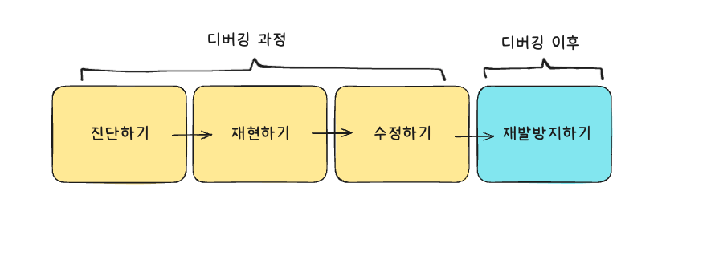

# 효과적인 디버깅을 위한 4가지 단계

버그를 수정하는 일은 단순히 문제를 고치는 데 그치지 않아요. 진짜 중요한 건 **문제를 어떻게 찾고, 어떻게 다시 발생하지 않게 만드는지**예요. 잘하는 디버깅은 코드 품질을 지키고, 개발 속도를 높이는 데 큰 역할을 해요. 디버깅을 더 효과적으로 하려면 아래 4가지 관점을 함께 생각해야 해요.

## 1. 진단하기

문제를 무작정 해결하려고 하기보단, **무엇이 문제인지 정확히 파악하는 것**이 먼저예요. 에러 메시지를 읽고, 로그를 남기고, 실행 흐름을 시각화해서 원인을 체계적으로 좁혀가야 해요.
- [에러 메시지로 진단하기](./diagnose/error-message.md)
- [작업 지도 그리기](./diagnose/map.md)

## 2. 재현하기

**재현되지 않는 버그는 고칠 수 없어요.** 문제를 확실히 재현할 수 있어야, 빠르게 수정하고 테스트할 수 있어요.
- [최대한 간단한 코드로 재현하기](./reproduce/simply.md)
- [디버거, 콘솔 활용하기](./reproduce/debugger.md)
- [일반적인 범위에서 벗어나도록 재현하기](./reproduce/out-range.md)
- [반복적인 재현 과정을 자동화하기](./reproduce/repeat.md)
- [버그 발생 경로를 추적하기](./reproduce/trace.md)

## 3. 수정하기

**겉으로 드러난 증상만 고치면 버그는 다시 나타나요.** 진짜 원인을 찾아서 수정하고, 더 나은 코드로 개선해야 해요.
- [근본 원인 수정하기](./fix/correct.md)
- [순수 함수 분리하기](./fix/pure.md)
- [데드코드 제거하기](./fix/dead-code.md)

## 4. 재발 방지하기

**디버깅의 끝은 재발 방지예요.** 버그가 왜 생겼는지 되짚어 보고, 다음엔 같은 실수를 하지 않도록 기록하고 공유해요.
- [에러 로그를 상세히 남기기](./prevent/error-log.md)
- [버그 리포트 남기기](./prevent/bug-report.md)
- [팀과 공유하고 공통 유틸에 반영하기](./prevent/util.md)
