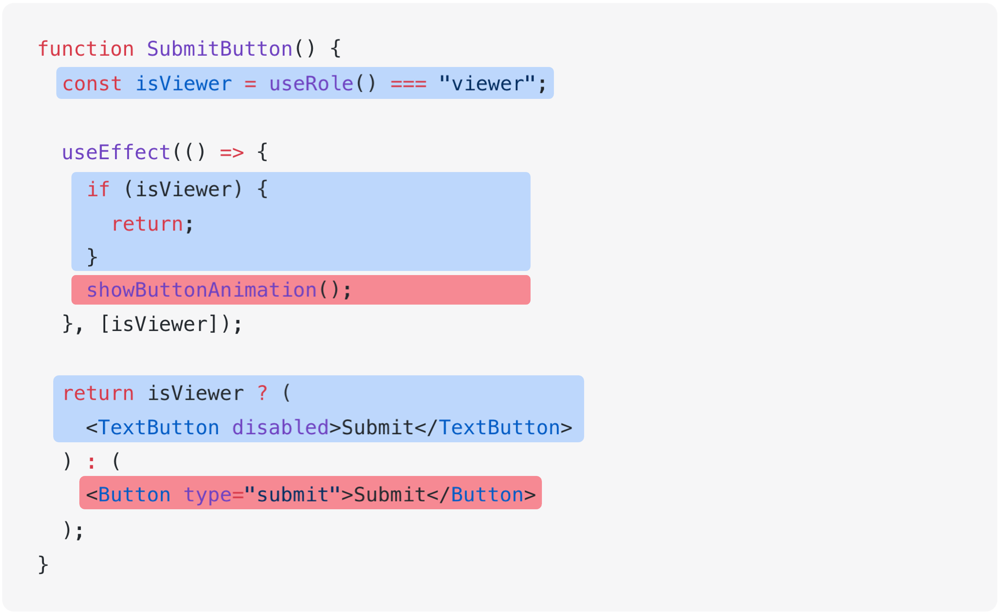

# 一緒に実行されないコードを分離する

<div style="margin-top: 16px">
<Badge type="info" text="可読性" />
</div>

同時に実行されないコードが1つの関数やコンポーネントにあると、挙動を一目で把握するのが難しくなります。
実装部分に多くの分岐が含まれていると、どのような役割を果たしているのか理解しづらくなります。

## 📝 コード例

次の`<SubmitButton />`コンポーネントは、ユーザーの権限に応じて異なる挙動をします。

- ユーザーの権限が閲覧専用（`"viewer"`）の場合、招待ボタンは無効化されており、アニメーションも再生されません。
- ユーザーが一般ユーザーの場合、招待ボタンを使用でき、アニメーションも再生されます。

```tsx
function SubmitButton() {
  const isViewer = useRole() === "viewer";

  useEffect(() => {
    if (isViewer) {
      return;
    }
    showButtonAnimation();
  }, [isViewer]);

  return isViewer ? (
    <TextButton disabled>Submit</TextButton>
  ) : (
    <Button type="submit">Submit</Button>
  );
}
```

## 👃 コードの不吉な臭いを嗅いでみる

### 可読性

`<SubmitButton />`コンポーネントでは、ユーザーが持つ2つの権限状態を1つのコンポーネント内で同時に処理しています。そのため、コードを読む人が一度に考慮しなければならないコンテキストが多くなります。

例えば、次のコードで青色の部分はユーザーが閲覧専用権限（`'viewer'`）を持っているときに実行されるコードで、赤色の部分は一般ユーザーの場合に実行されるコードです。同時に実行されないコードが交差して現れるため、コードを理解するのが難しくなってしまっています。

{.light-only}
{.dark-only}

## ✏️ リファクタリングしてみる

次のコードは、ユーザーが閲覧専用権限を持つ場合と一般ユーザーの場合を完全に分けて管理するようにしたものです。

```tsx
function SubmitButton() {
  const isViewer = useRole() === "viewer";

  return isViewer ? <ViewerSubmitButton /> : <AdminSubmitButton />;
}

function ViewerSubmitButton() {
  return <TextButton disabled>Submit</TextButton>;
}

function AdminSubmitButton() {
  useEffect(() => {
    showAnimation();
  }, []);

  return <Button type="submit">Submit</Button>;
}
```

- `<SubmitButton />`のコードの至る所にあった分岐が1つにまとめられ、分岐が減りました。
- `<ViewerSubmitButton />`と`<AdminSubmitButton />`では1つの分岐のみを管理しているため、コードを読む人が一度に考慮しなければならないコンテキストが少なくなります。
